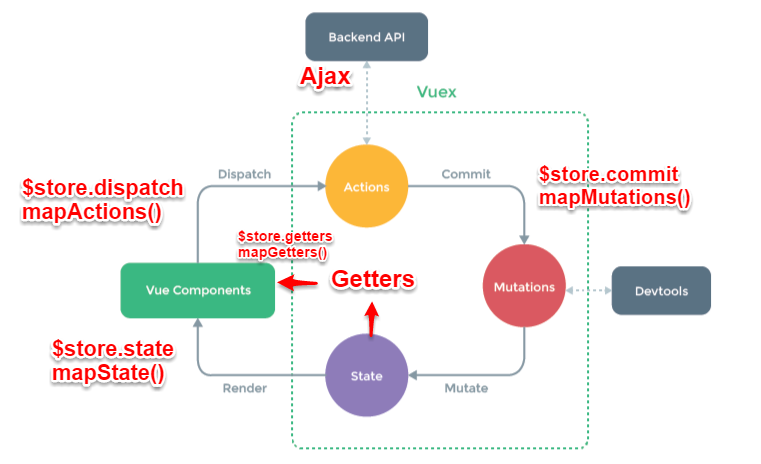
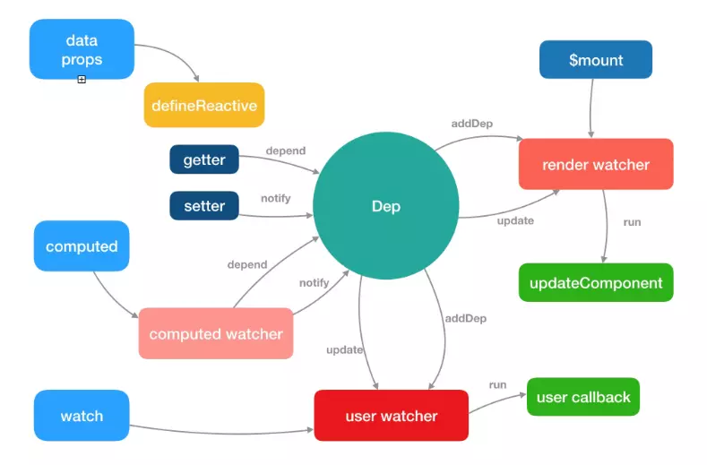
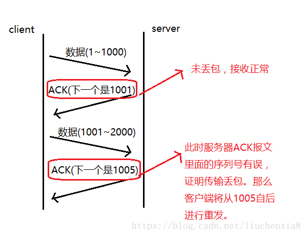
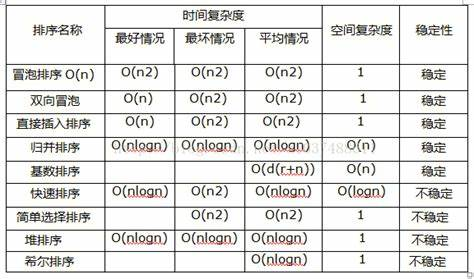

# preperation4interview

### 2019前端趋势
* https://www.infoq.cn/article/K_RFbwfff5MugJXixYDQ

### 笔试
* https://www.jianshu.com/p/35a027c7e4d9

### 前端面试：
* https://github.com/azl397985856/fe-interview（或者https://lucifer.ren/fe-interview/#/）

### ReactNative原理:
- ui跨端通过虚拟dom（ui描述json文件），不同平台拿到标准描述文件去实现各个平台ui，从而实现跨端
- 通讯则通过javascriptcore，或jscore.so实现与原生平台通讯
* https://www.jianshu.com/p/038975d7f22d
* https://blog.cnbang.net/tech/2698/
* [react native三端同构](https://www.ibm.com/developerworks/cn/web/wa-universal-react-native/index.html)

### web components
custom element, shodaw dom, template模板（x-tag，polymer），小程序貌似使用web component标准
可重用，非侵入式，可维护，语义化组件
* https://www.w3cplus.com/web-components/why-web-components-are-important.html
* https://developer.mozilla.org/zh-CN/docs/Web/Web_Components
* http://taobaofed.org/blog/2018/10/31/a-tag/

### 小程序原理：
* https://juejin.im/post/5afd136551882542682e6ad7
* https://github.com/Lmagic16/blog/issues/31

### webRTC:
* https://developer.mozilla.org/zh-CN/docs/Web/API/WebRTC_API

### 装饰器模式：
* http://es6.ruanyifeng.com/#docs/decorator
* https://segmentfault.com/a/1190000014495089

### [websocket](http://www.ruanyifeng.com/blog/2017/05/websocket.html)
- HTTP 协议有一个缺陷：通信只能由客户端发起,websocket全双工通讯
- 建立在 TCP 协议之上，服务器端的实现比较容易。
- 与 HTTP 协议有着良好的兼容性。默认端口也是80和443，并且握手阶段采用 HTTP 协议，因此握手时不容易屏蔽，能通过各种 HTTP 代理服务器。 
- 数据格式比较轻量，性能开销小，通信高效。
- 可以发送文本，也可以发送二进制数据。
- 没有同源限制，客户端可以与任意服务器通信。
- 协议标识符是ws（如果加密，则为wss），服务器网址就是 URL。


### serviceWorker：
* 1.Service worker运行在worker上下文，因此它不能访问DOM。
* 2.相对于驱动应用的主JavaScript线程，它运行在其他线程中，所以不会造成阻塞。它设计为完全异步，同步API（如XHR和localStorage）不能在service worker中使用。
* 3.出于安全考量，Service workers只能由HTTPS承载，毕竟修改网络请求的能力暴露给中间人攻击会非常危险。在Firefox浏览器的用户隐私模式，Service Worker不可用。
* 4.Service workers大量使用Promise，因为通常它们会等待响应后继续，并根据响应返回一个成功或者失败的操作。Promise非常适合这种场景。
注册-》下载-》安装-》激活
* https://developer.mozilla.org/zh-CN/docs/Web/API/Service_Worker_API
* http://www.alloyteam.com/2016/01/9274/
* http://taobaofed.org/blog/2018/08/08/workbox3/

### PWA
- 基于service worker
- 配置manifest，可配置到主屏到标题，logo，主题等等
- 就是一层代理，拦截所有请求，从而控制整个站点
- 单独的运行环境和执行线程，不操作dom，事件机制通讯，后台运行
- 支持离线缓存，消息推送

### webpack
* https://github.com/gwuhaolin/dive-into-webpack
* https://github.com/ruanyf/webpack-demos#demo01-entry-file-source
* https://juejin.im/post/5acabd696fb9a028c97a5733

### react redux react-router
* 深入REACT技术栈+陈屹著.pdf （必看书目）
* https://github.com/renderedtext/react-redux-demo
* https://coding.imooc.com/learn/list/313.html (综合实例)

### nodejs架构及大概介绍
* https://www.zhihu.com/question/33578075

### minxin, 高阶组件，react hooks
* https://segmentfault.com/a/1190000016950339
* https://zh-hans.reactjs.org/docs/hooks-intro.html

### react生命周期，对比vue，及vue的核心概念

* https://juejin.im/post/5a062fb551882535cd4a4ce3
* https://cn.vuejs.org/v2/guide/instance.html#%E7%94%9F%E5%91%BD%E5%91%A8%E6%9C%9F%E5%9B%BE%E7%A4%BA
* 相比较vue的mvvm框架，react是组件是开发更多关注view，虚拟dom，单向数据流，函数式编程
* 基本指令，模板语法，渲染，事件处理，组件，组件通讯，逻辑复用，路由，状态管理，ajax类库等等。
* 横切逻辑共用： vue mixin 类比 react mixin hoc hooks
* 容器组件：     vue slot（name指定） 类比 react props.children （数组索引）
* 双向通信：     vue props+event 类比 react props+callback
* 渲染：		   vue render(h=>h(component)) 类比 react ReactDOM.render(component, container)
* 全家桶：       vue vuex  Vue-router elmentUI等 类比 react + redux + React router（Browser Router） antdUI等

#### [vue组件通讯，vue组件通信](https://juejin.im/post/5cde0b43f265da03867e78d3)
- prop/事件，父组件A通过props的方式向子组件B传递，B to A 通过在 B 组件中 $emit, A 组件中 v-on 的方式实现。
- 事件总线，这种方法通过一个空的Vue实例作为中央事件总线（事件中心），用它来触发事件和监听事件,巧妙而轻量地实现了任何组件间的通信，包括父子、兄弟、跨级。
- vuex，Vuex实现了一个单向数据流，在全局拥有一个State存放数据，当组件要更改State中的数据时，必须通过Mutation进行，Mutation同时提供了订阅者模式供外部插件调用获取State数据的更新。而当所有异步操作(常见于调用后端接口异步获取更新数据)或批量的同步操作需要走Action，但Action也是无法直接修改State的，还是需要通过Mutation来修改State的数据。最后，根据State的变化，渲染到视图上。



#### [vue双向绑定原理](https://juejin.im/post/5d421bcf6fb9a06af23853f1)
Object.defineProperty+订阅发布模式+解释器compiler解释vue自定义命令
3.0用了proxy
- proxy性能最佳，同时支持全语言特性支持，lazy by default（只有数据被用到才会被监听，所以大规模数据性能很好）
  - 对象属性增加，删除
  - 数组index，length更改
  - map，set，weakmap，weakset
  - classes



#### vue生命周期图


#### watch和computed的区别
- 计算属性是基于它们的响应式依赖进行缓存的。只在相关响应式依赖发生改变时它们才会重新求值。
- 虽然计算属性在大多数情况下更合适，但有时也需要一个自定义的侦听器。这就是为什么 Vue 通过 watch 选项提供了一个更通用的方法，来响应数据的变化。当需要在数据变化时执行异步或开销较大的操作时,使用 watch 选项允许我们执行异步操作 (访问一个 API)，限制我们执行该操作的频率，并在我们得到最终结果前，设置中间状态。这些都是计算属性无法做到的。

#### [script标签中async和defer有什么区别, async,defer区别](https://segmentfault.com/q/1010000000640869)


### react受控组件和非受控组件
* 受控组件数据由react管理，而非受控组件数据存储在dom中
* 非受控组件往往代码少，且写的比较快，方便和第三方组件结合，虽然不美观，而受控组件状态更新需要写处理函数（change处理函数每一个组件都要写，很烦）
* 但是同一份数据，多个控件，
* 受控组件默认值由defaultValue，defaultChecked
* 文件上传控件始终是非受控组件，因为其值用户设置而非代码设置，
* https://react.docschina.org/docs/uncontrolled-components.html
* http://meloguo.com/2018/10/08/%E5%8F%97%E6%8E%A7%E4%B8%8E%E9%9D%9E%E5%8F%97%E6%8E%A7%E7%BB%84%E4%BB%B6/ （重点看看）

### react事件
* 在 React 底层，主要对合成事件做了两件事:事件委派和自动绑定
* 事件委托在结构的最外层，react自动绑定this，但是es6和纯函数需要手动绑定
* 可以使用原生事件，在componentdidmount中，但是记得在componentwillunmount中移除，防止内存泄漏，合成事件不需要，react已经处理
* 阻止 React 事件冒泡的行为只能用于 React 合成事件系统 中，且没办法阻止原生事件的冒泡。反之，在原生事件中的阻止冒泡行为，却可以阻止 React 合成 事件的传播。
* React 的合成事件系统只是原生 DOM 事件系统的一个子集。它仅仅实现了 DOM Level 3 的事件接口，并且统一了浏览器间的兼容问题。有些事件 React 并没有实现，或者受某些 限制没办法去实现，比如 window 的 resize 事件。
* React 的合成事件则并没有实现事件捕获，仅仅支持了事件冒泡机制。这种 API 设计方式统一而简洁， 符合“二八原则”。

### react router及内部原理，源码分析 
* 在路由跳转过程中，onLeave hook 会在所有将离开的路由中触发，从最下层的子路由开始直到最外层父路由结束。然后onEnter hook会从最外层的父路由开始直到最下层子路由结束。
* https://react-guide.github.io/react-router-cn/index.html
* https://www.jianshu.com/p/6f8babea6243
* http://zhenhua-lee.github.io/react/history.html
* https://github.com/youngwind/blog/issues/109

### react setState过程及源码分析
* https://imweb.io/topic/5b189d04d4c96b9b1b4c4ed6

### mvvm原理
* http://www.ruanyifeng.com/blog/2015/02/mvcmvp_mvvm.html
* https://coding.imooc.com/lesson/129.html#mid=9409
* https://github.com/DMQ/mvvm

### react如何借用其他类库的组件，比如jquery
* https://zh-hans.reactjs.org/docs/integrating-with-other-libraries.html

### 牛人博客
* https://segmentfault.com/u/zach5078

### 正则表达式
* https://juejin.im/post/5965943ff265da6c30653879
* https://juejin.im/post/5acb4d3f6fb9a028c813295e
* https://www.cnblogs.com/zxin/archive/2013/01/26/2877765.html
* https://developer.mozilla.org/zh-CN/docs/Web/JavaScript/Guide/Regular_Expressions

#### 浏览器输入网址回车后的一系列事情 输入url回车发生一系列事情
* dns域名解析获取到ip地址（浏览器缓存->系统缓存->路由器缓存->dns服务器缓存->递归搜索）
* 基于ip地址建立tcp连接，tcp三次握手，http连接建立
* 如果是https则还需要进行秘钥交换，随后建立连接
* 服务器接收请求查看http header，看是否有301,302跳转，没有就下载html页面，拿到html静态页面
* 解析页面中的外链，css，js，img等，判断是否有缓存，根据相应策略得到资源
* 同时dom树附加样式产生渲染树
* https://segmentfault.com/a/1190000012092552
* https://blog.csdn.net/LEoe_/article/details/79476279

#### [状态码](https://www.runoob.com/http/http-status-codes.html)
- 1表示信息类，2表示状态类，3表示重定向301永久，302临时 4请求错误403禁止访问，404找不到 5服务器错误 500服务器错误 503服务不可用

### http https，udp，tcp，三次握手，四次挥别
- tcp面向连接，可靠，正确顺序，三次握手，连接时间长，适合大量数据传输
- udp非面向连接，不可靠，少量数据传输，速度快
- dns中机房到机房用tcp，用户到机房则udp
- TCP三次握手和四次挥手
  - https://cloud.tencent.com/developer/article/1421145
  - https://blog.csdn.net/weixin_39924293/article/details/97371860
- [tcp保证可靠性](https://blog.csdn.net/cbjcry/article/details/84925028)
  - 校验和,计算方式：在数据传输的过程中，将发送的数据段都当做一个16位的整数。将这些整数加起来。并且前面的进位不能丢弃，补在后面，最后取反，得到校验和。 
    - 发送方：在发送数据之前计算检验和，并进行校验和的填充。
    - 接收方：收到数据后，对数据以同样的方式进行计算，求出校验和，与发送方的进行比对。
    - 注意：如果接收方比对校验和与发送方不一致，那么数据一定传输有误。但是如果接收方比对校验和与发送方一致，数据不一定传输成功。
  - 确认应答与序列号, TCP传输时将每个字节的数据都进行了编号，这就是序列号
    - TCP传输的过程中，每次接收方收到数据后，都会对传输方进行确认应答。也就是发送ACK报文。这个ACK报文当中带有对应的确认序列号，告诉发送方，接收到了哪些数据，下一次的数据从哪里发。
    
  - 超时重传, 没有收到ack报文原因（接收方没有接收到，发送的ACK报文响应却由于网络原因丢包了）
  - 流量控制，TCP连接的每一方都有固定大小的缓冲空间，TCP的接收端只允许发送端发送接收端缓冲区能接纳的数据
  - 拥塞控制，当网络拥塞时，减少数据的发送，发送方有拥塞窗口，发送数据前比对接收方发过来的即使窗口，取小（以接收方窗口数据为准）， 慢启动、拥塞避免、拥塞发送、快速恢复，TCP的接收端会丢弃重复的数据。 
* https://www.cnblogs.com/zhuqil/archive/2012/07/23/2604572.html
* https://blog.csdn.net/zhongzh86/article/details/69389967
* https://segmentfault.com/a/1190000017524542
- TIMEWAIT问题及解决方案
  - 造成资源被占用，比如端口号，无法处理更多的请求，高并发的天敌
  - net.ipv4.tcp_syncookies = 1 表示开启SYN Cookies。当出现SYN等待队列溢出时，启用cookies来处理，可防范少量SYN攻击，默认为0，表示关闭；
net.ipv4.tcp_tw_reuse = 1 表示开启重用。允许将TIME-WAIT sockets重新用于新的TCP连接，默认为0，表示关闭；
net.ipv4.tcp_tw_recycle = 1 表示开启TCP连接中TIME-WAIT sockets的快速回收，默认为0，表示关闭。
net.ipv4.tcp_fin_timeout 修改系默认的 TIMEOUT 时间
  - vi /etc/sysctl.conf
  - net.ipv4.tcp_keepalive_time = 1200 
  - #表示当keepalive起用的时候，TCP发送keepalive消息的频度。缺省是2小时，改为20分钟。
  - net.ipv4.ip_local_port_range = 1024 65000 
  - #表示用于向外连接的端口范围。缺省情况下很小：32768到61000，改为1024到65000。
  - net.ipv4.tcp_max_syn_backlog = 8192 
  - #表示SYN队列的长度，默认为1024，加大队列长度为8192，可以容纳更多等待连接的网络连接数。
  - net.ipv4.tcp_max_tw_buckets = 5000 
  - #表示系统同时保持TIME_WAIT套接字的最大数量，如果超过这个数字，TIME_WAIT套接字将立刻被清除并打印警告信息。
  - 默认为180000，改为5000。对于Apache、Nginx等服务器，上几行的参数可以很好地减少TIME_WAIT套接字数量，但是对于 Squid，效果却不大。此项  参数可以控制TIME_WAIT套接字的最大数量，避免Squid服务器被大量的TIME_WAIT套接字拖死。

#### https建立的整个过程
- client发送request（包含支持的加密协议及版本）请求到server
- server下发证书（包含公钥），证书为ca颁发的
- client到ca验证证书到合法性，生成随机数及数字签名（即对随机数hash）公钥加密发送到server
- server私钥解密，并用hash验证是否篡改，合法则再生成一个随机信息用client的随机数加密并生成签名（即对随机信息hash）发送到client
- client用随机数解密验证合法性
- 对称加密通讯

#### http劫持及防御
- 因为http是明文传输，所以中间运营商就可以在页面中加人恶意广告代码
- 投诉中间运营商
- 升级成https秘文传输，无法加人任何恶意代码

#### 跨域CORS
* http://www.ruanyifeng.com/blog/2016/04/cors.html
- Access-Control-Allow-Origin: http://api.bob.com
Access-Control-Request-Method
Access-Control-Allow-Credentials: true
Access-Control-Expose-Headers: FooBar
- 只要同时满足以下两大条件，就属于简单请求
  - （1) 请求方法是以下三种方法之一：

    HEAD
    GET
    POST
  （2）HTTP的头信息不超出以下几种字段：

    Accept
    Accept-Language
    Content-Language
    Last-Event-ID
    Content-Type：只限于三个值application/x-www-form-urlencoded、multipart/form-data、text/plain

#### [http options HTTP 的 OPTIONS 方法 用于获取目的资源所支持的通信选项。客户端可以对特定的 URL 使用 OPTIONS 方法，也可以对整站（通过将 URL 设置为“*”）使用该方法](https://developer.mozilla.org/zh-CN/docs/Web/HTTP/Methods/OPTIONS)

#### [http1.1存在的问题](https://www.cnblogs.com/ainyi/p/9723563.html)
1、TCP 连接数限制
对于同一个域名，浏览器最多只能同时创建 6~8 个 TCP 连接，调用接口的时候可以看到 (不同浏览器不一样)

2、线头阻塞 (Head Of Line Blocking) 问题
每个 TCP 连接同时只能处理一个请求 - 响应，浏览器按 FIFO 原则处理请求，如果上一个响应没返回，后续请求 - 响应都会受阻。
为了解决此问题，出现了 管线化 - pipelining 技术，但是管线化存在诸多问题，比如第一个响应慢还是会阻塞后续响应、服务器为了按序返回相应需要缓存多个响应占用更多资源、浏览器中途断连重试服务器可能得重新处理多个请求、还有必须客户端 - 代理 - 服务器都支持管线化

3、Header 内容多，而且每次请求 Header 不会变化太多，没有相应的压缩传输优化方案

4、为了尽可能减少请求数，需要做合并文件、雪碧图、资源内联等优化工作，但是这无疑造成了单个请求内容变大延迟变高的问题，且内嵌的资源不能有效地使用缓存机制

5、明文传输不安全

#### http2
- 二进制分帧（所有帧共享8个首字节，包括帧长，类型，标志，保留位标识当前帧，多帧任意发送，通过标识帧组装）
- 首部压缩（客户端有首部表，通过它追加或替换首部）
- 流量控制（每一跳而非端到端，接收方设置流量窗口大小，只有data部分可以控制流量大小）
- [多路复用（基于分帧和首部组装，交错发送请求响应，一个连接并行发送多个请求响应）（多路复用允许同时通过单一的 HTTP/2 连接发起多重的请求-响应消息）](https://www.cnblogs.com/ainyi/p/9723563.html)
  - 与http1.1 keepalive区别（是完全多路复用的，而非有序并阻塞的——只需一个连接即可实现并行）
  - 在一个 TCP 连接上，我们可以向对方不断发送帧，每帧的 stream identifier 的标明这一帧属于哪个流，然后在对方接收时，根据 stream identifier 拼接每个流的所有帧组成一整块数据。
把 HTTP/1.1 每个请求都当作一个流，那么多个请求变成多个流，请求响应数据分成多个帧，不同流中的帧交错地发送给对方，这就是 HTTP/2 中的多路复用。
流的概念实现了单连接上多请求 - 响应并行，解决了线头阻塞的问题，减少了 TCP 连接数量和 TCP 连接慢启动造成的问题
所以 http2 对于同一域名只需要创建一个连接就可以加载页面，而不是像 http/1.1 那样创建 6~8 个连接
- 请求优先级（0最高，2**31-1最低，客户端设置优先级，服务器响应优先级）
- 服务器推送
- 低延迟高吞吐
- 启用http2注意事项，openssl必须是1.0.2e之后版本，只支持https站点（升级到https注意事项参考“http升级https前后端都要注意什么”，即下一个知识点），nginx必须1.9.5以上版本

#### http升级https前后端都要注意什么？
- 前端
  - 资源引用最好的方式是不加协议，用://xxx.xxx.com/
- 后端
  - 安装支持https的nginx版本，包括依赖库
  - 购买ssl证书，放到指定目录
  - 监听443端口，配置证书位置和私钥位置
  - 同时监听80端口，return 301 https://$server_name$request_uri
- https://mp.weixin.qq.com/s/sICGZ55uRgiWAXr-EDGhZw
  
#### http3
- http是基于tcp连接，需要三次握手
- 而http3是基于udp的
- http3炒tcp的作业，发送方对发送的数据进行编号，接收方对接收到的编号进行确认

#### DNS劫持及防御
- 在域名映射成ip的过程中被指向一个恶意ip
- 区域传输用tcp(面向连接，可靠)，客户端请求用udp（非连接，开销少）
- 通过http请求域名ip（app上使用）
- dns-over-https加密传输防止被劫持
- 投诉，要求放开劫持
- [缓存设置短一些，切换到其他dns服务商，甚至自己建设dns](https://www.dns.com/supports/675.html)
  - DNS云加速覆盖国内6大主要运营商以及31个省份及地区的10w＋加速节点，模拟普通用户上网请求不间断的向运营商DNS服务器发起主动查询推送请求，从而让运营商的DNS服务器一直拥有准确的域名解析记录，保障国内绝大部分地区的运营商DNS服务器都能响应准确的解析结果，这样当真实的用户进行访问的时候就能获取到真实准确的地址了，能够有效从而降低DNS被劫持的风险。

### 域名收敛
- PC 时代为了突破浏览器的域名并发限制。有了域名发散，但多了dns解析开销及劫持风险
- 收敛则反之，减少多个域名
* https://www.jianshu.com/p/7c7ea420cee8

### nodejs和javascript事件循环(包括macrotask，microtask说明)
* https://nodejs.org/zh-cn/docs/guides/event-loop-timers-and-nexttick/
* http://lynnelv.github.io/js-event-loop-nodejs

### 同步，异步，阻塞，非阻塞概念
- cpu速度比i/o速度快，执行需要等待，就阻塞了，如果同步执行浪费时间
- 所以在nodejs中往往都有异步方法，通过回调达到非阻塞的目的
* https://zhuanlan.zhihu.com/p/22707398
* https://nodejs.org/zh-cn/docs/guides/blocking-vs-non-blocking/

### str.match(reg)返回匹配数组 reg.test(str)返回bool

### new发生了什么
* 创建一个空的简单JavaScript对象（即{}）；
* 链接该对象（即设置该对象的构造函数）到另一个对象 ；
* 将步骤1新创建的对象作为this的上下文 ；
* 如果该函数没有返回对象，则返回this。
* https://developer.mozilla.org/zh-CN/docs/Web/JavaScript/Reference/Operators/new
* https://segmentfault.com/q/1010000005141424

### Promise
* https://developer.mozilla.org/zh-CN/docs/Web/JavaScript/Reference/Global_Objects/Promise
* http://es6.ruanyifeng.com/#docs/promise

### 页面生命周期
* https://github.com/fi3ework/blog/issues/3

### 跨域
* https://segmentfault.com/a/1190000011145364
* https://www.jianshu.com/p/a0dd1e712c3a

### typeof instanceof区别
* https://segmentfault.com/a/1190000000730982
* http://jartto.wang/2019/01/17/js-typeof/

### for in for of forEach 区别
* https://blog.csdn.net/crystal6918/article/details/75099816

### generator
* http://es6.ruanyifeng.com/#docs/generator

### flex
* http://www.ruanyifeng.com/blog/2015/07/flex-grammar.html

### 数据结构与算法
* https://coding.imooc.com/learn/list/315.html
* https://github.com/kdn251/interviews

### 缓存机制,原理
* https://imweb.io/topic/55c6f9bac222e3af6ce235b9
* https://www.jianshu.com/p/1a1536ab01f1
* https://www.jianshu.com/p/54cc04190252
* https://github.com/ljianshu/Blog/blob/master/%E6%96%87%E7%AB%A0%E4%B8%AD%E7%9A%84%E6%80%9D%E7%BB%B4%E5%AF%BC%E5%9B%BE/%E6%B5%8F%E8%A7%88%E5%99%A8%E7%BC%93%E5%AD%98%E6%9C%BA%E5%88%B6.xmind

### meta viewport layout viewport visual viewport ideal viewport
* https://www.cnblogs.com/2050/p/3877280.html
* https://www.quirksmode.org/mobile/viewports2.html
* https://www.runoob.com/w3cnote/viewport-deep-understanding.html

### 前端性能优化
* https://juejin.im/post/59ff2dbe5188254dd935c8ab
### 测量白屏和首屏加载时间
* https://lz5z.com/Web%E6%80%A7%E8%83%BD%E4%BC%98%E5%8C%96-%E9%A6%96%E5%B1%8F%E5%92%8C%E7%99%BD%E5%B1%8F%E6%97%B6%E9%97%B4/

### 兼容IE事件工具函数
* https://blog.csdn.net/wangcuiling_123/article/details/73085958

### h5原生优缺点
* https://www.jianshu.com/p/daeacf35e72f

### amd和cmd区别，import区别，及import异步实现
* amd有requirejs，cmd有seajs，这些规范的目的都是为了 JavaScript 的模块化开发，特别是在浏览器端的
* 对于依赖的模块，AMD 是提前执行，CMD 是延迟执行。不过 RequireJS 从 2.0 开始，也改成可以延迟执行（根据写法不同，处理方式不同）。CMD 推崇 as lazy as possible.
* CMD 推崇依赖就近，AMD 推崇依赖前置。
* https://www.zhihu.com/question/20351507

### requirejs常用方法
* http://www.hangge.com/blog/cache/detail_1702.html

### buffer模块
* buffer用来处理大量二进制数据，操作字节；类Array对象，javascript和C++模块结合体，性能c，非性能js
* 内存不是v8分配，属于堆外内存，buffer太常见，默认无需require即可使用
* 拼接不能+号，而是通过ondata方式，onend再转换成字符串
* 网络传输二进制最高效

### Stream是什么
* node有内存限制，大文件操作用stream，node原生模块直接引用即可
* 当不能通过fs.readFile,fs,writeFile时，使用fs.createReadStream,fs,createWriteStream

### http模块实现异步变同步请求
* https://blog.csdn.net/WANGLEI20116527/article/details/62892070

### utf8和gbk区别
* UTF-8：Unicode TransformationFormat-8bit，允许含BOM，但通常不含BOM。是用以解决国际上字符的一种多字节编码，它对英文使用8位（即一个字节），中文使用24为（三个字节）来编码。UTF-8包含全世界所有国家需要用到的字符，是国际编码，通用性强。UTF-8编码的文字可以在各国支持UTF8字符集的浏览器上显示。如，如果是UTF8编码，则在外国人的英文IE上也能显示中文，他们无需下载IE的中文语言支持包。
GBK是国家标准GB2312基础上扩容后兼容GB2312的标准。GBK的文字编码是用双字节来表示的，即不论中、英文字符均使用双字节来表示，为了区分中文，将其最高位都设定成1。GBK包含全部中文字符，是国家编码，通用性比UTF8差，不过UTF8占用的数据库比GBD大。

### 前端数据采集
- onError事件，try catch，自定义错误及日志
- html5的performance帮助采集性能数据
* https://cdc.tencent.com/2018/09/13/frontend-exception-monitor-research/

### 腾讯面试题
#### jsonp有哪些安全问题，服务端可能存在csrf攻击
* 从消费者的角度来看：
* 必须相信提供商不会返回恶意JavaScript，而不是返回指定的JSONP回调中包含的预期JSON。
* 任何第三方JavaScript嵌入式附件（例如Google Analytics）也是如此。
* 这与XSS攻击类似，它允许第三方在应用程序中执行任意JavaScript，但是，必须首先通过首先提出请求来选择信任该第三方。
* 从提供者的角度来看：
* 即使客户的Cookie存在于您的控制网页的请求中，也不能认为该消息是存在的。检查Referer标头与授权URL的白名单，并且/或不要依赖基于cookie的认证。
* 类似于CSRF /混淆的副攻击。
* https://erlend.oftedal.no/blog/static-130.html?blogid=130
* https://cloud.tencent.com/developer/ask/77723
* https://www.jianshu.com/p/14f569b13dcc
* https://erlend.oftedal.no/blog/static-130.html?blogid=130
* 未来浏览器允许设置合法域携带cookie，这样就无法实现csrf攻击了  
* https://www.acunetix.com/blog/articles/chrome-tightens-csrf-protection/ 
* https://www.jianshu.com/p/66f77b8f1759

#### 怎么防止重复提交
* 多次submit按钮，刷新，回退会造成重复提交，前端和后端分别如何防御
* https://hw1287789687.iteye.com/blog/2427055
* https://www.jianshu.com/p/01b6ab61f24a

#### 怎么防止提交当价格被篡改，及防止重放攻击
* 对参数做数字签名，生产signature，提交服务器回传，服务器密钥参数再hash与signatrue对比即可知道是否被串改
* https://blog.csdn.net/u014756827/article/details/86631118

#### react两个组件中的请求有依赖如何处理
* 使用高阶组件，假如a依赖b，两种方式，一是通过props.callback，b中componentWillReceiveProps拿到a中异步请求依赖数据，二是通过hoc，b作为传人组件，高阶组件中实现a对逻辑，请求返回数据后，通过props传入b组件，形成增强组件

#### react中虚拟dom diff算法
陈屹《深入react技术栈》

#### xss安全问题，比如url中传递一张图片应该做哪些处理，哪些特殊字符需要过滤
* xss攻击分为存储型和反射性
* httponly,设置csp浏览器只执行指定域名对script
* <,>"'&/等字符进行转译
* url中参数要进行编码转义，decodeURIComponent
* https://tech.meituan.com/2018/09/27/fe-security.html
* https://zhuanlan.zhihu.com/p/32237154

#### 跨域cors的http头要设置哪些，以及浏览器如何发送预检请求，整个原理说一说
* Access-Control-Allow-Origin: http://foo.example
* Access-Control-Allow-Methods: POST, GET, OPTIONS
* Access-Control-Allow-Headers: X-PINGOTHER, Content-Type
* Access-Control-Max-Age: 86400
* https://developer.mozilla.org/zh-CN/docs/Web/HTTP/Access_control_CORS
* http://www.ruanyifeng.com/blog/2016/04/cors.html


#### 前端优化描述，除了雅虎军规之外的优化
* http2(多路复用，首部压缩，服务器推送，流量控制)，http3基于udp，ttr
* 域名收敛，dns预解析（<meta http-equiv="x-dns-prefetch-control" content="on" ><link rel="dns-prefetch" href="//cdn.domain.com" >）
* 通常情况下，我们认为 TCP 网络传输的最大传输单元（Maximum Transmission Unit，MTU）为 1500B，即一个RTT（Round-Trip Time，网络请求往返时间）内可以传输的数据量最大为 1500 字节。因此，在前后端分离的开发模式中，尽量保证页面的 HTML 内容在 1KB 以内，这样整个 HTML 的内容请求就可以在一个 RTT 内请求完成，最大限度地提高 HTML 载入速度。
* pwa，serviceworker
* ssr,服务器端渲染

#### 前端埋点监控怎么做（白屏，首屏，onload时间，html5的performance）
* head开发的地方定义起始时间，body开始处定义白屏结束时间，首屏html片段处定义首屏结束时间
* 使用html5 performance.timing的api，有各个阶段详细的时间点

#### react生命周期，及再didmount和willunmout一般做什么
componentDidMount： dom已经加装到页面，可以操作页面dom，比如集成第三方框架
componentWillUnmount：清理垃圾，比如删除绑定的事件等等内存回收的地方

#### 前端clone，深拷贝
* JSON.parse(JSON.stringify(XXXX)) （不能复制function、正则、Symbol，循环引用）
* 手写递归自己实现，简单类型，直接复制。对于引用类型，递归复制它的每一个属性，注意循环引用，使用缓存对象做判断（参考alibaba/alibaba.html）
* 使用lodash的deepclone
* 使用html5的方式拷贝，但是最大的问题是异步

#### 前端继承的方式有哪些
- 借用父级构造函数，二是通过原型，三是通过两种的组合方式（other/oop.html）
- __proto__指向构造函数的prototype对象，而非构造函数
- 

#### 缓存机制及如何定制缓存时间？为什么使用这种策略？
* https://imweb.io/topic/5795dcb6fb312541492eda8c

#### setTimeout和setImmediate区别
* node中执行顺序不确定，因为setTimeout不能做到0毫秒执行，分别在timer阶段和check阶段，process.tick优先级最高，每个阶段执行完就执行tick
* http://www.ruanyifeng.com/blog/2018/02/node-event-loop.html

* setTimeout无法保证指定时间后执行，那该如何保证指定时间后一定执行

#### mvvm的原理及实现细节
* 参考前文

#### redux详细说说
* 参考前文

#### react数据流说说看
* 推崇简单的自顶向下的单向数据流，双向绑定可以用回调

#### 如何提高用户的转化率（更快下单）
* 首先页面加载速度要快，让用户快速看到支付按钮
* 交互响应要及时，提示友好
* 页面设计要简洁清爽，支付按钮要突出，用户容易找到（不要一堆广告），支付页面的核心是让用户快速完成支付
* 不能有中断性的广告啊，提示呀
* 异常处理要友好，比如支付失败，有重新支付按钮，不能让用户有多余的操作
* 所有的广告可以移到支付成功页去

#### javascript将扁平的数据转为树形结构
* https://blog.csdn.net/qq_37746973/article/details/78662177

#### nodejs如何利用多核cpu
- cluster模块(child_process,net组合)
- 使用child_process模块，提供了child_process.fork()函数实现进程复制，onmessage,send来监听和发送消息

#### 响应式布局
- <meta name="viewport" content="width=device-width, initial-scale=1" />
- 媒体查询（media queries)
- rem,vw,淘宝的felxiable库
- srcset解决图片高清问题
- 尽量用svg或者css3构建一些背景图，替代png
- 1px问题
  - viewport+rem+js（对整个网页进行缩放）
  - 直接1/dpr设置像素
  - 伪元素+transform:scale(1,0.5)
  - 图片，每次更新颜色要换背景图片
  - boxshodow

#### for in和Reflect.ownKeys
- for in 遍历所有可枚举属性
- Reflect.ownKeys遍历所有属性（包括不可枚举）

#### for in和for of
- for in遍历的时候是key值
- for of遍历的是[key, value]可遍历所有实现了iterbale的列表

#### [new发生了什么](https://developer.mozilla.org/zh-CN/docs/Web/JavaScript/Reference/Operators/new)
- 创建一个空的简单JavaScript对象（即{}）；
- 链接该对象（即设置该对象的构造函数）到另一个对象 ；
- 将步骤1新创建的对象作为this的上下文 ；
- 如果该函数没有返回对象，则返回this，如果返回非对象则忽略（即还是返回this）

#### React与三方库协同
- 集成带有 DOM 操作的插件
  - 做组件隔离，你可以渲染一个无需更新到react元素，然后组件放在这个div里面隔离
  - 留一个ref值给jquery插件即可
  - 要注意自己去销毁注册的事件防止内存泄漏

#### ES6
- const,let,默认参数，箭头函数，尾调用优化，解构对象、数组，for of 展开运算符，set，map，Array.from
- const 定义一个常量，且必须初始化，不可修改，但如果定义的是对象，对象的属性可以修改，因为对象属性的修改不影响对象（或者说并没有修改对象）
- [es6 set](https://developer.mozilla.org/zh-CN/docs/Web/JavaScript/Reference/Global_Objects/Set)
- [es6 map](https://developer.mozilla.org/zh-CN/docs/Web/JavaScript/Reference/Global_Objects/Map)

#### 箭头函数和普通函数区别
- 箭头函数不能new，没有prototype
- this指向定义时父函数（如果父也是箭头函数则往上再找）所指的this
- 没有arguments绑定，使用rest替代
- call和apply不会改变this指向

#### css布局方式
- position
- display: table,子元素 table-cell
- flex,一维布局
- grid，二维布局

#### es6中的class
- 类中的prototype不可以被重写
- 所有成员不可枚举
- 必须使用new调用构造函数
- 只可以在派生类中使用super函数且只能第一个使用，new.target指向构造函数
  
#### 浏览器存储数据有cookie，localstorage，sessionstorage，indexDB
- cookie大概4kb左右，http请求会携带给服务器
- 本地存储5m

#### js数据类型，String, Number, undefined, null, Boolean, Object 

#### 5.15多少度 67.5度

#### 数字和字母8位  /^[0-9a-zA-Z]{8,}$/意思是数字或字母长度至少为8位，/^(?![0-9]+$)(?![a-zA-Z]+$)[0-9A-Za-z]*$/ 数字和字母组合
- https://developer.mozilla.org/zh-CN/docs/Web/JavaScript/Guide/Regular_Expressions
- 对 "123abc" 使用 /\d+/ 将会匹配 "123"，而使用 /\d+?/ 则只会匹配到 "1"。
- /(?:foo){1,2}/。如果表达式是 /foo{1,2}/，{1,2} 将只应用于 'foo' 的最后一个字符 'o'。如果使用非捕获括号，则 {1,2} 会应用于整个 'foo' 单词。
- /Jack(?=Sprat)/会匹配到'Jack'仅当它后面跟着'Sprat'。/Jack(?=Sprat|Frost)/匹配‘Jack’仅当它后面跟着'Sprat'或者是‘Frost’。但是‘Sprat’和‘Frost’都不是匹配结果的一部分。
- /(?<=Jack)Sprat/会匹配到' Sprat '仅仅当它前面是' Jack '。/(?<=Jack|Tom)Sprat/匹配‘ Sprat ’仅仅当它前面是'Jack'或者是‘Tom’。但是‘Jack’和‘Tom’都不是匹配结果的一部分。
- 

#### 负载均衡
- 轮循算法，就是将来自网络的请求依次分配给集群中的节点进行处理。
- 最小连接数算法，就是为集群中的每台服务器设置一个记数器，记录每个服务器当前的连接数，负载均衡系统总是选择当前连接数最少的服务器分配任务。
- 快速响应优先算法，是根据群集中的节点的状态（CPU、内存等主要处理部分）来分配任务。 这一点很难做到，事实上到目前为止，采用这个算法的负载均衡系统还很少。尤其对于硬件负载均衡设备来说，只能在TCP/IP协议方面做工作，几乎不可能深入到服务器的处理系统中进行监测。但是它是未来发展的方向。

#### href是当前元素与链接资源的关联，非阻塞；而src引入的资源是页面不可少部分，嵌入页面当前位置，要占位置

#### title是站点级别标题，h是文章标题，而em和strong是部分强调

#### 事件注册到同一元素与冒泡捕获无关，触发的顺序只与注册先后有关

#### let，var
- var声明要么全局要么函数作用域
- let局部作用域，不会声明提升，不能重复声明

### 进程
- 进程可以包含多个线程，线不可包含多个进程
- 进程独占内存，线程共享内存
- 进程上下文切换大于线程切换消耗

#### 死锁
- 互斥，请求保持，不可剥夺，循环等待
- 一次分配好所有资源
- 减少资源占用时间，减少竞争资源，顺序访问资源

#### n个台阶，每次只能走一步或两步，有多少种走法，斐波那契数列

#### [sql join](https://www.cnblogs.com/logon/p/3748020.html)
- inner join保留两张表中完全匹配到结果集（交集）
- left join以左表为准的结果集合，即使右表没有（）
- right join以右表为准的结果集合，即使左表没有
- full join左右表的并集（并集）

#### 防止参数被篡改，使用数字签名，即对参数做hash签名，服务器端校验参数和签名是否一致即可辨别是否被篡改

### 浏览器缓存
- 首先通过expires（1.0），cache-control判断缓存是否过期，如果没有过期使用浏览器缓存不发请求
- 过期则发请求，会带上etag或者last-modify与服务器上的相应值对比，如果没有变化返回304，否则返回新文件和新的etag和modify时间戳
- 如果需要强制更新，加版本号或者文件hash
- modify只能精确到秒

#### 使用fastclick解决移动端单击延迟问题，点透问题（因为单击延迟，所以浮层隐藏后会单击到下面到元素）

### 安全
- 机密性，不可明文传输，秘文
- 完整性不被篡改（数字签名）
- 可用性，防止dos，ddos攻击
- 可审计，不可抵赖
- 系统设计，服务器配置的时候，只允许做什么，而不是不允许做什么
- 最小权限原则，开通的权限越小越好
- 多维度防御，网络防御，防火墙，数据库，后台语言，前端都要做防御
- 数据和代码分离，xss，sql注入等等
- 不可预测原则，csrf攻击，加一个token串

### 安全防御措施
- 前端不操作任何敏感cookie，后台设置cookie为httponly
- 敏感信息不存储在前端，包括cookie，localstorage，本地数据库
- [单击劫持设置X-Frame-Options deny sameorigin allow-from uri](https://developer.mozilla.org/zh-CN/docs/Web/HTTP/X-Frame-Options)
- [csrf防御](https://cloud.tencent.com/developer/article/1494289)
  - 判断请求来源，referer，origin
  - 表单携带token（黑客虽然携带cookie，但是我们可以控制请求参数，此token可以约定算法或者服务器存储【安全系数高】）
  - cookie的SameSite属性， lax（link，form get），strict（其他域都不允许）属性
- xss攻击，存储型和反射型，对输入和输出都要进行编码，分为html编码，url编码，javascritp编码，css编码，html标签属性编码，json编码，目前框架基本都已经做了编码处理，结合csp（script-src，style-src，img-src）
  - [防御类库](https://github.com/leizongmin/js-xss)
  - [owasp类库，org.owasp.encoder](https://owasp.org/www-project-java-encoder/#tab=Use_the_Java_Encoder_Project)
  - 后端将数据存入数据库之前，先进行转义。
  - 后端输出给前端的数据，需要进行统一转义处理。
  - 前端获取后端的数据后，对数据进行转义处理。
  - 转义的内容包括，html标签，html标签属性（onerror,href）,css内联样式，script标签js，内联json，跳转链接
  - DOM 中的内联事件监听器，如 location、onclick、onerror、onload、onmouseover 等，a标签的 href 属性，JavaScript 的 eval()、setTimeout()、setInterval() 等，都能把字符串作为代码运行。如果不可信的数据拼接到字符串中传递给这些 API，很容易产生安全隐患，请务必避免
  - 输入页面转义的字符有 & < > " ' / 
  - url中取参数需要过滤javascript，http, https, script等等
  - json需要转义U+2028 U+2029 <
  - 在 style 属性和标签中，包含类似 background-image:url("javascript:...") expression(...) 的代码（新版本浏览器已经可以防范）
  - html标签中危险属性直接过滤调
  - 富文本编辑器
    - 事件应该被严格禁止，标签选择应该用白名单，只允许a,img,div
    - 禁止用户自定义css，style等
- [iframe嵌入三方应用时，sandbox的安全属性限制其行为，默认是最小权限原则，有允许提交表单，弹窗，执行脚步等等](https://developer.mozilla.org/zh-CN/docs/Web/HTML/Element/iframe)
- 上传一段js（本来要求用户上传图片的），浏览器强大等容错能力识别是js并执行，防御方式设置X-Content-Type-Options这个HTTP Header明确禁止浏览器去推断响应类型。

#### disable readonly区别都不可更改，但readonly会提交数据，input针对输入框，而disable针对所有表单

#### 排序算法复杂度


#### [leetCode试题](https://www.cnblogs.com/grandyang/p/4606334.html)

#### [javascript正则去除注释（删除注释）](https://blog.csdn.net/justoneroad/article/details/8227254)
```javascript
var reg = /("([^\\\"]*(\\.)?)*")|('([^\\\']*(\\.)?)*')|(\/{2,}.*?(\r|\n))|(\/\*(\n|.)*?\*\/)/g,// 正则表达式
    str = $('event').html(); // 欲处理的文本
console.log(str); // 打印出：原文本
console.log(str.match(reg));// 打印出：匹配子串
str.replace(reg, function(word) { // 去除注释后的文本
    return /^\/{2,}/.test(word) || /^\/\*/.test(word) ? "" : word;
});
```

#### 把1000个苹果分到10个箱子里。分好后随便我要几个苹果，你都可以整箱整箱的搬给我
- 1，2，4，8，16，32，64，128，256，512 
$$ 2^{n-1} $$

#### [如果一个处理器同时只能处理一个进程，现给出每个进程的时间戳，问最少需要几个处理器才能全部处理完毕?（leetcode 253）](https://www.cnblogs.com/grandyang/p/5244720.html)

#### [滑动窗口最大值问题](https://www.cnblogs.com/grandyang/p/4656517.html)

#### [断点续传](https://juejin.im/post/5dff8a26e51d4558105420ed)

#### 异常捕获
- 使用try catch，reject会触发
- Promise全局异常使用window.addEventListener('unhandledrejection', function browserRejectionHandler(event) {
  event && event.preventDefault()
})
- componentDidCatch(error：抛出的错误, info：带有 componentStack key 的对象，其中包含有关组件引发错误的栈信息) 

#### [js懒加载原理](https://blog.csdn.net/qq_25600055/article/details/82086377)

#### [懒加载延迟加载新api，IntersectionObserver API 使用教程](http://www.ruanyifeng.com/blog/2016/11/intersectionobserver_api.html)

#### css3 animation css3动画
- @keyframes myfirst
{
    from {background: red;}
    to {background: yellow;}
}
@keyframes myfirst
{
    0%   {background: red; left:0px; top:0px;}
    25%  {background: yellow; left:200px; top:0px;}
    50%  {background: blue; left:200px; top:200px;}
    75%  {background: green; left:0px; top:200px;}
    100% {background: red; left:0px; top:0px;}
}
- animation: 
{
  animation-name: myfirst;
  animation-duration: 5s;
  animation-timing-function: linear;
  animation-delay: 2s;
  animation-iteration-count: infinite;
  animation-direction: alternate;
  animation-play-state: running;
}

#### nodejs主进程和子进程挂了怎么办
- 如果子进程挂了，通过监听子进程的exit，uncaughtException事件自动重启，其实就是再递归调用自己一次
  - 同时监听process主进程的exit事件，这样可以温和的kill所有子进程
- 通过监听主进程即process的exit，uncaughtException事件来

#### react性能优化
- 打包使用生产环境的包，mode: 'production'
- BundleAnalyzerPlugin插件分析脚本大小
- 虚拟长列表react-window 和 react-virtualized 是热门的虚拟滚动库
- shouldComponentUpdate(nextProps, nextState) 默认返回true表示需要diff更新dom，false不diff更新dom
- 使用PureComponent组件，无状态组件
- 动态加载路由

#### 事件循环 event loop


#### [tree shoking原理](https://twindy.org/qian-xi-tree-shakinggong-zuo-yuan-li/)
- tree shaking 不支持动态导入（如CommonJS的require()语法），只支持纯静态的导入（ES6的import/export）
- webpack中可以在项目package.json文件中，添加一个 “sideEffects” 属性,手动指定由副作用的脚本


#### null和undefined区别
- null表示"没有对象"，即该处不应该有值
- undefined表示"缺少值"，就是此处应该有一个值，但是还没有定义
  - （1）变量被声明了，但没有赋值时，就等于undefined。
（2) 调用函数时，应该提供的参数没有提供，该参数等于undefined。
（3）对象没有赋值的属性，该属性的值为undefined。
（4）函数没有返回值时，默认返回undefined。

#### 数据双向绑定方式及优缺点 mvvm
- 脏检查，Object.defineProperty，proxy，
- 脏检查性能最差但兼容性最好，每次数据变更都需要遍历拥有ng-bind指令都元素
- Object.defineProperty性能次之兼容性次之，ie8+，没有脏检查
- proxy性能最佳，同时支持全语言特性支持，lazy by default（只有数据被用到才会被监听，所以大规模数据性能很好）
  - 对象属性增加，删除
  - 数组index，length更改
  - map，set，weakmap，weakset
  - classes

#### 浏览器内核

<table>
<thead>
<tr>
  <th>浏览器</th>
  <th>渲染引擎</th>
  <th>-</th>
  <th>JS引擎</th>
</tr>
</thead>
<tbody><tr>
  <td>IE</td>
  <td>Trident</td>
  <td>–</td>
  <td>Chakra</td>
</tr>
<tr>
  <td>Firefox</td>
  <td>Gecko</td>
  <td>–</td>
  <td>SpiderMonkey</td>
</tr>
<tr>
  <td>Chrome</td>
  <td>Webkit</td>
  <td>Webcore</td>
  <td>V8</td>
</tr>
<tr>
  <td>Safri</td>
  <td>Webkit</td>
  <td>Webcore</td>
  <td>javascriptcore</td>
</tr>
<tr>
  <td>Opera</td>
  <td>Presto</td>
  <td>–</td>
  <td>Carakan</td>
</tr>
</tbody></table>

#### nodejs全局异常处理
- 中间件错误监控
/* 全局错误抛出 */
app.use((error, req, res, next) =&gt; {
  if (error) {
    res.json({ msg: error.message, code: error.code })
  }
});
- 全局错误监控，任何全局未处理的异常都可以通过监听进程上的“uncaughtException”事件来拦截，如果任何事件发射器引发`error`事件，并且没有为此事件预订事件发射器的监听器，则在进程上也会引发`uncaughtError`事件。
- exit事件在进程即将退出时发出

#### [heap vs stack 堆和栈的优缺点,栈适合递归，历史记录撤销操作，堆完全搜索二叉树，求第k大小的值](https://www.guru99.com/stack-vs-heap.html)
<table class="table1 table-striped"><thead><tr><th><strong>Parameter</strong> </th><th><strong>Stack</strong> </th><th><strong>Heap</strong> </th></tr></thead><tbody><tr><td>Type of data structures </td><td>A stack is a linear data structure. </td><td>Heap is a hierarchical data structure. </td></tr><tr><td>Access speed </td><td>High-speed access </td><td>Slower compared to stack </td></tr><tr><td>Space management </td><td>Space managed efficiently by OS so memory will never become fragmented. </td><td>Heap Space not used as efficiently. Memory can become fragmented as blocks of memory first allocated and then freed. </td></tr><tr><td>Access </td><td>Local variables only </td><td>It allows you to access variables globally. </td></tr><tr><td>Limit of space size </td><td>Limit on stack size dependent on OS. </td><td>Does not have a specific limit on memory size. </td></tr><tr><td>Resize </td><td>Variables cannot be resized </td><td>Variables can be resized. </td></tr><tr><td>Memory Allocation </td><td>Memory is allocated in a contiguous block. </td><td>Memory is allocated in any random order. </td></tr><tr><td>Allocation and Deallocation </td><td>Automatically done by compiler instructions. </td><td>It is manually done by the programmer. </td></tr><tr><td>Deallocation </td><td>Does not require to de-allocate variables. </td><td>Explicit de-allocation is needed. </td></tr><tr><td>Cost </td><td>Less </td><td>More </td></tr><tr><td>Implementation </td><td>A stack can be implemented in 3 ways simple array based, using dynamic memory, and Linked list based. </td><td>Heap can be implemented using array and trees. </td></tr><tr><td>Main Issue </td><td>Shortage of memory </td><td>Memory fragmentation </td></tr><tr><td>Locality of reference </td><td>Automatic compile time instructions. </td><td>Adequate </td></tr><tr><td>Flexibility </td><td>Fixed size </td><td>Resizing is possible </td></tr><tr><td>Access time </td><td>Faster </td><td>Slower </td></tr></tbody></table>

#### css属性继承
- font相关属性，color，list-style，text-align，text-indent，line-height，word-spaceing，

#### javascript基本数据类型，undefined,null,boolean,number,string,object(array,function,object,regex), es6有Symbol,BigInt

#### [浏览器垃圾回收机制](https://www.cnblogs.com/dolphinX/p/3348468.html)
- 标记清除，有标记的删除，不在当前环境，垃圾回收器会在运行的时候给存储在内存中的所有变量加上标记，然后去掉环境中的变量以及被环境中变量所引用的变量（闭包），在这些完成之后仍存在标记的就是要删除的变量了，因为环境中的变量已经无法访问到这些变量了，然后垃圾回收器相会这些带有标记的变量机器所占空间
- 引用清除，被引用的次数为0，引用计数的策略是跟踪记录每个值被使用的次数，当声明了一个变量并将一个引用类型赋值给该变量的时候这个值的引用次数就加1，如果该变量的值变成了另外一个，则这个值得引用次数减1，当这个值的引用次数变为0的时候，说明没有变量在使用，这个值没法被访问了，因此可以将其占用的空间回收，这样垃圾回收器会在运行的时候清理掉引用次数为0的值占用的空间。
- 触发垃圾回收，当环境中存在256个变量、4096个对象、64k的字符串任意一种情况的时候就会触发垃圾回收器工作，后来是按百分比

#### [app扫码登录原理，微信扫描登录，网页扫描登录](https://blog.csdn.net/zl1zl2zl3/article/details/84261398)


#### [instanceof 运算符用于检测构造函数的 prototype 属性是否出现在某个实例对象的原型链上](https://developer.mozilla.org/zh-CN/docs/Web/JavaScript/Reference/Operators/instanceof)

#### [Object.assign() 方法用于将所有可枚举属性的值从一个或多个源对象复制到目标对象。它将返回目标对象。](https://developer.mozilla.org/zh-CN/docs/Web/JavaScript/Reference/Global_Objects/Object/assign)

#### [tree shaking原理](https://juejin.im/post/5a4dc842518825698e7279a9)
- 只能作为模块顶层的语句出现
- import 的模块名只能是字符串常量
- import binding 是 immutable的
ES6模块依赖关系是确定的，和运行时的状态无关，可以进行可靠的静态分析，这就是tree-shaking的基础。所谓静态分析就是不执行代码，从字面量上对代码进行分析，ES6之前的模块化，比如我们可以动态require一个模块，只有执行后才知道引用的什么模块，这个就不能通过静态分析去做优化。这是 ES6 modules 在设计时的一个重要考量，也是为什么没有直接采用 CommonJS，正是基于这个基础上，才使得 tree-shaking 成为可能，这也是为什么 rollup 和 webpack 2 都要用 ES6 module syntax 才能 tree-shaking。
rollup只处理函数和顶层的import/export变量，不能把没用到的类的方法消除掉javascript动态语言的特性使得静态分析比较困难图7下部分的代码就是副作用的一个例子，如果静态分析的时候删除里run或者jump，程序运行时就可能报错，那就本末倒置了，我们的目的是优化，肯定不能影响执行
函数的副作用相对较少，顶层函数相对来说更容易分析，加上babel默认都是"use strict"严格模式，减少顶层函数的动态访问的方式，也更容易分析

#### Object.prototype.toString.call(obj)==="[object Object]",可以判断几乎所有类型，哪怕跨iframe，但是对自定义类型不友好都返回Object，所以要结合instanceof，typeof对于跨iframe判断有问题

#### JS 中的数组和 C++ 、Java 的数组有什么区别， javascript数组长度动态，而c++，java是固定声明好的长度，javascript中有伪数组，比如参数arguments，可以转化为数组，并使用数组的方法

#### 二叉树，冒泡排序，快速排序，动态规划，递归算法

