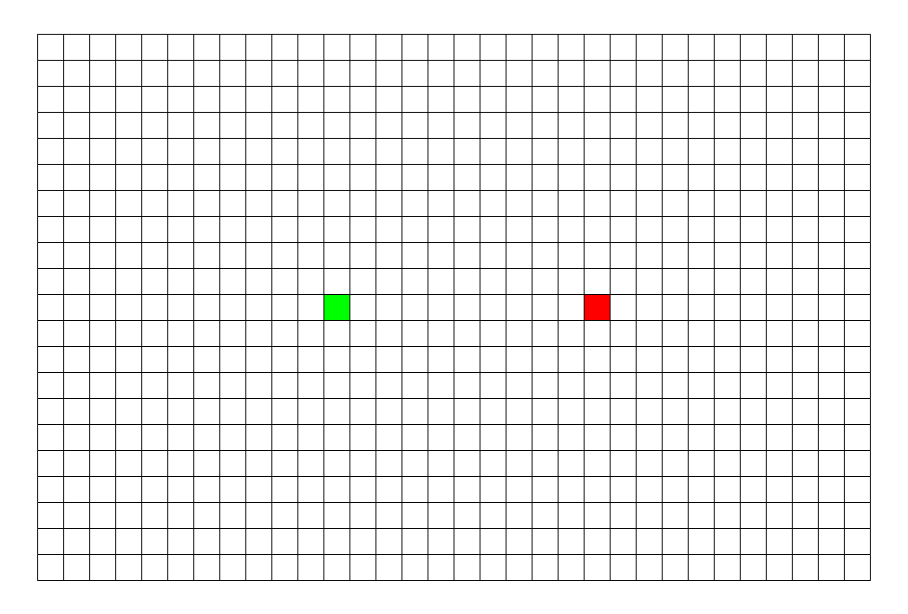
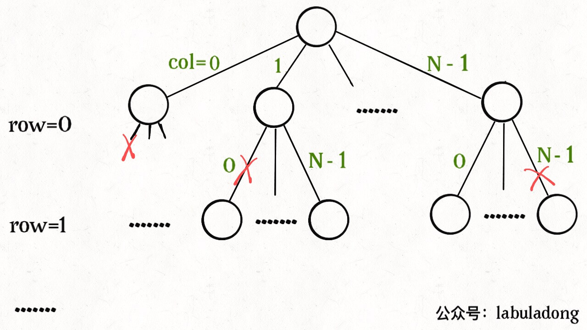

## 最基础的数据结构

- 数组：连续空间，索引访问，所以扩容是个问题，影响性能，最好一次分配好内存，增加和删除需要挪动内存慢，但查找和替换速度快 O(1)
- 链表：不连续空间，通过指针访问元素，所以扩容方便，增加，删除 O(1), 查找替换慢些
- 其他数据结构都是基于上面两种结构实现的
  - 队列，栈，图，散列表，树，堆（完全二叉树）

## 基本数据结构的遍历

- 数组遍历

```javascript
function arrTraverse(arr) {
  for (const [item, index] of arr) {
    // 迭代访问元素
  }
}
```

- 链表遍历

```javascript
class ListNode {
  constructor(val, nextNode) {
    this.val = val;
    this.next = nextNode;
  }
}
function listNodeTraverse(head) {
  while (head) {
    console.log(head.val);
    head = head.next;
  }
}
function listNodeTraverseRecursion(head) {
  if (head) console.log(head.val);
  listNodeTraverseRecursion(head.next);
}
```

- 二叉树遍历

```javascript
function binaryTreeTraverse(root) {
  // 前序遍历
  if (root) console.log(root.val);
  binaryTreeTraverse(root.left);
  // 中序遍历
  if (root) console.log(root.val);
  binaryTreeTraverse(root.right);
  // 后序遍历
  if (root) console.log(root.val);
}
```

- 多叉树遍历，图的遍历,图是可能出现环的？这个很好办，用个布尔数组 visited 做标记就行了

```javascript
function treeTraverse(root) {
  if (root) console.log(root.val);
  for (const child of root.childs) {
    treeTraverse(child);
  }
}
```

## 动态规划详解

- 一般是求最值
- 核心就是穷尽得到最值
- 一定存在重叠子问题，通过备忘录或者 dp Table 来优化，实际就是通过缓存（一维，二维，三维等数组）避免重复计算
- 一定有最优子结构，通过子问题最值得到目标最值
- 需要列出正确的状态转移方程
- 明确 base case -> 明确「状态」-> 明确「选择」 -> 定义 dp 数组/函数的含义。

```javascript
// 初始化 base case
dp[0][0][...] = base
// 进行状态转移
for 状态1 in 状态1的所有取值：
    for 状态2 in 状态2的所有取值：
        for ...
            dp[状态1][状态2][...] = 求最值(选择1，选择2...)
```

- 找零钱问题(给你 k 种面值的硬币，面值分别为 c1, c2 ... ck，每种硬币的数量无限，再给一个总金额 amount，问你最少需要几枚硬币凑出这个金额，如果不可能凑出，算法返回 -1 )

```python
def coinChange(coins: List[int], amount: int):
    # 备忘录
    memo = dict()
    def dp(n):
        # 查备忘录，避免重复计算
        if n in memo: return memo[n]
        # base case
        if n == 0: return 0
        if n < 0: return -1
        res = float('INF')
        for coin in coins:
            subproblem = dp(n - coin)
            if subproblem == -1: continue
            res = min(res, 1 + subproblem)

        # 记入备忘录
        memo[n] = res if res != float('INF') else -1
        return memo[n]

    return dp(amount)
```

```java
int coinChange(vector<int>& coins, int amount) {
    // 数组大小为 amount + 1，初始值也为 amount + 1
    vector<int> dp(amount + 1, amount + 1);
    // base case
    dp[0] = 0;
    // 外层 for 循环在遍历所有状态的所有取值
    for (int i = 0; i < dp.size(); i++) {
        // 内层 for 循环在求所有选择的最小值
        for (int coin : coins) {
            // 子问题无解，跳过
            if (i - coin < 0) continue;
            dp[i] = min(dp[i], 1 + dp[i - coin]);
        }
    }
    return (dp[amount] == amount + 1) ? -1 : dp[amount];
}
```

## DFS（深度优先搜索）和 BFS（广度优先搜索）

- 深度优先搜索算法（Depth-First-Search，缩写为 DFS），是一种利用递归实现的搜索算法。简单来说，其搜索过程和 “不撞南墙不回头” 类似。
- 广度优先搜索算法（Breadth-First-Search，缩写为 BFS），是一种利用队列实现的搜索算法。简单来说，其搜索过程和 “湖面丢进一块石头激起层层涟漪” 类似。
- BFS 的重点在于队列，而 DFS 的重点在于递归。这是它们的本质区别。
  
- 如上图所示，从起点出发，对于每次出队列的点，都要遍历其四周的点。所以说 BFS 的搜索过程和 “湖面丢进一块石头激起层层涟漪” 很相似，此即 “广度优先搜索算法” 中“广度”的由来。
  
- 如上图所示，从起点出发，先把一个方向的点都遍历完才会改变方向...... 所以说，DFS 的搜索过程和 “不撞南墙不回头” 很相似，此即 “深度优先搜索算法” 中“深度”的由来。

## 回溯算法解题套路框架

- 回溯算法其实就是我们常说的 DFS(深度优先搜索) 算法，本质上就是一种暴力穷举算法。
- 解决一个回溯问题，实际上就是一个决策树的遍历过程
  - 1、路径：也就是已经做出的选择。
  - 2、选择列表：也就是你当前可以做的选择。
  - 3、结束条件：也就是到达决策树底层，无法再做选择的条件。
- 其核心就是 for 循环里面的递归，在递归调用之前「做选择」，在递归调用之后「撤销选择」

```python
# 回溯算法的框架
result = []
def backtrack(路径, 选择列表):
    if 满足结束条件:
        result.add(路径)
        return

    for 选择 in 选择列表:
      # 将该选择从选择列表移除
        做选择
        路径.add(选择)
        backtrack(路径, 选择列表)
        #将该选择再加入选择列表
        撤销选择
        路径.remove(选择)
```

### 全排列问题

- 但是必须说明的是，不管怎么优化，都符合回溯框架，而且时间复杂度都不可能低于 O(N!)，因为穷举整棵决策树是无法避免的。这也是回溯算法的一个特点，不像动态规划存在重叠子问题可以优化，回溯算法就是纯暴力穷举，复杂度一般都很高。
- [1,2,3]的全排列
- [3] 就是「路径」，记录你已经做过的选择；[1,2] 就是「选择列表」，表示你当前可以做出的选择；「结束条件」就是遍历到树的底层，在这里就是选择列表为空的时候。
- 我们定义的 backtrack 函数其实就像一个指针，在这棵树上游走，同时要正确维护每个节点的属性，每当走到树的底层，其「路径」就是一个全排列。
   

```java
void traverse(TreeNode root) {
    for (TreeNode child : root.childern)
        // 前序遍历需要的操作
        traverse(child);
        // 后序遍历需要的操作
}
```


- 前序遍历的代码在进入某一个节点之前的那个时间点执行，后序遍历代码在离开某个节点之后的那个时间点执行。
- 回想我们刚才说的，「路径」和「选择」是每个节点的属性，函数在树上游走要正确维护节点的属性，那么就要在这两个特殊时间点搞点动作：
  

### N 皇后问题



```java
vector<vector<string>> res;

/* 输入棋盘边长 n，返回所有合法的放置 */
vector<vector<string>> solveNQueens(int n) {
    // '.' 表示空，'Q' 表示皇后，初始化空棋盘。
    vector<string> board(n, string(n, '.'));
    backtrack(board, 0);
    return res;
}

// 路径：board 中小于 row 的那些行都已经成功放置了皇后
// 选择列表：第 row 行的所有列都是放置皇后的选择
// 结束条件：row 超过 board 的最后一行
void backtrack(vector<string>& board, int row) {
    // 触发结束条件
    if (row == board.size()) {
        res.push_back(board);
        return;
        // 如果只需要得到一个答案的话
        // return true
    }

    int n = board[row].size();
    for (int col = 0; col < n; col++) {
        // 排除不合法选择
        if (!isValid(board, row, col))
            continue;
        // 做选择
        board[row][col] = 'Q';
        // 进入下一行决策
        backtrack(board, row + 1);
        // 如果只需要得到一个答案的话
        //  if (backtrack(board, row + 1))
        //     return true;
        // 撤销选择
        board[row][col] = '.';
    }
    // 如果只需要得到一个答案的话
    // return false
}
/* 是否可以在 board[row][col] 放置皇后？ */
bool isValid(vector<string>& board, int row, int col) {
    int n = board.size();
    // 检查列是否有皇后互相冲突
    for (int i = 0; i < n; i++) {
        if (board[i][col] == 'Q')
            return false;
    }
    // 检查右上方是否有皇后互相冲突
    for (int i = row - 1, j = col + 1;
            i >= 0 && j < n; i--, j++) {
        if (board[i][j] == 'Q')
            return false;
    }
    // 检查左上方是否有皇后互相冲突
    for (int i = row - 1, j = col - 1;
            i >= 0 && j >= 0; i--, j--) {
        if (board[i][j] == 'Q')
            return false;
    }
    return true;
}
```

## leetcode 题目

- 求二叉树中最大路径和

```javascript
function binaryTreeMaxSum(root) {
  let ans = Number.MIN_SAFE_INTEGER;
  function _temp(node) {
    if (!node) return 0;
    let left = _temp(node.left);
    let right = _temp(node.right);
    ans = Math.max(left, right);
    return node.val > 0 ? ans + node.val : ans;
  }
}
```

- 前序遍历和中序遍历还原一颗二叉树，还原二叉树

```javascript
function buildTree(preorder, preStart, preEnd, inorder, inStart, inEnd, inMap) {
  if (preStart > preEnd || inStart > inEnd) return null;

  let root = new TreeNode(preorder[preStart]);
  inRoot = inMap.get(root.val);
  numsLeft = inRoot - inStart;

  root.left = buildTree(
    preorder,
    preStart + 1,
    preStart + numsLeft,
    inorder,
    inStart,
    inRoot - 1,
    inMap
  );
  root.right = buildTree(
    preorder,
    preStart + numsLeft + 1,
    preEnd,
    inorder,
    inRoot + 1,
    inEnd,
    inMap
  );
  return root;
}
```

-
