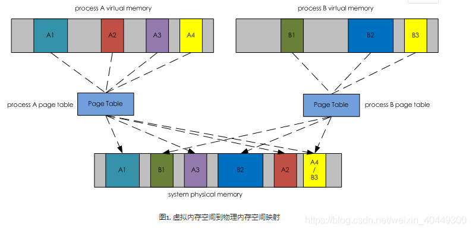
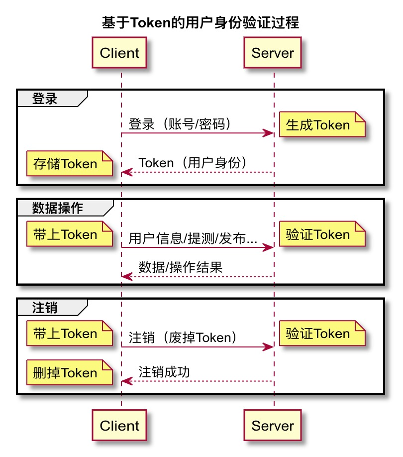
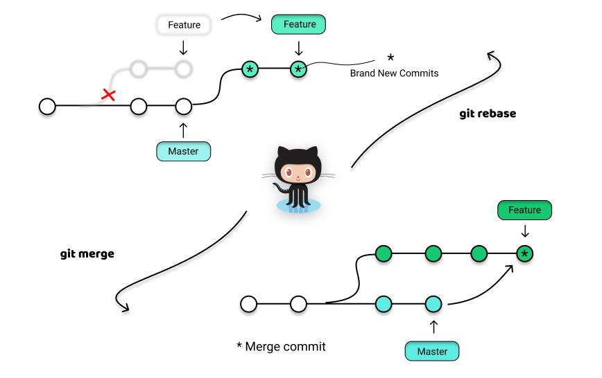
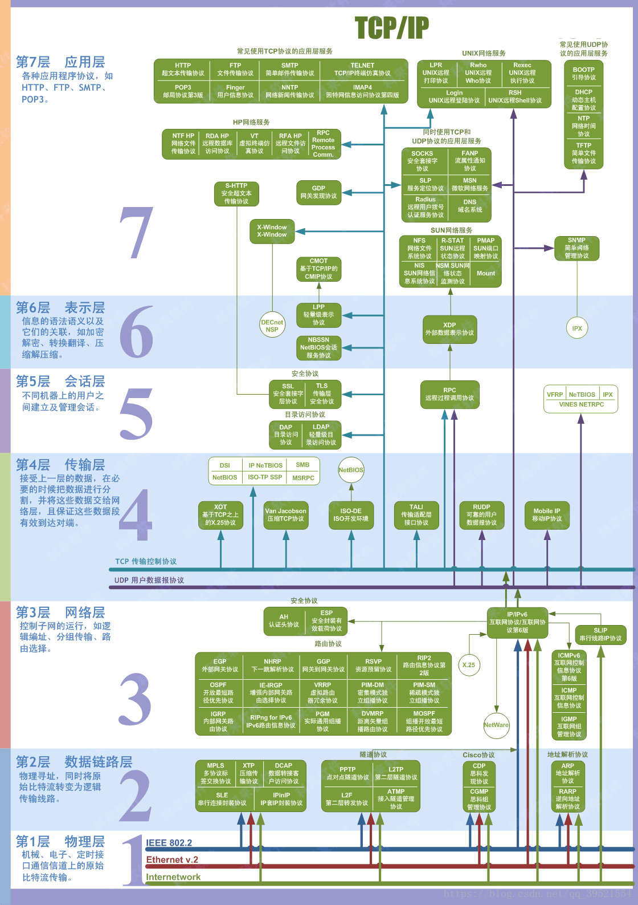
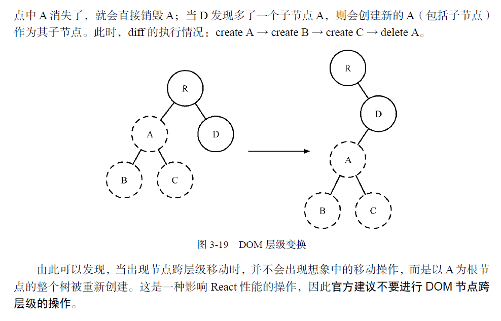
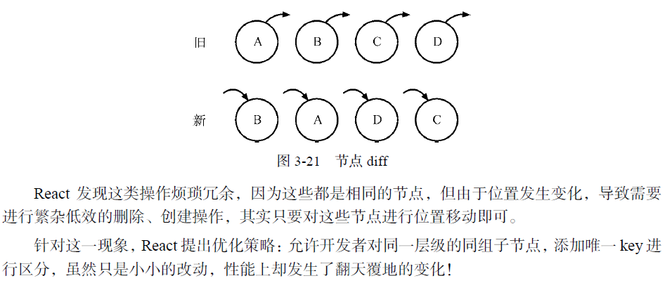
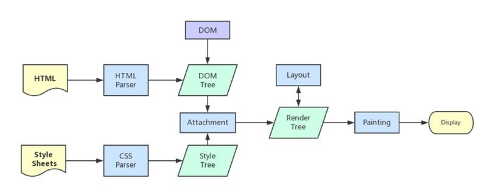

#### 单线程，多线程
- 多线程创建线程和线程上下文切换开销比较大
- 多线程有锁和状态同步的问题
- 多线程在多核cpu有优势
- 单线程顺序执行符合人类思维方式
- 单线程会阻塞等待，I/O和cpu速度差异大
- javascript单线程异步I/O, 避免锁和状态同步问题，同时不阻塞

#### [react，vue优缺点, vue和react区别](https://www.jianshu.com/p/2781cb61d2d0)
- [vue3特性](https://naotu.baidu.com/file/9506ac745baf842d4bd035ccf367ab22)
- [function component react](https://naotu.baidu.com/file/6fbeceb3ca8df372642f45ab1455b5d4)
- vue3新特性
  - 

#### 单向数据流动优点
- 可以把逻辑和展示UI分离开，更利于组件化管理，复用性更强，写出更健壮的，维护性，扩展性更强的代码

#### react中跨级通信
- props一级一级传递
- this.context对象
- 事件订阅
- redux

#### vuex使用
- state, getter(对state进行处理，类似redux中的reselector), mutation,action,module
- mapStates,mapGetters, mapActions
- import { createNamespacedHelpers } from 'vuex'
- new Vue({ store, router }) 
- 表单双向绑定v-model
```javascript
computed: {
  message: {
    get () {
      return this.$store.state.obj.message
    },
    set (value) {
      this.$store.commit('updateMessage', value)
    }
  }
}
```

#### vue router使用
- 嵌套路由<router-view></router-view>
- 路由跳转，router-link
- 路由重定向redirect，有别名
- 路由参数$route.params.id, 配置props解耦，URL /search?q=vue 会将 {query: 'vue'}
- 导航守卫有一些钩子
- 路由变化，通过watch获取服务器数据
- 滚动位置，scrollBehavior 
- 通过import方式动态加载路由
```javascript
const Foo = () => import(/* webpackChunkName: "group-foo" */ './Foo.vue')
const Bar = () => import(/* webpackChunkName: "group-foo" */ './Bar.vue')
const Baz = () => import(/* webpackChunkName: "group-foo" */ './Baz.vue')
```
```javascript
const router = new VueRouter({
  routes: [
    { path: '/user/:id', component: User, props: true },

    // 对于包含命名视图的路由，你必须分别为每个命名视图添加 `props` 选项：
    {
      path: '/user/:id',
      components: { default: User, sidebar: Sidebar },
      props: { default: true, sidebar: false }
    }
  ]
})
```
- router.push, replace, go
```javascript
[
  { 
    path: "/user/:id", // params
    role: "admin",
    component: user,
    children: [
      {
        path: "childuser/:cid",
        component: childuser
      },...
    ]
  }  
]

```

#### [http报文结构图解](https://blog.csdn.net/Joven0/article/details/48093899)


#### hr面，大概30min。 
#### 自我介绍， 
#### 项目经历， 
#### 说一下项目中的难点和解决， 
#### 从项目中学习到了什么， 
#### 平时朋友同学怎么评价你， 
#### 自我评价，说说优缺点， 
#### 目前有哪些offer， 
#### 这些公司里面，你的排序是怎样的，说下特点， 
#### 还有投递哪些公司，公司的流程到哪一阶段了，说下特点， 
#### 预期薪资是多少， 
#### 有没有亲属在腾讯， 
#### 你喜欢怎么样的mentor， 
#### 如何去适应校园到公司的节奏， 
#### 如果你入职之后一段时间发现不喜欢这个工作会怎么办。 
#### 希望能顺利，还是去很想留在深圳的

#### js有哪些特性？与node.js的区别
- javascript是弱类型，单线程异步i/o语言
- javascript依赖浏览器宿主环境，需要浏览器中javascript解析器，可以反问BOM，DOM等
- nodejs是基于v8引擎的javascript运行平台
- nodejs应用于服务器端运行语言，可以反问本地资源
#### [为什么http是无连接的](http://xieli.leanote.com/post/6.HTTP%E6%98%AF%E5%9F%BA%E4%BA%8ETCP%E7%9A%84%EF%BC%8C%E4%B8%BA%E4%BB%80%E4%B9%88%E6%98%AF%E6%97%A0%E7%8A%B6%E6%80%81%EF%BC%9F)
- 因为HTTP是短连接，即每次“请求-响应”都是一次TCP连接。比如用户一次请求就是一次TCP连接，服务器响应结束后断开连接。而每次TCP连接是没有关联的，因此HTTP是无状态的。如果想要使得每次TCP连接之间有关联，服务器和浏览器就得存储相关的信息，这个就是Cookie和Session的作用。
- 虽然HTTP 1.1为了效率，支持了keep-alive，但是这个keep-alive是有时间限制的。这个时间可以通过设置HTTP进程的配置文件来修改，这个时间很短，是以秒来计算的，例如10秒。因此在这10秒内的HTTP请求是使用同一个TCP连接，但是10秒后又重新进行连接。这个时间可以被认为是无状态的。例如那个购物的例子，不可能10s内的HTTP请求无需密码来验证，首先这个时间很短，并且还得记录每次HTTP请求的时间是否在10秒内，这样记录的方式和Session又有什么区别。
- keep-alive一个tcp可以发送多个http请求，只是不能同时使用，但http2可以，因为有多路复用
- chrome浏览器对同一域名允许并行6个tcp连接，可使用多域名加载多图片
#### 如果没有tcp，http请求会是怎样的
- http是基于tcp连接的，没有tcp，目前是无法使用吧，http3是基于udp的
#### 移动端页面有一万张图片，如何保证不卡顿
- 默认使用loading图片，到可视区域切换成真实到图片，非可视区域切换回loading图片
#### 函数的节流和防抖
- 节流是必须间隔一段时间，防抖是清空上一个定时器执行最新定时器
#### 作用域链，有什么方法可以反过来（with）
#### [异步任务的两个队列](https://beta.segmentfault.com/a/1190000011198232)

#### 10个宏任务，10个微任务，执行顺序是什么
#### 什么是跨域
- 协议，域名，端口，jsop，cors
#### 判断一个对象是对象、数组、函数
- Object.prototype.toString.call()
#### Object.prototype.toString.call()和toString()的区别
- 返回[object type],而toString则返回各个类型重写后到返回值
#### url是什么格式的
- 协议: //域名：端口/路径？参数#hash
#### 原型和原型链之间的关系
#### instanceof的原理
- instanceof 运算符用于检测构造函数的 prototype 属性是否出现在某个实例对象的原型链上

#### 数组的join方法，不传参数是什么
- 默认是逗号隔开
#### click事件在移动端有延迟，延迟多少毫米，为什么会出现这个问题
- 苹果需要判断双击事件，300ms，使用fastclick


#### 无序数组中求不相邻元素组成的子集的最大和, 比如 1 3 5 7 就是3+7=10
```javascript
// 本质 dp[i] = Math.max(dp[i-1], dp[i-2]+arr[i])
function sumTopN(arr){
  if(!Array.isArray(arr)){
    throw new Error('arguments arr is not array')
  }
  if(arr.length === 0){
    return -1
  }
  if(arr.length === 1){
    return arr[0]
  }
  if(arr.length === 2){
    return Math.max(arr[0], arr[1])
  }
  // 使用循环解题
  // let prev2 = arr[0]
  // let prev1 = Math.max(arr[0], arr[1])
  // let result = 0;
  // for (let index = 2; index < arr.length; index++) {
  //   const element = arr[index];
  //   result = Math.max(prev1, prev2+element)
  //   prev2 = prev1
  //   prev1 = result
  // }
  // return result

  // 使用递归
  return Math.max(sumTopN(arr.slice(0,arr.length-1)), sumTopN(arr.slice(0,arr.length-2))+arr[arr.length-1])
}
```
#### 将从小到大的有序数组循环左移未知次，找到左移后数组最小值, 比如 1234=》 4312，找到1
```javascript
    // 将从小到大的有序数组循环左移未知次，找到左移后数组最小值, 比如 1234=》 4312，找到1
    // 二分法查找
    function findMin(arr){
      let left = 0;
      let right = arr.length-1
      while (left<right) {
        let mid = left + Math.ceil((right-left)/2)
        if(arr[mid]<arr[right]){
          // 右边升序，则最小值在左边
          right = mid
        } else if(arr[mid]>arr[right]){
          // 左侧升序，则最小值在右侧
          left = mid + 1
        } else{
          // 相等则丢弃最后一个元素
          right--
        }
      }
      return arr[left]
    }
    console.log(findMin([1,3,5]), findMin([4,3,1,2]),findMin([4,5,1,2,3]),findMin([2,2,2,0,1]),findMin([3,3,3,0,2,2,2,3]))
```


#### 介绍一下自己的项目
#### git的reset和revert有什么区别。
- git revert是用一次新的commit来回滚之前的commit，git reset是直接删除指定的commit
#### vue的底层了解吗
#### 现在有一个宽高未知的父布局，以及一个未知宽高的子布局，实现水平垂直居中
- 参考middle-center.html, 绝对定位+transform: translate(-50%,-50%)实现， table-cell，flex，grid
#### hashmap的底层
- 根据key生成hashcode，来决定值存储的位置，不同的key可能产生相同的hashcode，即发生了碰撞
#### hashmap发生碰撞怎么解决？
- 散列表要解决的一个问题就是散列值的冲突问题，通常是两种方法：链表法和开放地址法。
  - 链表法就是将相同hash值的对象组织成一个链表放在hash值对应的槽位；
  - 开放地址法是通过一个探测算法，当某个槽位已经被占据的情况下继续查找下一个可以使用的槽位。
#### [思维题，1000瓶水，一瓶有毒。10只老鼠，喝到有毒的一小时以后会死，问如何在1小时找出哪瓶有毒。](https://blog.csdn.net/lwj734114646/article/details/12076271?utm_medium=distribute.pc_relevant.none-task-blog-title-1&spm=1001.2101.3001.4242)
- 1000瓶水用二进制编号，10位足矣
- 第一只老鼠喝第一位为0的所有水，第二只喝第二位为0的所有水，依次类推。。。
- if(如果第i只老鼠死了) 则让 water[第i位1的水的编号]的值-1. 
  else 则让 water[第i位1的水的编号]的值+1.  
  然后找出wanrer[0]--water[999] 中 的最小数water[i]，
  if(water[i] <0) 即为 第 i 瓶水有毒    else 为第0瓶水有毒。

#### 2、null和undefined
- undefined 的字面意思就是：未定义的值，undefined 一般都来自于某个表达式最原始的状态值，不是人为操作的结果
  - 声明了一个变量，但没有赋值
  - 访问对象上不存在的属性 
  - 函数定义了形参，但没有传递实参
  - 使用 void 对表达式求值
- null 的字面意思是：空值  。这个值的语义是，希望表示 一个对象被人为的重置为空对象，而非一个变量最原始的状态 。 在内存里的表示就是，栈中的变量没有指向堆中的内存对象，null则内存会被回收
- 虽然 undefined 和 null 的语义和场景不同，但总而言之，它们都表示的是一个无效的值。

#### [7、哪些方式有利于SEO](https://juejin.im/post/6844903824428105735)
- 搜索引擎的工作原理就是搜集关键字，所以优化的关键就是要让这些搜索引擎理解你这个网页
- 对网站的标题、关键字、描述精心设置，反映网站的定位，让搜索引擎明白网站是做什么的title、meta description和meta keywords
- 网站内容优化：内容与关键字的对应，增加关键字的密度
- 网页布局语义化，尽量扁平
- 在网站上合理设置Robot.txt文件
- 生成针对搜索引擎友好的网站地图，面包屑导航
- 增加外部链接，到各个网站上宣传
- 导航优化，尽量文字导航，img有title和alt属性
- 控制页面大小，最好不要超过100kb，否则爬虫超时也会离开, 减少http请求，外联静态资源，利用缓存，cdn，gzip等等手段
- 单页应用可以使用服务器端渲染，这样利于seo
#### 8、跨页面通信的方法
- [如果是多页应用](https://juejin.im/post/6844903495636615176)
  - url传参数，cookie，localstorage，sessionStorage, indexDB，postMessage, BroadcastChannel，SharedWorker，通过服务器保存数据(Websocket)
- 如果是单页应用的话
  - 上面多页应用的都可以，同时可以使用props传值，事件总线，vuex，redux
#### 10、项目中遇到的困难，如何解决
- 网签项目，应用了第三方组件，只支持标准都html，不支持vue组件，但是我们的UI组件需要展示一个写好的留言板vue组件和一个调用它们标注组件，
所以最后的方案是标注组件UI我们用vue实现，但是功能调用它们的内部API，同时因为样式也要自定义，按我们的需求来，所以就在它们外层包裹了一层class，
BEM方式防止重复，用层级样式重写它
- 还有就是签批人：签名框=1:n， 选中状态同步，人有哪些签名框及签名框是谁的，签批人在我们组件，签名框在它们组件，所以通信使用事件总线，
还有要求它们签名框支持自定义属性，这样不仅可以存储签名框属于哪个签批人，还能标注签名框类型，或者以后其他扩展功能
- 还有就是发现它们的控件单击后不响应右键事件，只能天天粘着他们的工程师解决这个bug

#### [介绍虚拟内存](https://baike.baidu.com/item/%E8%99%9A%E6%8B%9F%E5%86%85%E5%AD%98)
- 内存在计算机中的作用很大，电脑中所有运行的程序都需要经过内存来执行，如果执行的程序很大或很多，就会导致内存消耗殆尽
- windows有虚拟内存技术，当ram不够或运行慢时，数据从ram-》虚拟内存中（页面文件）


#### [项目中的登录注册如何实现的](https://www.cnblogs.com/fengzheng/p/8416393.html)
- Cookie-Session 认证
早期互联网以 web 为主，客户端是浏览器，所以 Cookie-Session 方式最那时候最常用的方式，直到现在，一些 web 网站依然用这种方式做认证。

  - 认证过程大致如下：
    - 用户输入用户名、密码或者用短信验证码方式登录系统；
    - 服务端验证后，创建一个 Session 信息，并且将 SessionID 存到 cookie，发送回浏览器；
    - 下次客户端再发起请求，自动带上 cookie 信息，服务端通过 cookie 获取 Session 信息进行校验；
  - 弊端
    - 只能在 web 场景下使用，如果是 APP 中，不能使用 cookie 的情况下就不能用了；
    - 即使能在 web 场景下使用，也要考虑跨域问题，因为 cookie 不能跨域；
    - cookie 存在 CSRF（跨站请求伪造）的风险；
    - 如果是分布式服务，需要考虑 Session 同步问题；
- Cookie-Session 改造版, 由于传统的 Cookie-Session 认证存在诸多问题，可以把上面的方案改造一下。改动的地方如下：
  - 不用 cookie 做客户端存储，改用其他方式，web 下使用 local storage，APP 中使用客户端数据库，这样就实现了跨域，并且避免了 CSRF ;
  - 服务端也不存 Session 了，把 Session 信息拿出来存到 Redis 等内存数据库中，这样即提高了速度，又避免了 Session 同步问题；
- 经过改造之后变成了如下的认证过程：
  - 用户输入用户名、密码或者用短信验证码方式登录系统；
  - 服务端经过验证，将认证信息构造好的数据结构存储到 Redis 中，并将 key 值返回给客户端；
  - 客户端拿到返回的 key，存储到 local storage 或本地数据库；
  - 下次客户端再次请求，把 key 值附加到 header 或者 请求体中；
  - 服务端根据获取的 key，到 Redis 中获取认证信息；



#### [session和cookie机制了解过嘛](https://segmentfault.com/a/1190000017831088)
- session是服务器存储信息的会话，而sessionid一般存储在cookie中（也可以存储在url中），sessionid标识一个客户端 
#### 那么其中token这种方***有什么问题呢？
- HTTP协议是无状态的，这种无状态意味着程序需要验证每一次请求，从而辨别客户端的身份。
- cookie存储在客户端，session存储在服务器端，但sessionid（标识客户端）是存储在cookie中的
- token的优点
  - 无状态、可扩展，支持移动设备不需要cookie支持，可跨域，无csrf问题
  - 不通过cookie中的token验证，而是通过http头或者请求参数验证，这样就没有csrf
  - token一般有一个有效期，比如10分钟，需要避免重复登录的话可以使用Refresh Token获取一个新的token
- 为了确保数据通信安全，必须加密通信，而不是明文通信，比如https
- 为了确保数据不被篡改，必须使用数字签名
  - 对元数据做hash摘要，摘要+秘钥加密参数数字证书（可以使用对称和非对称加密算法）
    - 对称加密使用同一个秘钥，加解密速度快，传输保存不安全，管理麻烦，【DES，AES】
    - 非对称，是一对秘钥，公钥私钥，都可以用于加解密，但公钥长，一般用于解密，速度慢，公钥传输不安全【RSA，ECC】
    - https传输对称加密秘钥使用非对称加密的方式
- DNS劫持及防御
  - 在域名映射成ip的过程中被指向一个恶意ip
  - 区域传输用tcp(面向连接，可靠)，客户端请求用udp（非连接，开销少）
  - 通过http请求域名ip（app上使用）
  - dns-over-https加密传输防止被劫持
  - 投诉，要求放开劫持
  - [缓存设置短一些，切换到其他dns服务商，甚至自己建设dns](https://www.dns.com/supports/675.html)
    - DNS云加速覆盖国内6大主要运营商以及31个省份及地区的10w＋加速节点，模拟普通用户上网请求不间断的向运营商DNS服务器发起主动查询推送请求，从而让运营商的DNS服务器一直拥有准确的域名解析记录，保障国内绝大部分地区的运营商DNS服务器都能响应准确的解析结果，这样当真实的用户进行访问的时候就能获取到真实准确的地址了，能够有效从而降低DNS被劫持的风险。
- 防止重放攻击
  - 首先使用数字签名防止数据被篡改
  - 其次通过timeStamp验证是否在有效期内，比如1分钟，支付请求的参数都是从支付供应商实时获取的，整个流程请求肯定不会超过1分钟吧，不在有效期内直接报错非法请求
  - 如果在1分钟内，则去验证nonce随机数，比如到radis内存中看看是不是存在，存在则表示是一个重复请求，报错，否则合法请求，然后radis配置策略nonce过期时间时1分钟，防止无限制浪费内存
#### 这两个字符串有什么不同？ let a ='123'; let b =newString();
- 字面量方式声明，不可变值，typeof返回string
- 构造函数声明创建的一个对象，typeof返回object
- Object.prototype.toString.call(a|b)都返回[object String]
- 字面量上执行操作，比如获取长度，访问属性，会隐式转换成String对象

#### 组件封装，组件设计原则
- 高内聚，内耦合，可复用，组合，职责划分清晰
- 列出组件的层次结构，props，state，method等，清楚整个架构，便于职责划分，清晰整个组件的关系
- 扁平的，面向数据的 state/props，尽量不要嵌套数据结构（省得不断使用展开运算符）
- 辅助代码分离，提炼公共代码，比如配置，假数据，utils函数（ajax，本地存储方法等等）
- 公共部分分成很多小模块，然后组合使用
- 集中/统一的状态管理
- 一个组件最好只做一件事，参数通过props传入
- 分为容器（逻辑）组件和展示组件，有状态【Stateful】和 无状态【Stateless】，这样扩展性和维护性更好
#### 你知道主流框架的区别吗？vue和react区别
- 相似之处
  - 使用 Virtual DOM
  - 提供了响应式 (Reactive) 和组件化 (Composable) 的视图组件。
  - 将注意力集中保持在核心库，而将其他功能如路由和全局状态管理交给相关的库。
- react
  - immutable+jsx
  - 函数式，数据不可变，单向数据流
- vue
  - mutable+template
  - 双向数据绑定的mvvm框架
  - 数据劫持&发布-订阅模式的方式
  - 声明式的指令
#### [微软的vs有一个叫依赖注入的，对这个怎么理解的？](https://juejin.im/post/6844903699249102861)
- 依赖注入就是为了解决模块之间的耦合的，被依赖的模块可以动态注入模块
- 比如requirejs AMD
```javascript
const injector = {
  dependencies: {},
  register: function(key, val){
    this.dependencies[key] = val
  },
  resolve: function(deps, func, scope){
    let depArgs = []
    deps.forEach(dep=>{
      depArgs.push(this.dependencies[dep])
    })
    scope = scope || {}
    return function(...args){
      return func.apply(scope, depArgs.concat(args))
    }
  }
}

injector.register('a', function(){ console.log('a') })
injector.register('b', function(){console.log('b')})
const doSomething = injector.resolve(['a','b'], function(a,b,others){
  a();
  b();
  console.log(others)
})
doSomething('others')

```
#### [es6模块化介绍](https://developer.mozilla.org/zh-CN/docs/Web/JavaScript/Guide/Modules)
- es6模块化是基于文件的，一个文件一个模块
- 在最高层export，同时无法在全局中范围到，除非你自己绑定到window对象上，但这样有耦合
- import不仅可以静态导入，也可以作为import函数动态导入
- 可以通过export将多个模块合并到一个模块再导出
- 现在浏览器都原生支持import，export，.mjs作为后缀
- 入口使用 script type="module" 导入，也可以脚步内部导入script type="module" //include script here /script.
- 可以使用as重命名导出与导入，可以导出变量，函数，类
-  .mjs 后缀的文件需要以 MIME-type 为 javascript/esm 来加载(或者其他的JavaScript 兼容的 MIME-type ，比如 application/javascript), 否则，你会一个严格的 MIME 类型检查错误，像是这样的 "The server responded with a non-JavaScript MIME type"
-  如果你尝试用本地文件加载HTML 文件 (i.e. with a file:// URL), 由于JavaScript 模块的安全性要求，你会遇到CORS 错误。你需要通过服务器来做你的测试。GitHub pages is ideal as it also serves .mjs files with the correct MIME type.
#### [es6了解过吗？模块化是怎么实现的？怎么做到变量名之间互不干扰就是模块之间如何保证互不影响，模块化是怎么做到的？](https://juejin.im/post/6844904159385239566)
- 所有导出的模块都统一由installedModules对象管理，路径作为key值，对象包括moduleId，isLoaded(是否加载)，exports(需要导出的变量，函数，类等)
- 通过installedModules[key]判断，防止循环依赖加载
- import时得到的是installedModules[key].exports
```javascript
// 1. 是一个立即执行函数
(function (modules) {
  var installedModules = {};
  // 4. 处理入口文件模块
  function __webpack_require__(moduleId) {
    if (installedModules[moduleId]) {
      return installedModules[moduleId].exports;
    }
    // 5. 创建一个模块
    var module = installedModules[moduleId] = {
      i: moduleId,
      l: false,
      exports: {}
    };
    // 6. 执行入口文件模块函数
    modules[moduleId].call(module.exports, module, module.exports, __webpack_require__);
    module.l = true;
    // 7. 返回
    return module.exports;
  }
  __webpack_require__.d = function (exports, name, getter) {
    if (!__webpack_require__.o(exports, name)) { // 判断name是不是exports自己的属性
      Object.defineProperty(exports, name, {enumerable: true, get: getter});
    }
  };
  __webpack_require__.r = function (exports) {
    if (typeof Symbol !== 'undefined' && Symbol.toStringTag) {
      // Symbol.toStringTag作为对象的属性，值表示这个对象的自定义类型 [Object Module]
      // 通常只作为Object.prototype.toString()的返回值
      Object.defineProperty(exports, Symbol.toStringTag, {value: 'Module'});
    }
    Object.defineProperty(exports, '__esModule', {value: true});
  };
  __webpack_require__.o = function (object, property) {
    return Object.prototype.hasOwnProperty.call(object, property);
  };
  // 3. 传入入口文件id
  return __webpack_require__(__webpack_require__.s = "./index.js");
})({ // 2. 模块对象作为参数传入
  "./index.js":
    (function (module, __webpack_exports__, __webpack_require__) {
      // __webpack_exports__就是module.exports
      "use strict";
      // 添加了__esModule和Symbol.toStringTag属性
      __webpack_require__.r(__webpack_exports__);
      var _module1__WEBPACK_IMPORTED_MODULE_0__ = __webpack_require__("./module1.js");
      console.log(_module1__WEBPACK_IMPORTED_MODULE_0__["m"])
    }),

  "./module1.js":
    (function (module, __webpack_exports__, __webpack_require__) {
      "use strict";
      __webpack_require__.r(__webpack_exports__);
      // 把m/n这些变量添加到module.exports中，并设置getter为直接返回值
      __webpack_require__.d(__webpack_exports__, "m", function () {return m;});
      __webpack_require__.d(__webpack_exports__, "n", function () {return n;});
      var m = 1;
      var n = 2;
    })
});

```
#### react如果更新上级节点，所有子级节点都会更新，要怎么去处理？
- 使用shouldComponentUpdate，最直接也是最有风险的方式，很容易出现不可预知的bug
```javascript
class CounterButton extends React.Component {
  constructor(props) {
    super(props);
    this.state = {count: 1};
  }
  shouldComponentUpdate(nextProps, nextState) {
    if (this.props.color !== nextProps.color) {
      return true;
    }
    if (this.state.count !== nextState.count) {
      return true;
    }
    return false;
  }

  render() {
    return (
      <button
        color={this.props.color}
        onClick={() => this.setState(state => ({count: state.count + 1}))}>
        Count: {this.state.count}
      </button>
    );
  }
}
```
- 使用PureComponent， React.memo 等效于 PureComponent
- 使用react.memo缓存，它会对props进行浅比较, 如果需要自定义比较，可以传入第二个函数自己处理
```javascript
const Button = React.memo((props) => {
  // 你的组件
});
```
- 使用useMemo
```javascript
const memoizedValue = useMemo(() => computeExpensiveValue(a, b), [a, b]);
function Parent({ a, b }) {
  // Only re-rendered if `a` changes:
  const child1 = useMemo(() => <Child1 a={a} />, [a]);
  // Only re-rendered if `b` changes:
  const child2 = useMemo(() => <Child2 b={b} />, [b]);
  return (
    <>
      {child1}
      {child2}
    </>
  )
}
```
#### 对web性能安全有什么了解吗？（主要说了xss和csrf）
- 数字签名防止篡改
- 防止重放攻击
  - 首先使用数字签名防止数据被篡改
  - 其次通过timeStamp验证是否在有效期内，比如1分钟，支付请求的参数都是从支付供应商实时获取的，整个流程请求肯定不会超过1分钟吧，不在有效期内直接报错非法请求
  - 如果在1分钟内，则去验证nonce随机数，比如到radis内存中看看是不是存在，存在则表示是一个重复请求，报错，否则合法请求，然后radis配置策略nonce过期时间时1分钟，防止无限制浪费内存

### 安全
- 机密性，不可明文传输，秘文
- 完整性不被篡改（数字签名）
- 可用性，防止dos，ddos攻击
- 可审计，不可抵赖
- 系统设计，服务器配置的时候，只允许做什么，而不是不允许做什么
- 最小权限原则，开通的权限越小越好
- 多维度防御，网络防御，防火墙，数据库，后台语言，前端都要做防御
- 数据和代码分离，xss，sql注入等等
- 不可预测原则，csrf攻击，加一个token串

### 安全防御措施
- 前端不操作任何敏感cookie，后台设置cookie为httponly
- 敏感信息不存储在前端，包括cookie，localstorage，本地数据库
- [单击劫持设置X-Frame-Options deny sameorigin allow-from uri](https://developer.mozilla.org/zh-CN/docs/Web/HTTP/X-Frame-Options)
- [csrf防御，黑客只是会传递cookie，但我们自己可以取到cookie放在header或请求体中](https://cloud.tencent.com/developer/article/1494289)
  - 判断请求来源，referer，origin
  - 表单携带token（黑客虽然携带cookie，但是我们可以控制请求参数，此token可以约定算法或者服务器存储【安全系数高】）
  - cookie的SameSite属性， lax（link，form get），strict（其他域都不允许）属性
- xss攻击，存储型和反射型，对输入和输出都要进行编码，分为html编码，url编码，javascritp编码，css编码，html标签属性编码，json编码，目前框架基本都已经做了编码处理，结合csp（script-src，style-src，img-src）
- CSP 的实质就是白名单制度，开发者明确告诉客户端，哪些外部资源可以加载和执行，等同于提供白名单。它的实现和执行全部由浏览器完成，开发者只需提供配置。
- 两种方法可以启用 CSP。一种是通过 HTTP 头信息的Content-Security-Policy的字段。
- 另一种是通过meta标签<meta http-equiv="Content-Security-Policy" content="script-src 'self'; object-src 'none'; style-src cdn.example.org third-party.org; child-src https:">
  * xss攻击分为存储型和反射性
  * httponly,设置csp浏览器只执行指定域名对script
  * <,>"'&/等字符进行转译
  * url中参数要进行编码转义，decodeURIComponent
  * https://tech.meituan.com/2018/09/27/fe-security.html
  * https://zhuanlan.zhihu.com/p/32237154
  - [防御类库](https://github.com/leizongmin/js-xss)
  - [owasp类库，org.owasp.encoder](https://owasp.org/www-project-java-encoder/#tab=Use_the_Java_Encoder_Project)
  - 后端将数据存入数据库之前，先进行转义。
  - 后端输出给前端的数据，需要进行统一转义处理。
  - 前端获取后端的数据后，对数据进行转义处理。
  - 转义的内容包括，html标签，html标签属性（onerror,href）,css内联样式，script标签js，内联json，跳转链接
  - DOM 中的内联事件监听器，如 location、onclick、onerror、onload、onmouseover 等，a标签的 href 属性，JavaScript 的 eval()、setTimeout()、setInterval() 等，都能把字符串作为代码运行。如果不可信的数据拼接到字符串中传递给这些 API，很容易产生安全隐患，请务必避免
  - 输入页面转义的字符有 & < > " ' / 
  - url中取参数需要过滤javascript，http, https, script等等
  - json需要转义U+2028 U+2029 <
  - 在 style 属性和标签中，包含类似 background-image:url("javascript:...") expression(...) 的代码（新版本浏览器已经可以防范）
  - html标签中危险属性直接过滤调
  - 富文本编辑器
    - 事件应该被严格禁止，标签选择应该用白名单，只允许a,img,div
    - 禁止用户自定义css，style等
- [iframe嵌入三方应用时，sandbox的安全属性限制其行为，默认是最小权限原则，有允许提交表单，弹窗，执行脚步等等](https://developer.mozilla.org/zh-CN/docs/Web/HTML/Element/iframe)
- 上传一段js（本来要求用户上传图片的），浏览器强大等容错能力识别是js并执行，防御方式设置X-Content-Type-Options这个HTTP Header明确禁止浏览器去推断响应类型。
- [sql注入与防御，把用户的输入数据当作sql语句执行](https://www.cnblogs.com/digdeep/p/4715245.html)
  - 防范使用存储过程，
  - 采用sql语句预编译和绑定变量，是防御sql注入的最佳方法，使用PreparedStatement把用户输入当成普通字符串，或者使用相应的函数过滤特殊sql字符
  - 严格检查参数的数据类型，还有可以使用一些安全函数，来方式sql注入。ESAPI.encoder().encodeForSQL(codec, name)编码成普通字符串，而不是sql语句
  - 一般框架现在默认都是预编译的


#### 我们如果有一个奖励的系统，有一个用户通过第三方疯狂调用我们的接口我们该怎么做？ 秒杀系统
- 需要考虑高并发，超卖，刷单
- 针对高并发，前端常用的三板斧是【扩容】【静态化】【限流】
  - 扩容：加机器，这是最简单的方法，通过增加前端池的整体承载量来抗峰值。
  - 静态化：将活动页面上的所有可以静态的元素全部静态化，并尽量减少动态元素。通过CDN来抗峰值。超大型活动可提前推送静态资源
  - 限流：一般都会采用IP级别的限流，即针对某一个IP，限制单位时间内发起请求数量。或者活动入口的时候增加游戏或者问题环节进行消峰操作。当然web前端可以使用本地存储限制用户单位时间内的请求数量
  - 无损服务：排队，答题，分层过滤
  - 有损服务：最后一招，在接近前端池承载能力的水位上限的时候，随机拒绝部分请求来保护活动整体的可用性。
  - 使用先进先出队列，比如1000件商品，100台服务器，每台服务器接收前1000个请求，同时请求发给缓存，此时看看缓存中库存大于0的话，使用下面如下两种方案的一种，返回结果给web前端服务器，没有就秒杀完了
  - 使用Memcached缓存方案1：将写操作前移到MC中，同时利用MC的轻量级的锁机制CAS来实现减库存操作。优点：读写在内存中，操作性能快，引入轻量级锁之后可以保证同一时刻只有一个写入成功，解决减库存问题。缺点：没有实测，基于CAS的特性不知道高并发下是否会出现大量更新失败？不过加锁之后肯定对并发性能会有影响。
  - 使用radis缓存方案2：将提交操作变成两段式，先申请后确认。然后利用Redis的原子自增操作，同时利用Redis的事务特性来发号，保证拿到小于等于库存阀值的号的人都可以功提交订单。然后数据异步更新到DB中。优点：解决超卖问题，库存读写都在内存中，故同时解决性能问题。缺点：由于异步写入DB，可能存在数据不一致。另可能存在少买，也就是如果拿到号的人不真正下订单，可能库存减为0，但是订单数并没有达到库存阀值。

- 防止疯狂刷单，用户ID黑白名单，限制IP，单位时间内调用接口次数（令牌桶，漏桶令牌），验证码（图灵测试，字符验证码，计算验证码，智力题验证码，滑块验证码）
- 通过采集终端设备的各项参数，在 APP 启动的时候，生成一个唯一的设备指纹，请求时返回服务器，然后风控分析它的可疑度，有效识别模拟器、改串码、群控等设备异常行为，设备信息通过约定的方法生成加密指纹信息，服务器解密得到信息可判断是否同一用户
- referer校验，ua，origin
#### 设计模式用过吗？最熟悉的模式是什么？
- 单例模式
```javascript
// 单例模式
// https://juejin.im/post/6844903874210299912
const CreateSingleTon = (function(){
  let instance
  return function(name){
    if(instance){
      return instance
    }
    this.name = name
    return instance = this
  }
})()

const singleTon1 = new CreateSingleTon('a')
const singleTon2 = new CreateSingleTon('b')
console.log(singleTon1 === singleTon2)
// 弹窗单例模式
const CreateDialog = function(fn){
  let instance
  return function(){
    return instance || (instance = fn.apply(this, arguments))
  }
}
function maskDialog(){

}
const maskDialogInstance = CreateSingleTon(maskDialog)()
```
- 发布订阅模式
```javascript
/*
4. 事件的发布订阅模式
*/
class EventEmitter {
  constructor() {
    this.sub = {};
  }
  on = (eventType, callback) => {
    this.sub[eventType] = this.sub[eventType] || {};
    // let callbackList = this.sub[eventType].list;
    if (!this.sub[eventType].list) {
      this.sub[eventType].list = [];
    }
    this.sub[eventType].list.push(callback);
  };
  one = (eventType, callback) => {
    let callbackList = this.sub[eventType].list;
    let index = callbackList.indexOf(callback);
    typeof callback === "function" ? callback() : "";
    callbackList.splice(index, 1);
  };
  off = (eventType, callback) => {
    // 遍历删除
    let callbackList = this.sub[eventType].list;
    let index = callbackList.indexOf(callback);
    // 删除指定事件回掉
    callbackList.splice(index, 1);
  };
  emit = (eventType, data) => {
    let callbackList = this.sub[eventType].list;
    while (callbackList.length) {
      let cb = callbackList.shift();
      typeof cb === "function" ? cb(data) : "";
    }
  };
}
```


#### 你说的这些我很赞同，但主要是工程方面，在技术方面呢？比如技术选型和调研，提升开发效率，有什么好的建议吗？比如你做业务中台，其中有一些是重复的工作，那么有什么可以去提升开发效率的事情呢？在技术选型上更多地会去考虑什么呢？
- 写成独立的组件开发，使用打包工具如webpack，使用自动集成工具比如jeankins或者walle
- 网络请求封装工具，重复请求工具
- javascript，typescript，css，saas，less
- vue，react选型
- 组件库，elementUI，antDesign
- 选型需要考虑
  - 首选考虑是否能满足自己的业务需求
  - 考虑兼容性问题，比如要支持老版本浏览器什么的
  - 如果需要考虑跨平台的话选型也要注意
  - 还要满足性能要求，文件大小，渲染速度的快慢等等
  - 扩展性怎么样，比如社区中确实还没有某个库，我在类库上扩张组件是否简单可行
  - 对代码校验的支持，因为毕竟是团队开发，如果支持不好的话，大家写的代码就更加不规范了
  - 模块化的支持，以及打包工具webpack配置是否简单可行，不复杂，最好有cli集成工具，开箱即用
  - 学习成本，以及现在项目中框架使用情况
  - 框架周边的生态及框架是否有牛人维护，社区的组件库丰富成熟

#### 那么要如何去检测线上的用户性能呢？你觉得其中有哪些数据是比较重要的呢？怎么去实现对他们的监测和分析呢？
- tcp连接，dns域名解析，dom ready
- 白屏时间
- 首屏加载时间
- 首页加载时间
- 整页加载时间
### 测量白屏时间和首屏时间
* https://lz5z.com/Web%E6%80%A7%E8%83%BD%E4%BC%98%E5%8C%96-%E9%A6%96%E5%B1%8F%E5%92%8C%E7%99%BD%E5%B1%8F%E6%97%B6%E9%97%B4/
- 白屏时间 = firstPaint - performance.timing.navigationStart || pageStartTime
  ```html
  <!DOCTYPE html>
  <html>
  <head>
      <meta charset="utf-8">
      <title>白屏</title>
      <script>
          // 不兼容 performance.timing 的浏览器
          window.pageStartTime = Date.now()
      </script>
          <!-- 页面 CSS 资源 -->
          <link rel="stylesheet" href="xx.css">
          <link rel="stylesheet" href="zz.css">
          <script>
              // 白屏结束时间
              window.firstPaint = Date.now()
              // 白屏时间
              console.log(firstPaint - performance.timing.navigationStart)
          </script>
  </head>
  <body>
      <h1>Hello World</h1>
  </body>
  </html>
  ```
- 首屏模块标签标记法,由于浏览器解析 HTML 是按照顺序解析的，当解析到某个元素的时候，你觉得首屏完成了，就在此元素后面加入 script 计算首屏完成时间。
  ```html
  <!DOCTYPE html>
  <html>
  <head>
      <meta charset="utf-8">
      <title>首屏</title>
      <script>
          // 不兼容 performance.timing 的浏览器
          window.pageStartTime = Date.now()
      </script>
  </head>
  <body>
      <!-- 首屏可见内容 -->
      <div class=""></div>
      <!-- 首屏可见内容 -->
      <div class=""></div>
      <script type="text/javascript">
              // 首屏屏结束时间
              window.firstPaint = Date.now()
              // 首屏时间
              console.log(firstPaint - performance.timing.navigationStart)
      </script>
      <!-- 首屏不可见内容 -->
      <div class=""></div>
      <!-- 首屏不可见内容 -->
      <div class=""></div>
  </body>
  </html>
  ```
- 统计首屏内加载最慢的图片/iframe, 我们只需要监听首屏内所有的图片的 onload 事件，获取图片 onload 时间最大值，并用这个最大值减去 navigationStart 即可获得近似的首屏时间。
  ```html
  <!DOCTYPE html>
  <html>
  <head>
      <meta charset="utf-8">
      <title>首屏</title>
      <script>
          // 不兼容 performance.timing 的浏览器
          window.pageStartTime = Date.now()
      </script>
  </head>
  <body>
      
      
      <script>
          function load () {
              window.firstScreen = Date.now()
          }
          window.onload = function () {
              // 首屏时间
              console.log(window.firstScreen - performance.timing.navigationStart)
          }
      </script>
  </body>
  </html>
  ```
#### 其中你提到了window.onError来监测线上的数据，那么是怎么做的呢？比如由于浏览器的同源策略，我们是不能获取到真实的代码位置和数据的。这些应该怎么做呢？
- window.onerror，onunhandledrejection 监听promose错误 ，react 的 componentDidCatch，vue有Vue.config.errorHandler，errorCaptured
- fetch可以创建跨域请求
- 跨域script error问题，第一种方式，静态js资源配置cors和crossorigin="anonymous"
```javascript
app.use(express.static('./public', {
  setHeaders(res) {
    res.set('access-control-allow-origin', res.req.get('origin'));
    res.set('access-control-allow-credentials', 'true');
  }
}));
<script src="http://127.0.0.1:4000/at4000.js" crossorigin="anonymous"></script>
```
- [因为try catch对跨域没有限制，catch中会捕获到堆栈信息，所以可以对$(document).ready，addEventListener，$.fn.click，setTimeout or requestAnimationFrame进行wrapper](https://blog.sentry.io/2016/01/04/client-javascript-reporting-window-onerror)
```javascript
function wrapErrors(fn) {
  // don't wrap function more than once
  if (!fn.__wrapped__) {
    fn.__wrapped__ = function () {
      try {
        return fn.apply(this, arguments);
      } catch (e) {
        captureError(e); // report the error
        throw e; // re-throw the error
      }
    };
  }
  return fn.__wrapped__;
}
var invoke = wrapErrors(function(obj, method, args) {
  return obj[method].apply(this, args);
});
invoke(Math, 'highest', [1, 2]); // no method Math.highest
$(wrapErrors(function () { // application start
  doSynchronousStuff1(); // doesn't need to be wrapped
  setTimeout(wrapErrors(function () {
    doSynchronousStuff2(); // doesn't need to be wrapped
  });
  $('.foo').click(wrapErrors(function () {
    doSynchronousStuff3(); // doesn't need to be wrapped
  });
}));
```
你有自己去实现过吗？怎么去定位线上用户的问题在哪里呢？
说一下小程序为什么比h5更好呢？（然后深挖了很多底层实现）

#### 那我们如果要把http1换成http2，我们网站需要做一些什么工作呢？
- 要求nginx的最低版本是1.10.0，openssl的最低版本是1.0.2, http/2在实现上基本上只支持https
- 必须升级到https，所以静态资源引用协议使用//不加协议，ng需要配置80端口强制跳转到443（用户http强制跳转到https）
- 所有静态资源必须升级为https
#### 说一下https为什么比http更安全？ 为什么要采用非对称加密【RSA，ECC】和对称加密【DES，AES】？
- 因为所有的通信都是加密的
- 非对称加密在交互对称加密的秘钥时使用，之后就使用对称加密方式加密，对称是同一个密钥，速度快，而非对称是公钥私钥，速度慢
#### [http3和http2的区别是什么？](https://blog.fundebug.com/2019/03/07/understand-http2-and-http3/)
- HTTP/2 使用了多路复用，一般来说同一域名下只需要使用一个 TCP 连接。但当这个连接中出现了丢包的情况，那就会导致 HTTP/2 的表现情况反倒不如 HTTP/1 了。因为在出现丢包的情况下，整个 TCP 都要开始等待重传，也就导致了后面的所有数据都被阻塞了。但是对于 HTTP/1.1 来说，可以开启多个 TCP 连接，出现这种情况反到只会影响其中一个连接，剩余的 TCP 连接还可以正常传输数据。
- http3基于upd，HTTP2基于tcp
- http3丢包后无序等待，因为它是基于UDP并自己实现一套QUIC协议的
- 因为 TCP 是基于 IP 和端口去识别连接的，这种方式在多变的移动端网络环境下是很脆弱的。但是 QUIC 是通过 ID 的方式去识别一个连接，不管你网络环境如何变化，只要 ID 不变，就能迅速重连上。
- TCP 协议头部没有经过任何加密和认证，但是 QUIC 的 packet 可以说是武装到了牙齿。除了个别报文比如 PUBLIC_RESET 和 CHLO，所有报文头部都是经过认证的，报文 Body 都是经过加密的。
- 向前纠错 (Forward Error Correction，FEC)，每个数据包除了它本身的内容之外，还包括了部分其他数据包的数据，因此少量的丢包可以通过其他包的冗余数据直接组装而无需重传。向前纠错牺牲了每个数据包可以发送数据的上限，但是减少了因为丢包导致的数据重传，因为数据重传将会消耗更多的时间(包括确认数据包丢失、请求重传、等待新数据包等步骤的时间消耗)
假如说这次我要发送三个包，那么协议会算出这三个包的异或值并单独发出一个校验包，也就是总共发出了四个包。当出现其中的非校验包丢包的情况时，可以通过另外三个包计算出丢失的数据包的内容。当然这种技术只能使用在丢失一个包的情况下，如果出现丢失多个包就不能使用纠错机制了，只能使用重传的方式了。
#### 后端是怎么设置Etag的呢？
- ETag设置成资源的hash值
#### [如果让你来做一个富文本编辑器，你觉得主要用了浏览器的什么功能？](https://juejin.im/post/6844903534798831629)
- 利用contenteditable属性结合document.execCommand API实现，比如国外的CKEditor、百度的UEditor、优秀的后起之秀wangEditor。
- 完全自己模拟实现selection、视图渲染等一切。比如Google Doc、有道云笔记、基于electron开发的VS Code。
#### 用过canvas吗？
```javascript
//1.获取canvas和上下文
var canvas = document.getElementById('canvas');
var ctx = canvas.getContext('2d');
//2.监听鼠标的移动
canvas.onmousedown = function (event){
    //清屏操作
    ctx.clearRect(0,0,canvas.width,canvas.height);
    //开启路径
    ctx.beginPath();
    //起点
    ctx.moveTo(event.offsetX, event.offsetY);
    canvas.onmousemove = function (event){
        //终点
        ctx.lineTo(event.offsetX, event.offsetY);

        //设置颜色和线宽
        ctx.strokeStyle = 'red';
        ctx.lineWidth = 5;
        //绘制 描边
        ctx.stroke();
    };
    canvas.onmouseup = function (){
        canvas.onmousemove = null;
        canvas.onmouseup = null;
    };
};
```
#### 如果让你来做动画，嵌入到我们的网站里，你会有什么方法？
- javascript svg
- apng 缺点：Chrome 59 之后，只有 IE 不支持
- dom动画
- gif，flash
- video， canvas
- 简单动画可以使用css3 transition/animation 
#### [4. 如何做移动端适配？](https://github.com/willson-wang/Blog/issues/84)
```javascript
if (!dpr && !scale) {
    var isAndroid = win.navigator.appVersion.match(/android/gi);
    var isIPhone = win.navigator.appVersion.match(/iphone/gi);
    var devicePixelRatio = win.devicePixelRatio;
    // 如果是iphone，则根据window.devicePixelRatio获取dpr
    if (isIPhone) {
        // iOS下，对于2和3的屏，用2倍的方案，其余的用1倍方案
        if (devicePixelRatio >= 3 && (!dpr || dpr >= 3)) {                
            dpr = 3;
        } else if (devicePixelRatio >= 2 && (!dpr || dpr >= 2)){
            dpr = 2;
        } else {
            dpr = 1;
        }
    } else {
        // 其他设备下，仍旧使用1倍的方案
        dpr = 1;
    }
    // 计算缩放比例
    scale = 1 / dpr;
}

// 设置data-dpr属性，以便可以通过css属性选择器做一些样式处理
docEl.setAttribute('data-dpr', dpr);

// 设置meta标签
if (!metaEl) {
    metaEl = doc.createElement('meta');
    metaEl.setAttribute('name', 'viewport');
    // 设置initial-scale的值
    metaEl.setAttribute('content', 'initial-scale=' + scale + ', maximum-scale=' + scale + ', minimum-scale=' + scale + ', user-scalable=no');
    if (docEl.firstElementChild) {
        docEl.firstElementChild.appendChild(metaEl);
    } else {
        var wrap = doc.createElement('div');
        wrap.appendChild(metaEl);
        doc.write(wrap.innerHTML);
    }
}

function refreshRem(){
    var width = docEl.getBoundingClientRect().width;
    if (width / dpr > 540) {
        width = 540 * dpr;
    }
    // 将docuemntElement宽度分成10份，用于等比缩放
    var rem = width / 10;
    docEl.style.fontSize = rem + 'px';
    flexible.rem = win.rem = rem;
}

// 监听resize事件，如果触发resize事件，重新设置根元素的font-size
win.addEventListener('resize', function() {
    clearTimeout(tid);
    tid = setTimeout(refreshRem, 300);
}, false);


win.addEventListener('pageshow', function(e) {
    if (e.persisted) {
        clearTimeout(tid);
        tid = setTimeout(refreshRem, 300);
    }
}, false);

refreshRem();
```
#### 9. git基本操作会哪些？git merge git rebase？ 
- git rebase 和 git merge 一样都是用于从一个分支获取并且合并到当前分支

#### 10. Vue自定义指令是否有用过？如何进行组件封装？ 
```javascript
// 组件内封装
directives: {
  drag: {
    /*
    el：指令所绑定的元素，可以用来直接操作 DOM。
    binding：一个对象，包含以下 property：
      name：指令名，不包括 v- 前缀。
      value：指令的绑定值，例如：v-my-directive="1 + 1" 中，绑定值为 2。
      oldValue：指令绑定的前一个值，仅在 update 和 componentUpdated 钩子中可用。无论值是否改变都可用。
      expression：字符串形式的指令表达式。例如 v-my-directive="1 + 1" 中，表达式为 "1 + 1"。
      arg：传给指令的参数，可选。例如 v-my-directive:foo 中，参数为 "foo"。
      modifiers：一个包含修饰符的对象。例如：v-my-directive.foo.bar 中，修饰符对象为 { foo: true, bar: true }。
    vnode：Vue 编译生成的虚拟节点。移步 VNode API 来了解更多详情。
    oldVnode：上一个虚拟节点，仅在 update 和 componentUpdated 钩子中可用。
    */
    bind: function(el, binding, vnode, oldnode){

    },
    // 指令的定义
    inserted: function (el) {
      el.focus()
    }
  }
}
// 全局绑定
Vue.directive('pin', {
  bind: function (el, binding, vnode) {
    el.style.position = 'fixed'
    var s = (binding.arg == 'left' ? 'left' : 'top')
    el.style[s] = binding.value + 'px'
  }
})
```

#### 3. 括号生成（代码也作为福利送给大家好了，不过不是我的原版） 
```javascript
// 输入：n = 3
// 输出：[
// "((()))",
// "(()())",
// "(())()",
// "()(())",
// "()()()"
// ]
var generateParenthesis = function(n) {
    if(!n) return [];
    let res = [];
    function dfs(subs,left,right,n){
        if(left === n && right === n){
            res.push(subs);
            return;
        }
        if(left < right){
            return;
        }
        left < n && dfs(subs+'(',left+1,right,n);
        right < n && dfs(subs+')',left,right+1,n);
    }
    dfs('',0,0,n);
    return res;
};

```


#### [前端浏览器加载原理](https://github.com/amandakelake/blog/issues/55)
#### axios和ajax区别
- ajax
  - 1.本身是针对MVC的编程,不符合现在前端MVVM的浪潮
  - 2.基于原生的XHR开发，XHR本身的架构不清晰。
  - 3.JQuery整个项目太大，单纯使用ajax却要引入整个JQuery非常的不合理（采取个性化打包的方案又不能享受CDN服务）
  - 4.不符合关注分离（Separation of Concerns）的原则
  - 5.配置和调用方式非常混乱，而且基于事件的异步模型不友好。
- axios
  - 1.从浏览器中创建 XMLHttpRequest
  - 2.支持 Promise API
  - 3.客户端支持防止CSRF
  - 4.提供了一些并发请求的接口（重要，方便了很多的操作）
  - 5.从 node.js 创建 http 请求
  - 6.拦截请求和响应
  - 7.转换请求和响应数据
  - 8.取消请求
  - 9.自动转换JSON数据
#### params具体请求原理
- get请求放在url中key=value形式
- post放在请求体中
#### webpack打包优化
```javascript
module.exports = {
  entry: {
    app: './index.js',
  },
  output: {
    path: path.resolve(__dirname, '..', 'dist'),
  },
  resolve: {
    extensions: ['.js', '.jsx', '.json'],
    alias: {
      '@src': path.resolve(__dirname, '../src'),
    },
  },
  module: {
    rules: [
      {
        test: /\.jsx?$/,
        exclude: /(node_modules)/,
        use: [
          {
            loader: `happypack/loader?id=${JS_LOADER_ID}`,
          }
        ],
      },
      {
        test: /\.(less|css)/,
        exclude: /\.modules\.(less|css)$/,
        use: [
          {
            loader: `happypack/loader?id=${cssLoaderId}`,
          },
        ],
      },
      {
        test: /\.less$/,
        include: CSS_MODULE_PATH,
        use: [ `happypack/loader?id=${cssModuleLoaderId}` ],
      },
      {
        test: /\.(eot|woff2?|ttf|svg)$/,
        use: [
          {
            loader: 'url-loader',
            options: {
              name: '[name]-[hash:5].min.[ext]',
              limit: 5000, // fonts file size <= 5KB, use 'base64'; else, output svg file
              publicPath: 'fonts/',
              outputPath: 'fonts/',
            },
          },
        ],
      },
      {
        test: /\.(png|jpg|jpeg|gif)$/,
        use: [
          {
            loader: 'url-loader',
            options: {
              name: '[name]-[hash:5].min.[ext]',
              limit: 0, // size <= 10KB
              outputPath: 'images/',
            },
          },
        ],
      },
    ],
  },
  plugins: [
    // new BundleAnalyzerPlugin(),
    // dll替代方案，提升编译速度
    new HardSourceWebpackPlugin(),
    // 开发环境和生产环境二者均需要的插件
    new HtmlWebpackPlugin({
      title: '标注系统',
      filename: 'index.html',
      template: path.resolve(__dirname, '..', 'index.html'),
      chunksSortMode: 'none',
      minify: {
        collapseWhitespace: true,
      },
    }),
    new CleanWebpackPlugin(),
    new HappyPack({
      // 用唯一的标识符 id 来代表当前的 HappyPack 是用来处理一类特定的文件
      id: JS_LOADER_ID,
      // 如何处理 .js 文件，用法和 Loader 配置中一样
      loaders: ['babel-loader?cacheDirectory'],
      threadPool: happyThreadPool,
    }),
    new HappyPack({
      // 用唯一的标识符 id 来代表当前的 HappyPack 是用来处理一类特定的文件
      id: cssLoaderId,
      // 如何处理 .css 文件，用法和 Loader 配置中一样
      loaders: ['style-loader', 'css-loader'],
      threadPool: happyThreadPool,
    }),
    new HappyPack({
      // 用唯一的标识符 id 来代表当前的 HappyPack 是用来处理一类特定的文件
      id: cssModuleLoaderId,
      // 如何处理 .css 文件，用法和 Loader 配置中一样
      loaders: [
        'style-loader',
        {
          loader: 'css-loader',
          options: {
            importLoaders: 1,
            modules: true,
            localIdentName: "[name]__[local]___[hash:base64:5]",  
          },
        },
        'less-loader', // 使用 less-loader 将 less 转为 css
      ],
      threadPool: happyThreadPool,
    }),
  ],
};
```
#### vueX四个用法
```javascript
// vuex分模块, vuex本质上还是事件总线的方式通信
import Vuex from 'vuex'
import getters from './getters'
import home from './modules/home.js'
import approval from './modules/approval'
import process from './modules/process'
import workbench from './modules/workbench'
import personalData from './modules/personalData'
import personalApproval from './modules/personalApproval'
Vue.use(Vuex)
export default new Vuex.Store({
  modules: {
    home,
    approval,
    process,
    workbench,
    personalData,
    personalApproval
  },
  getters
})
// 在项目根目录下导入vuex，比如main.js
import store from './store'
new Vue({
  router,
  store,
  render: h => h(App)
}).$mount('#app')

// 然后再在具体页面导入mapState,mapGetter,mapActions
import { createNamespacedHelpers } from 'vuex'
const { mapActions } = createNamespacedHelpers('process')
const { mapState } = createNamespacedHelpers('process')
```
#### 数组常用方法，以及每个方法入参和返回值
```javascript
arr.forEach((item, index, array)={})
arr.push(...args)
arr.unshift(...args)
arr.pop()
arr.shift()
arr.indexOf()
// index:添加/删除元素索引 
// howmany：可选。规定应该删除多少元素。必须是数字，但可以是 "0"。如果未规定此参数，则删除从 index 开始到原数组结尾的所有元素。
// ...itemX: 需要添加的项
arr.splice(index,howmany,item1,.....,itemX)
arr.slice()
arr.concat(value1[, value2[, ...[, valueN]]])
```
#### vue3.0新特性
- Composition API
  - 整个函数就是一个功能
  - 函数包含创建新文件夹所依赖的数据和逻辑
  - 函数完全独立，功能可以复用
  - 不知道代码引用来源
  - 与引入的组件属性或方法命名冲突
  - HOC和slot需要额外的有状态的组件实例，从而使得性能有所损耗。
  ```javascript
  /*
  *所有的数据来源都非常清晰
  可以通过解构重命名，不存在命名冲突
  不再需要仅为逻辑复用而创建的组件实例
  */
  import { useMousePosition } from './mouse'
  export default {
    setup() {
      const { x, y } = useMousePosition()
      // 其他逻辑...
      return { x, y }
    },
  }
  ```
- Vue2.x使用Object.defineProperty拦截数据实现响应式系统，到了Vue3.0，响应式系统的核心api使用了Proxy, 从此告别$set
- defineProperty和Proxy区别
  - Object.defineProperty针对对象上特定属性(不能拦截新增属性)，Proxy针对handler对象(不论你是否为新增属性)
  - Proxy除了get、set外还有其他多种操作符
  - Proxy不兼容IE 11，相当于IE家族不能使用Vue3.0的应用了(也许未来Vue或社区有优雅降级的方案)
  - proxy优点
  - 对属性的添加、删除动作的监测
  - 对数组基于下标的修改、对于 .length 修改的监测
  - 对 Map、Set、WeakMap 和 WeakSet 的支持
  - 公开的用于创建 observable (即响应式对象——译注) 的 API。这为小型到中型的应用提供了一种轻量级的、极其简单的跨组件状态管理解决方案。（译注：在这之前我们可以通过另外 new Vue({data : {…}}) 来创建这里所谓的 observable；另外，其实 vuex 内部也是用这种方式来实现的）
  - 默认为惰性监测（Lazy Observation）。在 2.x 版本中，任何响应式数据，不管它的大小如何，都会在启动的时候被监测。如果你的数据量很大的话，在应用启动的时候，这就可能造成可观的性能消耗。而在 3.x 版本中，只有应用的初始可见部分所用到的数据会被监测，更不用说这种监测方案本身其实也是更加快的。
  - 更精准的变动通知。举个例子：在 2.x 系列中，通过 Vue.set 强制添加一个新的属性，将导致所有依赖于这个对象的 watch 函数都会被执行一次；而在 3.x 中，只有依赖于这个具体属性的 watch 函数会被通知到。
  - 不可变监测对象（Immutable observable）：我们可以创建一个对象的“不可变”版本，以此来阻止对他的修改——包括他的嵌套属性，除非系统内部临时解除了这个限制。这种机制可以用来冻结传递到组件属性上的对象和处在 mutation 范围外的 Vuex 状态树。
  - 更良好的可调试能力：通过使用新增的 renderTracked 和 renderTriggered 钩子，我们可以精确地追踪到一个组件发生重渲染的触发时机和完成时机，及其原因。
  - 更加全面、精准、高效；更具可调试性的响应跟踪；以及可用来创建响应式对象的 API。使速度加倍，并节省了一半的内存开销。
- VDom的性能优化，对于静态节点将不进行diff，添加事件缓存  
- Vue3.0做到了按需引入，更好支持tree shaking，有时候并不需要Vue全部的功能，打包时可以将无用的代码剪掉
- Vue3.0支持模板添加多个根节点，意味着render函数也可以返回数组了
#### ssl握手过程,ssl原理，ca证书校验过程，校验ca证书是否会发请求，https加密方式,https原理

- 数字证书认证机构(CA)通过非常严格的审核之后颁发的电子证书 (当然了是要钱的，安全级别越高价格越贵)。颁发证书的同时会产生一个私钥和公钥。私钥由服务端自己保存，不可泄漏。公钥则是附带在证书的信息中，可以公开的。证书本身也附带一个证书电子签名，这个签名用来验证证书的完整性和真实性，可以防止证书被篡改。
- 客户端解析证书并对其进行验证。如果证书不是可信机构颁布，或者证书中的域名与实际域名不一致，或者证书已经过期，就会向访问者显示一个警告，由其选择是否还要继续通信
- 握手期间所使用的的密钥交换和认证算法 (最常用的是 RSA 算法)
- 加密算法 (用于握手完成后的对称加密，常用的有 AES、3DES等)
- 信息摘要算法 (常用的有 SHA-256、SHA-1 和 MD5 等)
#### options请求
- cors跨域预检请求，检查服务器支持的http方法
- 触发预检请求的条件（触发一定条件时浏览器会在正式请求之前自动先发起OPTIONS请求，即CORS预检请求，服务器若接受该跨域请求，浏览器才继续发起正式请求。）
  - 使用了除get，post之外的方法，比如PUT/DELETE/CONNECT/OPTIONS/TRACE/PATCH
  - 使用了自定义头部（即人为设置了以下集合之外首部字段）Accept/Accept-Language/Content-Language/Content-Type/DPR/Downlink/Save-Data/Viewport-Width/Width
  -  Content-Type 的值不属于下列之一application/x-www-form-urlencoded、multipart/form-data、text/plain
-  Access-Control-Max-Age可以缓存options预检请求的结果
#### em（参考父元素fontsize） rem（参考根元素fontsize） vw（1vw等于视窗宽度的1%） vh（1vh等于视窗高度的1%）
#### OSI七层模型及原理
- ssl在会话层，在表示层和传输层之间

#### margin的百分比是基于谁的
- 相对于父元素的宽度来计算
#### react 中 key的作用， react diff算法
- React diff 算法的 3 个策略
  - 策略一：Web UI 中 DOM 节点跨层级的移动操作特别少，可以忽略不计。tree diff
  - 策略二：拥有相同类的两个组件将会生成相似的树形结构，拥有不同类的两个组件将会生成不同的树形结构。 component diff
  - 策略三：对于同一层级的一组子节点，它们可以通过唯一 id 进行区分 element diff
- tree diff
  - React 对树的算法进行了简洁明了的优化，即对树进行分层比较，两棵树只会对同一层次的节点进行比较。如果发现层级变化，则直接删除，重建
  - 
- component diff(当组件 D 变为组件 G 时，即使这两个组件结构相似，一旦 React 判断 D 和
G 是不同类型的组件，就不会比较二者的结构，而是直接删除组件 D，重新创建组件 G 及其子节
点。虽然当两个组件是不同类型但结构相似时，diff 会影响性能，但正如 React 官方博客所言：
不同类型的组件很少存在相似 DOM 树的情况，因此这种极端因素很难在实际开发过程中造成重
大的影响。)
  - 如果是同一类型的组件，按照原策略继续比较 Virtual DOM 树即可。
  - 如果不是，则将该组件判断为 dirty component，从而替换整个组件下的所有子节点。
  - 对于同一类型的组件，有可能其 Virtual DOM 没有任何变化，如果能够确切知道这点，那
么就可以节省大量的 diff 运算时间。因此，React 允许用户通过 shouldComponentUpdate()
来判断该组件是否需要进行 diff 算法分析。
  - 
- element diff
  -  
  - 
#### 设计搜索框
#### 抖音打点设计
#### 每隔k个反转链表
#### 合并有序链表
#### 炒股问题最难那两个
#### 二叉树叶子节点的路径
#### 大数相加
#### 交换整数中两位使得到的结果最大

#### 重排重绘，重排和重绘，页面渲染过程，dom渲染过程， 如何减少重排
- HTML 被 HTML 解析器解析成 DOM 树；
- CSS  被 CSS 解析器解析成 CSSOM 树；
- 结合 DOM 树和 CSSOM 树，生成一棵渲染树(Render Tree)，这一过程称为 Attachment；
- 生成布局(flow)，浏览器在屏幕上“画”出渲染树中的所有节点；
- 将布局绘制(paint)在屏幕上，显示出整个页面。
- 第四步和第五步是最耗时的部分，这两步合起来，就是我们通常所说的渲染。

- 重绘：某些元素的外观被改变，例如：元素的填充颜色
- 重排：重新生成布局，重新排列元素。
- 重绘不一定导致重排，但重排一定会导致重绘。
- 减少重排
  - 减少重排范围
  - 减少重排次数
    - 样式集中改变
    - 分离读写操作
  - 将 DOM 离线（拼凑好html字符，一次性插入，或者使用fragment）
  - 使用 absolute 或 fixed 脱离文档流
  - 优化动画，GPU 加速通常包括以下几个部分：Canvas2D，布局合成, CSS3转换（transitions），CSS3 3D变换（transforms），WebGL和视频(video)。
#### BFC
- BFC(Block Formatting Contexts)直译为"块级格式化上下文"。Block Formatting Contexts就是页面上的一个隔离的渲染区域，容器里面的子元素不会在布局上影响到外面的元素，反之也是如此。如何产生BFC？
float的值不为none。 
overflow的值不为visible。 
position的值不为relative和static。
display的值为table-cell, table-caption, inline-block中的任何一个。 
那BFC一般有什么用呢？比如常见的多栏布局，结合块级别元素浮动，里面的元素则是在一个相对隔离的环境里运行。
#### 虚拟DOM
- dom操作很可能会重排重绘，即重新渲染，这个操作是非常昂贵的，所以才有了虚拟dom最小化更新dom操作
- 虚拟dom是在内存中计算是否更新，所以速度很快
- 构建一套简易 Virtual DOM 模型并不复杂，它只需要具备一个 DOM 标签所需的基本
元素即可, 标签名; 节点属性, 包含样式、属性、事件等; 子节点; 标识 id
- 通过javascript描述UI
- 服务器端渲染还是拼接字符串速度更快
```javascript
{
// 标签名
tagName: 'div',
// 属性
properties: {
// 样式
style: {}
},
// 子节点
children: [],
// 唯一标识
key: 1
}
```
#### 实现Array.reduce()
```javascript
Array.prototype.polyfillReduce = function(fn, initValue){
  let arr = this
  let base = typeof initValue === 'undefined' ? arr[0] : initValue
  let startPoint = typeof initValue === 'undefined' ? 1 : 0
  arr.slice(startPoint).forEach((value, index)=>{
    base = fn(base, value, startPoint+index, arr)
  })
  return base
}
```
#### 使用reduce实现map
```javascript
if (!Array.prototype.mapUsingReduce) {
  Array.prototype.mapUsingReduce = function(callback, thisArg) {
    return this.reduce(function(mappedArray, currentValue, index, array) {
      mappedArray[index] = callback.call(thisArg, currentValue, index, array)
      return mappedArray
    }, [])
  }
}
```
#### babel 的原理（ES6 转到 ES6 的过程）

- ES6代码输入 ==》 babylon进行解析 ==》 得到AST
==》 plugin用babel-traverse对AST树进行遍历转译 ==》 得到新的AST树
==》 用babel-generator通过AST树生成ES5代码
- babel-core：babel转译器本身，提供了babel的转译API，如babel.transform等，用于对代码进行转译。像webpack的babel-loader就是调用这些API来完成转译过程的。
- babylon：js的词法解析器
- babel-traverse：用于对AST（抽象语法树，想了解的请自行查询编译原理）的遍历，主要给plugin用
- babel-generator：根据AST生成代码
- 功能包
  - babel-types：用于检验、构建和改变AST树的节点
  - babel-template：辅助函数，用于从字符串形式的代码来构建AST树节点
  - babel-helpers：一系列预制的babel-template函数，用于提供给一些plugins使用
  - babel-code-frames：用于生成错误信息，打印出错误点源代码帧以及指出出错位置
  - babel-plugin-xxx：babel转译过程中使用到的插件，其中babel-plugin-transform-xxx是transform步骤使用的
  - babel-preset-xxx：transform阶段使用到的一系列的plugin
  - babel-polyfill：JS标准新增的原生对象和API的shim，实现上仅仅是core-js和regenerator-runtime两个包的封装
  - babel-runtime：功能类似babel-polyfill，一般用于library或plugin中，因为它不会污染全局作用域
#### 怎么将公共的 JS 代码抽离？
- vue使用mixins
- 实践中更好的方式是放在单独的文件中，通过import方式导入
#### 获取相应的 class 的第一个元素，最后一个元素
- :nth-child(an+b) 这个 CSS 伪类首先找到所有当前元素的兄弟元素，然后按照位置先后顺序从1开始排序，选择的结果为CSS伪类:nth-child括号中表达式（an+b）匹配到的元素集合（n=0，1，2，3...）
- :nth-of-type() 这个 CSS 伪类是针对具有一组兄弟节点的标签, 用 n 来筛选出在一组兄弟节点的位置。
- :first-child，:last-child
- CSS 伪类 :first-of-type表示一组兄弟元素中其类型的第一个元素。
- :last-of-type CSS 伪类 表示了在（它父元素的）子元素列表中，最后一个给定类型的元素。当代码类似Parent tagName:last-of-type的作用区域包含父元素的所有子元素中的最后一个选定元素，也包括子元素的最后一个子元素并以此类推。
#### 根据 class 获取 元素（querySelector、querySelectorAll、getElementsByClassName）


求两个数组中公共数字组成的数组


Proxy
Iframe
2.设计 一个a 能使a === 1 && a===2 && a===3 === true
3.n杯水中有一杯有毒，找出这杯毒水最少需要多少个试剂


自我介绍
UDP、TCP
React框架 优势 性能 对比
项目，typescript
数据结构 数组和链表
最短路径和


小Q定义了一种数列称为翻转数列:
给定整数n和m, 满足n能被2m整除。对于一串连续递增整数数列1, 2, 3, 4..., 每隔m个符号翻转一次, 最初符号为'-';。
例如n = 8, m = 2, 数列就是: -1, -2, +3, +4, -5, -6, +7, +8.
而n = 4, m = 1, 数列就是: -1, +2, -3, + 4.
小Q现在希望你能帮他算算前n项和为多少。


8.数组有哪些方法
concat 、 every、 filter、 forEach 、indexOf 、 lastIndexOf、 join 、 map 、pop 、push  、reduce 、 reverse 、 slice、splice、shift、 some、sort、 toLocaleSTring、 toString 、 unshift、shift 
11.首屏优化
（CSS containment: content-visibility:auto 可以告诉浏览器暂时跳过不可见元素的布局和渲染工作，知道这个元素滚动到当前视口，从而加快整个页面的初始渲染，缩短用户和页面可交互需要花费的时间、contain-intrinsic-size） 
12.vue怎么做到按需加载
13.vue中的diff算法


页面加载js，css执行顺序
vue/react 用的哪个？为什么选择他？（我学的是vue，说vue优点即可）
vue的diff算法原理（层级比较Vnode，patch打补丁）
看一段代码，说出输出顺序，同步异步任务执行顺序（考察eventloop执行原理 同步任务，异步任务，宏任务队列，微任务队列）
看一段代码，题目大概是两个div包裹着，分别绑定addEventListener的单机事件，第三个参数分别设置true和false，一共四个事件，分别alert 1,2,3,4，点击子div问1234输出顺序（考察事件流的事件捕获，事件冒泡执行顺序）
防抖和节流
算法题：求数组中连续元素最大和（剑指原题）
算法题：一串都是由大中小正反括号组成的字符串，判断该字符串是否符合括号嵌套标准（思路：用一个数组顺序遍历存放这些字符串正括号，出现反括号就看此时数组中最后一个元素是不是与之对应的正括号，是的则从数组移除，不是则不符合嵌套标准，最后这个数组长度为0说明括号是一对一的匹配的，才是对的）
反问环节，今天表现如何？
面试官小姐姐说基础不错，她这边没什么问题，要我后续关注react，腾讯技术栈用的是react。
一面结束，状态由初试变为复试。总结，因为腾讯就两面技术，所以一面基础问的比较全，感觉什么都问了一些，算法题中规中矩，平稳撕完。

8.20腾讯pcg二面leader面 30min（面试链接牛客网）
二面面试官是个发际线比较高的leader，三十出头吧。以下是面试问题
自我介绍
做了哪些项目
项目有哪些难点，或者亮点（慌得鸭皮，项目难点说的不好，因为是基于组件快速的开发，都是用的各个ui，或者bootstrap组件，看着官网文档的api写的，技术用的中规中矩，前端jq，vue，axios，vue-cli，webpack，后端node，能有啥亮点。。。，真不会说）
项目优化问题（项目怎么优化的，我感觉我说的好low啊，图标雪碧图，整合css文件，减少css文件，js文件导入，js文件尽量放在css之后导入，防止加载阻塞页面白屏）
项目安全问题（项目安全还真没怎么去设置，就说了登录权限这块用的token令牌，后端用的jwt，登录时验证token是否合法，防止csrf）
在实习公司做的啥工作，用的什么技术栈（bootstrap-Table ，jq，layui，后端java）
目前有没有看什么新的技术（最近在看typescript）
反问环节。今天表现怎么样，请面试官评价我一下。
面试官：你说项目的时候还是很自信的哈，整个项目流程也都清晰，还是多看看这些个组件底层的源码，不要只会用，组件开发有局限性，需要自己会写，再就是多看vue，react源码，项目整体技术偏于传统。
二面结束，整个面试过程一直在聊项目，面试官没有问基础问题，也没有撕代码，项目有些问题聊得不好，心想凉了。面试状态一直卡着，8.24状态变为hr面（以为凉了的，还是给过了）

8.29腾讯pcgHR面 20min 电话面试
面试官是个小姐姐，声音很好听，hr声音都很奈斯
自我介绍
本科是哪里的
为什么想着来深圳
未来的几年的职业打算
家里人员情况
有没有女朋友
做了哪些项目，项目中的难点如何解决的
前端的学习模式和方法
对于加班有什么看法
平时有什么爱好
目前还在面试哪些公司


js基本数据类型 
闭包以及自己平时如何应用 
如何实现一个instanceof 函数 
new一个函数的过程
js原型链实现继承的几种方式
如何用函数的方式给对象添加属性 

输入url后的过程 
重绘和重排 
浏览器缓存过程 
http状态码 304,404,206 
https的工作原理 
http1.0/1.1和2.0的区别 
跨域的实现方式 
http cros头有哪些信息，跨域如何设置，Access-Control-Allow-Origin如何设置 
js中的继承 
js中的垃圾回收机制 
settimeout函数中的内容一定会执行吗 
宏任务和微任务 
原生ajax的实现以及readyState的5种状态含义 
点击每个li输出里面的内容 

代码题 
n阶楼梯，每次一级或两级，多少种方式?使用递归的如何优化？动归。

作者：Aster_.
链接：https://www.nowcoder.com/discuss/491690
来源：牛客网

http2.0的新特性有哪些

数据结构知道哪些，链表知道哪几种

dfs和bfs

设计模式说一下，单例模式及优点，工厂模式说一下

vue源码看过吗，看过哪些部分，具体说是什么部分的源码，看到那种深度

第一个项目的代码量，到现在为止所有项目的代码量，要说具体的数

网络优化知道哪些方法

cdn

web安全方面

浏览器缓存说一下，原理（说完之后面试官表示你这是看的知识点吧，实际没有用到过对吧）

算法上，排序算法知道那些，说插入排序的具体原理

闭包和使用场景

js执行上下文，和上下文中有哪些对象，知道的都说一下


- 1.判断数组中是否有重复数
- 2.排序链表去重
- 3. 翻转二叉树
- 4. 分割链表。leetcode86
- 5. 解压展开。 输入ab[2|cd]e， 输出 abcdcde。与leetcode394类似 
- js基础：闭包，原型链，DOM操作，垃圾回收


2、项目
3、快排，链表，数据结构
4、vue双向数据绑定
5、原型对象、原型链
6、js继承
7、http和https，以及ssl协议
8、TCP与UDP区别
9、this，怎么改变this，apply，call，bind
10、http的连接方式


js的类型？基础类型和引用类型的区别？哪个在堆哪个在栈？解释一下栈和堆？描述一下大根堆小根堆？
5.call/apply/bind的区别和联系
6.了解前端性能优化吗？说了一些了解的比如http的dom的css的，然后问我GUI加速怎么启动？transform就可以启动吗？
7.了解移动端吗，写过吗？没写过项目，讲了讲rem，然后问我移动端的touch相关的事件，说了下ontouchstart、ontouchmove、ontouchend
8.load和DomContentLoaded的区别？没猜对。。问我理解的白屏时间首屏时间，以及了解渲染性能的参数吗？（不了解）
9.js的错误捕获机制？trycatch有什么缺点？还有什么错误捕获方式？（这个。。）
10.前端的垃圾回收机制？


1. 跨域 
2. 二叉树 
3. cookie和session 
4. 详细讲一下什么时候会发生跨域，或者说跨域的几种情况都有什么 
5.  讲一讲jsonp   详细 
6.  讲一讲localstorage 
7.  几道代码题  说结果   不难  有this指向，同步异步＋微宏队列输出结果  ，  原型链等 
8.   this问题展开讲   怎么改变this    讲讲bind 
9.   vue的一些问题 


10. xss是啥
11. xss怎么防范
12. sql注入怎么防范
13. csrf是啥，怎么防范
14. restful api是啥，有啥用
15. mvc框架怎么理解
16. express怎么写一个中间件
17. 了不了解跨域
18. 跨域怎么解决
19. cookie、localstorage和globalstorage的区别
20. csrf token为什么安全
21. 设置http only有什么不好的
22. node.js的优缺点
23. 了不了解回流和重绘


1、ajax的原理
2、jsonp的原理
3、jsonp方法中，怎么捕获异常
4、try catch中可以捕获try中的异步异常吗-不能
5、跨域解决方法中cors怎么设置只允许a.com,b.com的域名访问
6、promise的原理
7、promise的catch可以捕获构造函数中的异步中的异常吗
8、对原型链的了解
9、怎么继承
10、函数提升，给个console输出啥
11、获取的token存在哪比较安全，新开同一个tab，怎么获取token,这种一般存哪安全


项目中的亮点讲一下
移动端适配
项目性能优化
vue中v-if和v-show的区别和使用场景
事件循环机制
页面中引入两个js文件，其中一个里面有报错的话，另一个还会继续执行吗？
事件委托
js中typeof和instanceof的区别以及原理
typeof null返回什么？为什么？
前端路由
hash和history的区别、onhashchange事件
vue的响应式原理
HTTP状态码
三个算法题：
闭包输出循环中正确的值
青蛙跳  https://www.nowcoder.com/practice/8c82a5b80378478f9484d87d1c5f12a4?tpId=117&&tqId=23261
循环移动数组 (https://www.nowcoder.com/practice/e19927a8fd5d477794dac67096862042?tpId=117&&tqId=1024689)
智力题：100个乒乓球、甲乙一次可以拿一到五个、甲先拿的话怎么能最后一个拿完
git撤销操作
git reset
git revert


在线文档有什么难点、应该怎么解决

前端文档内容实时更新怎么实现？

服务端使用websocket与客服端通信

websocket和http的区别

富文本怎么做

input里面放script的危险性

前端的攻击有哪些、怎么解决(cookie)

前端怎么实现离线缓存、离线加载

对比缓存和强缓存分别返回什么状态码

301和302的区别以及分别的应用场景

cookie和localstorage的区别

怎么获取cookie，怎么阻止获取cookie

session是啥、用在哪

除了cookie和localstorage之外还有什么存储方式

indexDB、memory cache、disk cache

页面渲染中遇到复杂计算造成的卡顿怎么解决？

在引入js文件的script标签中加defer或者async实现异步加载

开启一个web worker子线程来计算

前端还有哪些worker

service worker、web worker、shared worker

分别介绍一下、说一下怎么用区别啥的

如何监控页面的卡顿、崩溃

service worker

前端的表格怎么布局

渲染10万个div会造成什么？为什么？怎么解决？

http和https的区别

刷算法题对于前端有哪些好处

代码质量评价的标准、代码质量优化的手段

webpack对于一个文件中未使用的函数也会进行打包吗？需要怎么操作？

开启tree shaking


对腾讯文档了解吗？

让你实现的话觉得有哪些难点？

除了websocket还可以怎么实现内容实时更新（emmmm，其实websocket是二面面试官告诉我的，客户端每隔一秒钟发一次请求、轮询之类的开始胡扯了）

还有其他的吗

两个同时更新一块内容造成冲突咋办（加锁，，，瞎胡扯的）

面试官说这样体验不好，，，还有其他办法吗？

浏览器缓存机制

Etag 是干啥的，怎么生成的，为啥有了Last-Modified还要Etag

http、https、http2.0区别

https怎么更安全的，具体说一下

H5和小程序的区别？为啥小程序更受欢迎

移动端适配方案

设计模式以及在前端的应用

观察者和订阅/发布的区别

学习前端多久了？用过react、node吗？

写过开源项目吗？（没

绩点多少呀，，，（还问了满分是多少

平时喜欢刷算法题？

应该还有其他的不记得了，，，

然后面试官说好就到这吧，（不让我问问题吗，，，强行问了一波，一共有几轮技术面？为啥我的官网状态没更新（面试官微信找我约的时间，面试就是在微信语音，没有邮件和面试通知）

答曰：会有四五轮技术面，（除了第一轮之外都是复试的状态），HR面大概一轮，然后说这是提前批，九月初就会结束掉，不会影响正式的秋招，，，


作者：Jennifer~
链接：https://www.nowcoder.com/discuss/486632
来源：牛客网

数据结构有哪些、图的深度优先遍历、图的广度优先遍历

时间复杂度、空间复杂度、排序算法、快排思想、桶排序思想

项目中用到的设计模式：

工厂模式及其优缺点

单例模式及其优缺点

观察者模式及其优缺点

进程与线程的区别

死锁的含义

怎么避免死锁

银行家算法

js中的上下文对象

ES6新增的内容有哪些

http3.0的特点

http2.0的特点

前端攻击

缓存策略

call、apply、bind 的区别
口述了一段代码输出啥
看过哪些源码

用过哪些UI，看过源码吗

hr 面试
自我介绍
对于以后工作的打算，意向的城市和公司
收到了哪些offer，怎么选择呢
对于这些公司以及在流程中的公司心里的排序是什么呢
家是哪里的、家里几口人、父母对于以后的工作有没有什么建议
三个词形容自己的优点
三个词形容自己的性格缺点
实习的收获
项目中印象深刻的难点、怎么处理的
觉得学生到社会的过渡中自己还有哪些方面的欠缺
学历确认
有无亲戚在腾讯
有无疾病
后续流程告知


1、介绍项目和个人基本情况
2、根据项目问相关实现原理，算法思路等等（我做过小程序，问我有没有了解过小程序的性能比原生的好？）
3、一个网站输入用户名和密码之后，隔一段时间还能登录不用再次输入用户名密码，这是什么原理？
4、cookie的执行原理说一下
5、一个论坛，有一个link，表面为点赞link，实际上点一下就发送新帖子，服务器并不知情，遇到这种现象如何规避？
6、网页安全方面你知道哪些？（我回答了xss，csrf以及它们的概念，面试官说概念太泛了，就问我这两个的实现原理）
7、如果你是黑客，你如何在攻击浏览器？
8、es6写过吗？let和var有什么区别？


1. 自我介绍 
2. 实习项目（怎么写组件的？项目重构涉及到哪些内容？……记不真切了） 
3. js数据类型有哪些？展开说一下基本数据类型和引用类型？说一下深拷贝浅拷贝 
4. 说一下跨域 
5. 原型链 
6. 说一下闭包，闭包解决了什么问题 
7. 说一下前端模块化 
8. 项目中怎么配置typescript的 
9. 没太听明白，好像是怎么禁止修改对象的属性？我懵了一下，被跳过了 
10. js执行机制（可能我回答的太啰嗦了，被叫停） 
11. 说一下webpack，自由发挥说 
12. 一道算法题，判断字符串的括号是否配对 


1、让我聊聊项目 （说我项目太简单了没难度 直接提问基础了）
2、vue数据双向绑定
3、父子间通信
4、生命周期全过程 细讲 
5、webworker（不会）
6、跨域？ jsonp cors（答得不好）
7、js作用域说一下
8、变量提升是什么？
9、闭包的理解
10、闭包和js作用域的联系？
11、let const var讲一下
12、http 1.0 1.1 2.0 s（我讲的比较全 结果给自己埋坑了****）
13、https 用过吗？ （就说我的项目用过）
14、怎么用的（讲了一下阿里云获取证书 然后关联域名 去远程服务器部署）
15、docker用过吗？ （简单用过 原理不懂 说了一下基本操作） 
16、nginx怎么部署的  别人访问80 你怎么跳转443？ （我说nginx中 server{ listen 80； return }这样）
17、return状态码用的多少？ （我说304 引申把http缓存机制全讲了）
18、 状态码全讲一遍 （只记住了一些常见的 解释说遇到不会的会去查百度）
19、重定向以后，参数怎么传递的？get post都说了一下 （不太会 讲了一下自己的想法）
20、常见的网络攻击知道吗？（只知道xss 简单说了一下）
21、那https的ca证书，秘钥配对的全过程？（不会， 我说希望问一点基础的...**** 小坑变大坑）
22、讲讲二叉树吧 （我断片了，会但是没复习，不知道从哪儿讲起 ****掉坑里了）
23、那你讲讲快排（这个记得 讲了一遍）


1.自我介绍

2.你是怎么学习前端的

3.问简历上的项目和比赛

4.项目中遇见的最大的难题是什么

5.讲讲为什么浏览器加载时为什么会出现白屏现象（你是如何测试白屏时间的）

6.事件冒泡

7.你项目上说使用了vuex，讲讲你的了解

8.看过vue或element-ui的源码吗

9.闭包

10.BOM 和 DOM 

11.浏览器渲染页面过程

12.http是什么

13.1.x和2.0的区别

14.get和post的区别

15.https和http的区别

16.https是怎么加密的

17.为什么https比http安全(这里还讲了网络劫持）


18.栈内存和堆内存

19.什么是跨域，什么情况下会用到跨域


算法题：

1. 给个链表和数字x，让比x小的节点到链表前端，比x大的就不移动，保持顺序不变

例如1->2->4->3->2->5

输出1->2->2->4->3->5

2..力扣上面有类似的原题，就是一个解压展开题。题目不记得了，就是根据数字将后面的字符展开多少次

输入ab[2|cd]e

输出 abcdcde


浏览器缓存了解过吗
怎么判断是强制缓存还是协商缓存
前端安全 了解过吗（XSS、CSRF）
怎么防御CSRF攻击
跨域有了解过吗（还真了解过，但是看过都忘了）
cookie和session了解过吗
讲一下session
session怎么实现数据什么时候被销毁


一面
vue双向绑定，数组怎么更新
diff 更新过程
https
账户系统，怎么加密（密码+token，csp）
xss （转义，实体字符），csrf
跨域，cors
快排
二面
vue 实例化过程
vue 模板编译
微信小程序使用 native 转发的缺点
VNode
diff
url 输入到浏览器显示
https
token，cookie
csrf
网页怎么渲染pdf（canvas）


echarts做什么
vuex做什么
双向绑定原理
vue 数组和对象渲染
原型链
手写new
http和tcp有深入了解吗
nodejs了解吗
手写promise，promise的规范
手写快速排序
1000杯水，有一杯有毒，最少几只兔子找出有毒那杯


一面 （8.7电话面试 1h左右)
- DOM操作
- 数组方法
- Babel配置怎么写
- vue.$set什么意思
- vue,当data中新增了一个元素，发生了什么
- CDN
- 服务端渲染了解吗
- async,generator
- 本地存储有哪些
- 跨域，CROS怎么配置
- 按需引入怎么实现
以为挂了，12号又接到一个约面试的电话，看下官网状态变成了复试

二面（8.12 40min) 面试官评价基础不行
- 对象obj，alert(obj)为3，如何实现（面试官想要的回答应该是定义toString,toValue方法
- 如何实现input框显示，但是无法输入（preventDefault
- 用js创建的DOM白屏，如何定位问题，DOM
- 断点调试工具考察。两个一样的函数，如何判断执行了哪个
- CDN原理（唉，同一个问题翻车两次
- 前端安全
- token过程
- 几个基础知识翻车了，于是开始问性格优缺点这种问题
- 时间复杂度最优的排序算法。我说桶排序。追问桶排序的原理

三面 8.24 30min
基本没问js和vue。人太菜了，一问三不知，直接没有反问环节，状态已灰
- 浏览器渲染的细节。为什么要构建渲染树
- tcp拥塞控制的机制，详细
- 堆
- 链表倒数第k个结点
- 操作系统学过吗？没有。那问个最简单的堆和栈的区别
- js垃圾回收机制
- git原理
- 弹幕功能实现，要考虑性能


1、项目开发流程。

2、对vuex的看法。

（1）vuex 是一个专为 vue.js 应用程序开发的状态管理模式。它采用集中式存储管理应用的所有组件的状态，并以相应的规则保证状态以一种可预测的方式发生变化。

（2）vuex 的适用场景：

①涉及到非父子关系的组件，例如兄弟关系、祖孙关系，甚至更远的关系；

②他们之间如果有数据交互，那么应该使用Vuex来实现；

③如果页面复杂度比较低的话，也可以考虑使用 global-event-bus 来实现；

④如果只是父子关系的组件数据交互，那么应该考虑使用props进行单向传递；

⑤如果涉及到子组件向父组件的数据传递，那么应该考虑使用 $emit 和 $on；

其实就是多层组件或者跨页面传值问题而诞生。比如，常见的登录状态，常用的就是后台管理系统。


3、vue从data改变到页面渲染的过程。

（1）new Vue，执行初始化。

（2）挂载$mount方法，通过自定义Render方法、template、el等生成Render函数。

（3）通过Watcher监听数据的变化。

（4）当数据发生变化时，Render函数执行生成VNode对象。

（5）通过patch方法，对比新旧VNode对象，通过DOM Diff算法，添加、修改、删除真正的DOM元素；


4、介绍状态机。

5、组件设计原则。

（1）层次结构和 UML 类图；

（2）扁平化、面向数据的 state/props；

（3）更加纯粹的 State 变化；

（4）低耦合；

（5）辅助代码分离；

（6）及时模块化；

（7）集中/统一的状态管理；


6、怎么看待组件层级嵌套很多层？

7、前端安全防范措施。

8、介绍oauth。

9、怎么看待virtual dom。

10、对flutter的了解。

11、weex和rn原理。

12、大屏用的技术。

13、大屏数据来源与管理。

14、websocket的使用场景。

相对于HTTP这种非持久的协议来说，Websocket是一个持久化的协议。用websocket可以实现服务端主动发送信息给客户端，并且客户端能够接收进行处理。当我们创建某个会话的时候，我们彼此就建立了持久化的协议，然后各自都有约定好的监听，后台可以随时主动与你通信，你也可以主动给后台发送请求  具体的使用场景如下：

社交订阅、多玩家游戏、协同编辑/编程、点击流数据、股票基金报价、体育实况更新等。


15、pwa的使用。

16、对http2的了解。

17、对新技术的了解。

18、未来三年的职业规划。

19、为什么想来腾讯？

20、有什么问我的？


1、页面级别优化。

（1）合理的设置http缓存，恰当的缓存设置可以大大减少http请求。要尽可能地让资源能够在缓存中待得更久

（2）从设计实现层面简化页面，保持页面简洁、减少资源的使用时是最直接的。

（3）资源合并与压缩，尽可能的将外部的脚本、样式进行合并，多个合为一个。

（4）CSS Sprites，通过合并 CSS图片，这是减少请求数的一个好办法。


2、http缓存机制。

3、做过的有特点的项目。

4、遇到的问题与解决方案。

5、toB和toC的区别。

6、现场面对客户的经历。

7、前端安全相关(着重中间人劫持)

安全问题：

（1）XSS：跨站脚本攻击

页面渲染的数据中包含可运行的脚本   一般就是富文本编辑器 或者一些input输入框   即用户可以输入内容的地方，会被注入一些 脚本代码

（2）CSRF：跨站请求伪造

a网站的前后端通信后，a网站浏览器存储了一些信息，然后，b网站获取a网站上存储的信息 去给a网站后端发送请求，即 a网站登录后，信息存储本地。然后，b网站获取到登录信息，跳过登录去进行操作。

（3）点击劫持

第三方网站通过iframe内嵌某一个网站，并且将iframe设置为透明不可见，将其覆盖在其他经过伪装的DOM上，伪装的可点击DOM（按钮等）与实际内嵌网站的可点击DOM位置相同，当用户点击伪装的DOM时，实际上点击的是iframe中内嵌的网页的DOM从而触发请求操作


解决方案：

（1）Xss的话，input地方，当然，要对信息进行转义，比如大于小于等于。

（2）csrf的话，用egg框架，所有的post请求，要带有csrf，可以放参数里，也可以放请求头里。然后，后台会对比每次的csrf，然后后台对csrf 进行每次刷新及返回，其实就是比对每次的csrf是否相同，还有就是利用token 可以放cookie，然后，每次请求的时候都带着。

（3）iframe的话，还是egg 框架，里面可以设置你的网站是否允许被iframe包含，这是最有效的处理的方式。


8、为什么跳槽？

9、职业规划。

10、有什么需要问我的？


一面
隐式转换if(!flag)
判定是否为数组的几种方法
bind,call,apply
编程：实现bind（箭头函数，闭包）
ES6新数据结构，解释Set，Map
cookie，如何禁止修改
XSS及如何避免
CORS(同站欺骗)及如何避免
https与http
对称加密和非对称加密
keep-alive
http1.0 与 http2.0(多路复用，头部压缩)
编程：生成n个不相同的取值【2-32】的随机数，使用Set，边界条件，代码块风格
React新特性有哪些，Fiber做了什么，为什么要提出来
webpack，打包优化做了些什么
跨域有哪些方法，知道的全说
怎么做屏幕适配
那rem呢，为什么不用em
动画有哪些
缩放怎么做
二面
项目如何做角色管理
如果会动态赋予某角色更多权限，要怎么做
http1与http2的区别
http2头部压缩，压缩什么
项目为什么不用https
https为什么被广泛使用
对称加密和非对称加密
xss是什么，怎么防护，怎么转码，转成什么码
面对不同的运营商，有什么想法提升用户的使用性能？？？
TCP三次握手
常见状态码
https
移动端适配


webpack原理 
post()和get()的本质区别 
前段安全 
tcpip协议 
虚拟dom原理 
前段路由原理 
js数据类型 
解构 
前端储存方法 
cookie都包含什么 
正则表达式 


一面

1、性能优化；

2、http缓存；

3、做过的有特点的项目；

4、遇到的问题与解决方案；

5、toB和toC的区别；

6、现场面对客户的经历；

7、前端安全相关；(着重中间人劫持)

8、为什么跳槽？

9、职业规划；

10、有什么问我的？(团队简介、前端参与项目的过程)


二面

1、项目开发流程；

2、对vuex的看法；

3、vue从data改变到页面渲染的过程；；

4、介绍状态机；

5、组件设计原则；

6、怎么看待组件层级嵌套很多层；

7、前端安全防范措施；

8、介绍oauth；

9、怎么看待virtual dom？

10、对flutter的了解？

11、weex和rn原理；

12、大屏用的技术；

13、大屏数据来源与管理；

14、websocket的使用场景；

15、pwa的使用；

16、对http2的了解；

17、对新技术的了解；

18、职业规划；

19、为什么想来腾讯？

20、有什么问我的？（团队协作方式、技术积累、对我的期待）


三面

1、为什么想离职，上一家公司不好吗？

2、360企业安全和360是什么关系？

3、你认为蓝信为什么要有支付功能？

4、剩下全聊简历上的项目，就不描述了；

5、有什么问我的？（招人原因 node使用场景、技术栈、项目集成方案）


四面

1、介绍项目特色与难点；

2、性能优化；

3、对MVC MVP MVVM的了解？

4、对SEO的了解？

5、然后做了一道逻辑题；

6、国内前端行业的发展；

7、有什么问我的？（团队名称的意义、团队的业务、如何定位前端在设计团队的角色）


五面

1、同事怎么看待你的？

2、你的优点和你的缺点；

3、你认为自己还能提高的地方在哪里？

4、三年内的职业规划

5、其他的日常聊天，在这里就不再过多地赘述了；

6、你还有什么想要问我的？

然后我问了一些部门的基本情况，比如部门在 XXG 以至公司的定位，相比于公司其他方向的部门，我们的特点是什么？相比于同方向其他公司的部门，我们的特点是什么？设计师、产品、研发之间的合作？以及部门对公司或对行业最大的贡献是？


一面
1、大致介绍一下你的前端项目经历；

2、如何使低版本的浏览器支持新的语言特性？

3、JS为什么是单线程？这样做有什么好处是多线程语言无法实现的？

4、项目中有使用过react 和vue 那么请比较说明一下两者的优劣；

5、vue是如何实现数据的双向绑定的？

6、react中的单向数据流动有什么好处？

7、对框架源码的熟悉程度 react向一个位于很深节点的子组件传值，除了props还有没有别的方法？

8、简单说明一下你对ES6中箭头函数的理解

9、跨域问题：如何解决跨域问题？设置请求头应该如何设置？那么服务器返回的报文的响应头中有什么不一样的地方？

10、讲一下TCP三次握手的过程，输入一个url到页面呈现到浏览器上的全过程

11、怎样以对象为构造函数创建一个对象

12、使用过webpack吗？讲一下插件（plugin）和loader的区别

13、关于js为什么是单线程？操作系统的线程和进程


二面
1、这次没有自我介绍，上来就让你介绍一下你的前端学习经历，参与过哪些项目？

2、你觉得你做的这个项目比较出彩的点在哪里？

3、你使用到了cookie，讲一下你具体的使用方法

4、你把cookie存在浏览器端，那么如果有人恶意获取到了你的cookie，他就可以登录你的账号，你怎么解决这个问题？

5、具体怎么实现，不谈加密的方法，你说说你要对哪些数据对象进行加密。那么如果他获取了你加密的cookie一样可以继续实现登录，问题依然存在，再给你5分钟思考一下。

6、那么下一个问题，你讲一下dns解析的具体过程，比如对 www.qq.com 进行解析。dns是基于哪个协议的？

7、你谈到你有用过vue，说一下双向数据绑定是如何实现的。

8、那么model层的数据变化可以被监听到并更新到view层，如果是view层的数据变化要怎么去更新model层呢？

9、讲一下vue中的组件传值，父子组件和组件间的传值方法

10、说一下xss，针对这个问题你如何解决，具体方法。

11、SQL注入你知道嘛，这个问题你要怎么解决？

12、this的指向问题。

13、你有用过es6、es7你觉得他们的特点是什么？

14、利用apply手写一个bind函数， bind函数返回的是一个什么东西？

15、如何用js实现两个大数相加，会有哪些问题，如何解决？


一面 90min 
○手撕代码: 数组去重及优化，检查运行结果，说思路，再实现下对象数组去重。
○手撕代码: 大数相加及优化，检查运行结果，说思路，还有其他实现方式吗？
○输入一个url到页面渲染发生了什么？
○html代码如何形成DOM树？
○js会阻塞页面的渲染吗？为什么？
○css会阻塞js的加载吗？为什么？
○说一下原型和原型链。
○说一下闭包？应用场景
○说一下事件机制。
○如果对一个容器同时绑定捕获和冒泡事件，先触发哪个？为什么？
○说一下EventLoop。
○说一下Promise,简单实现一下Promise
○async await又是怎么实现的？await怎么做到的阻塞？
○H5语义化标签用过吗？为什么使用语义化标签？
○居中有多少种实现方式，越多越好。
○CSS的优先级,如果是你，你怎么去实现CSS的优先级，说一下思路。
○跨域解决方案有哪些，详细讲讲jsonp，同源策略又是什么？
○写过博客吗？怎么部署？
○cookie和session的区别
○cookie的属性有哪些，如果cookie不设置有效期，cookie什么时候删除
○如何加快页面首屏渲染？
○详细说一下浏览器缓存
○304？协商缓存时浏览器会发请求给服务器吗？
○如何实现DNS预解析？DNS预解析在什么时候执行？
○详细说一下CDN？它是怎么找到离它地理位置最近的服务器的而不是其他的服务器？
○http2.0了解多少？http3.0呢？
○说一下vue的实现原理
○vue的生命周期
○vue指令了解多少？v-if和v-show的区别？两者的应用场景
○vue3.0和2.0有什么区别，说下vue3.0的新特性
○vue和react的有什么相同点和不同点？
○项目用的是vue-cli3.0吧？vue.config.js用过吗？拿来做什么？还配置过什么？
○说一下webpack。自己写过loader吗？
○node.js用过吗？express拿来做什么？koa用过吗？
○最后闲聊，问专业，现在在哪？实习多久，毕业事情等等。。。

二面 24min
○刚刚的面试怎么样，说一下感受，自己有哪些不足的地方说一下
○可以实习多久？学校让你们出来实习吗？多久能来实习？
○从刚刚面试我基本上有所了解了，问一下你有没有哪些擅长的领域？比如说计算机网络？计算机组成原理？操作系统？计算机视觉？神经网络？
○vue源码有没有看过？vue-router原理？
○webpack打包流程知道吗？treeshaking是什么？它是怎么实现的？源码看过吗？自己手写过loader吗？
○后端会写吗？koa？mysql？要是来这实习的话，后端一般是要自己写的
○介意加班吗？这边一般要晚上9－10点才能回去
○你有什么想问我的吗？
○后面基本上是闲聊，聊聊公司技术，react熟吗？算法怎么样？,叫我回去好好学习下react，以及之后应该要注意的地方，最后说了下后面面试应该没啥太大问题，好好准备后面的面试

三面 28min
○问项目，问了挺久的，一些功能实现，和细节,难点？如何解决的？
○页面白屏如何逐一排除问题？
○如何知道用户的网络有问题？
○说一下网络请求底层是怎么实现的？
○页面如何进行调试？
○vue源码看过吗？虚拟dom实现原理？diff算法如何实现的？
○前端学习方法
○前端性能优化，图片具体，什么格式应用什么场景，详细问了base64
○最近在学习什么？有看过什么书吗？
○react生命周期
○一个班70%的人喜欢足球 80%喜欢篮球，90%喜欢排球，同时喜欢足球和篮球的有多少人
○手上offer，现在还在面其他公司吗？
○实习多久，什么时候能来实习？

hr面 30min
○自我介绍
○讲一讲你的项目，难点是怎么解决的
○项目的亮点，与众不同的地方，怎么实现的？
○如何进行学习
○你觉得有成就感的事
○你有什么优势和劣势
○目前海康实习是在做什么事？
○项目交给你，是怎么提前这么久完成的？你是怎么着手项目的？
○能实习多久，多久来实习
○考研吗？为什么不考？
○介绍下你的家庭，父母同意你来深圳吗？
○有女朋友吗？她怎么看？
○还在面哪家公司或其他offer吗，如果字节也面到了怎么选择
○你还有什么问题想问我吗？


1. Given an array nums, write a function to move all 0's to the end of it while maintaining the relative order of the non-zero elements.
For example, given nums = [0, 1, 0, 3, 12], after calling your function, nums should be [1, 3, 12, 0, 0].

Note: You must do this in-place without making a copy of the array. Minimize the total number of operations.

2.  实现一个函数countLongest(tree)，输入一棵二叉树，返回二叉树中距离最长的两个叶子节点的距离
3. 在前端开发中，通常会把多个 js 文件合并成一个文件，以减少网络请求次数，达到优化加载速度的目的，但是当文件之间存在依赖关系时，对 js 合并的顺序，会有一定的要求，比如 A.js 依赖了 B.js，那打包后的文件，B.js 需要排在 A.js 的前面。实现一个函数 `resolve(tree)`，根据 js 的依赖关系树 tree，输出合理的打包顺序的数组（结果可能不唯一，输出其中一种即可）。
4. 给定一个整数数组 a，实现一个函数 `countMax(a)`，计算出从 a 中选择出多个不相邻元素组成最大的和是多少。

以下代码输出
var name = "first";
(function foo() {
	var name = "second";
	console.log(this.name);
})();
console.log(this.name);


var name = "global name";
var a = {
	name: "name A",
	func: function () {
		console.log(this.name);
	},
};
a.func();
window.a.func();
var func = a.func;
func();
func = window.a.func;
func();


var foo = { n: 1 };
(function (foo) {
	var foo;
	console.log(foo.n);
	foo.n = 3;
	var foo = { n: 2 };
	console.log(foo.n);
})(foo);
console.log(foo.n);

8. 问了一下如何上传文件
9. drag, drop api怎么使用


1、知道animation-fill-mode吗？不知道
2、跨域的几种解决方案？了解postMessage吗？
3、游览器的安全问题及解决办法。
4、如何渲染一个十几万条的大数据显示到页面上。
5、输入url到页面显示的过程。
6、项目的构建工具，vue-cli、webpack。
7、有用到什么项目测试工具，这个了解过，但是没用过，答不了。
8、call/aaply/bind
9、原型链


1.TS有了解？不了解
2.除了js还有学过哪些语言？比如说一些静态语言？没有
3. 项目做过那些优化？有做指标吗？做过图片的优化和cdn，没有具体的指标。
4.做过单元测试吗？没有
5.原型链继承的原理以及内部实现？说了原理，内部实现是什么鬼？难道是说原型链的proto？
6.js的错误监控机制有了解吗？没有
7.http缓存的机制？回答了强缓存和协商缓存的策略
8.项目有什么亮点吗？回答动态权限管理，感觉不太满意
9.还有什么问题吗？


3.HTML跟HTML5的区别（面试官为我解释了本质区别，框架上的区别😅）

4.在前端上未来有什么打算？有没有什么想学的东西？是只想找个工作还是想怎么发展？

5.TCP和UDP区别

6.写代码的时候应用到的数据结构，比如说二叉树、堆栈、队列等，你可以现在去百度然后告诉我（我写项目的时候确实没考虑过这些东西，唉，面试官都让我现场百度了）

（思考上题....长达一分钟沉默😂）

7.Mysql性能问题，数据量大时分表，你常用的mysql安装在哪儿。面对一批数据你怎么进行添加到数据库？

8.你在面试的时候有没有觉得自己原本以为不重要的内容被问到了？或者说，面试你觉得是否是偏基础而不是偏向核心技术。