#### 单线程，多线程
- 多线程创建线程和线程上下文切换开销比较大
- 多线程有锁和状态同步的问题
- 多线程在多核cpu有优势
- 单线程顺序执行符合人类思维方式
- 单线程会阻塞等待，I/O和cpu速度差异大
- javascript单线程异步I/O, 避免锁和状态同步问题，同时不阻塞

#### 进程和线程
- 进程是系统进行资源分配和调度的一个独立单位
- 线程自己基本上不拥有系统资源,只拥有一点在运行中必不可少的资源(如程序计数器,一组寄存器和栈),但是它可与同属一个进程的其他的线程共享进程所拥有的全部资源.
- 线程是属于进程的，线程运行在进程空间内，同一进程所产生的线程共享同一内存空间，当进程退出时该进程所产生的线程都会被强制退出并清除。线程可与属于同一进程的其它线程共享进程所拥有的全部资源，但是其本身基本上不拥有系统资源，只拥有一点在运行中必不可少的信息(如程序计数器、一组寄存器和栈)。
- 同一个进程中的多个线程之间可以并发执行.
- 一个程序至少有一个进程,一个进程至少有一个线程.
- 线程的划分尺度小于进程，使得多线程程序的并发性高。
- 进程在执行过程中拥有独立的内存单元，而多个线程共享内存，从而极大地提高了程序的运行效率。

#### js有哪些特性？与node.js的区别
- javascript是弱类型，单线程异步i/o语言
- javascript依赖浏览器宿主环境，需要浏览器中javascript解析器，可以访问BOM，DOM等
- nodejs是基于v8引擎的javascript运行平台
- nodejs应用于服务器端运行语言，可以访问本地资源

#### JS为什么是单线程？这样做有什么好处是多线程语言无法实现的？
- 浏览器对js资源分配是有限制的
- 刚刚出现时只是处理前端的简单表单，没想到会有今天这么复杂的应用
- 浏览器是多进程的，每个tab都是一个进程
- 单线程异步IO，避免锁和状态同步问题（比如dom操作，如果多线程就很麻烦，单线程代码同步执行也符合人类逻辑思维方式），同时不阻塞
- 使用webworker充分利用多线性（不能操作dom）

#### 如何设计实现一个复杂的表单
- 表单都有哪些类型，单选框，复选框，文本框，下拉框，级联框，日期选择等等
- 表单需要哪些验证
- v-model自动双向绑定
- 不同角色看到的表单是不是有区别
- 是否需要动态生成表单(form-create插件，本质上利用了vue.render动态创建elmentUI表单项)
- 表单的布局，一般我们都是栅栏布局el-row el-col
```javascript
<el-form :model="ruleForm" status-icon :rules="rules" ref="ruleForm" label-width="100px" class="demo-ruleForm">
  <el-form-item label="密码" prop="pass">
    <el-input type="password" v-model="ruleForm.pass" autocomplete="off"></el-input>
  </el-form-item>
  <el-form-item label="确认密码" prop="checkPass">
    <el-input type="password" v-model="ruleForm.checkPass" autocomplete="off"></el-input>
  </el-form-item>
  <el-form-item label="年龄" prop="age">
    <el-input v-model.number="ruleForm.age"></el-input>
  </el-form-item>
  <el-form-item>
    <el-button type="primary" @click="submitForm('ruleForm')">提交</el-button>
    <el-button @click="resetForm('ruleForm')">重置</el-button>
  </el-form-item>
</el-form>
<script>
  export default {
    data() {
      var checkAge = (rule, value, callback) => {
        if (!value) {
          return callback(new Error('年龄不能为空'));
        }
        setTimeout(() => {
          if (!Number.isInteger(value)) {
            callback(new Error('请输入数字值'));
          } else {
            if (value < 18) {
              callback(new Error('必须年满18岁'));
            } else {
              callback();
            }
          }
        }, 1000);
      };
      var validatePass = (rule, value, callback) => {
        if (value === '') {
          callback(new Error('请输入密码'));
        } else {
          if (this.ruleForm.checkPass !== '') {
            this.$refs.ruleForm.validateField('checkPass');
          }
          callback();
        }
      };
      var validatePass2 = (rule, value, callback) => {
        if (value === '') {
          callback(new Error('请再次输入密码'));
        } else if (value !== this.ruleForm.pass) {
          callback(new Error('两次输入密码不一致!'));
        } else {
          callback();
        }
      };
      return {
        ruleForm: {
          pass: '',
          checkPass: '',
          age: ''
        },
        rules: {
          name: [
            { required: true, message: '请输入活动名称', trigger: 'blur' },
            { min: 3, max: 5, message: '长度在 3 到 5 个字符', trigger: 'blur' }
          ],
          pass: [
            { validator: validatePass, trigger: 'blur' }
          ],
          checkPass: [
            { validator: validatePass2, trigger: 'blur' }
          ],
          age: [
            { validator: checkAge, trigger: 'blur' }
          ]
        }
      };
    },
    methods: {
      submitForm(formName) {
        this.$refs[formName].validate((valid) => {
          if (valid) {
            alert('submit!');
          } else {
            console.log('error submit!!');
            return false;
          }
        });
      },
      resetForm(formName) {
        this.$refs[formName].resetFields();
      }
    }
  }
</script>
```

#### vue创建组件方式
- vue单文件形式
- vue.component
```javascript
// 全局注册
Vue.component('anchored-heading', {
  // 也可以使用jsx语法，需要babel插件即可
  render: function (createElement) {
    return createElement(
      'h' + this.level,   // 标签名称
      this.$slots.default // 子节点数组
    )
  },
  props: {
    level: {
      type: Number,
      required: true
    }
  }
})
// 局部组件
var ComponentA = { /* ... */ }
var ComponentB = {
  components: {
    'component-a': ComponentA
  },
  // ...
}
```

#### [react，vue优缺点, vue和react区别](https://www.jianshu.com/p/2781cb61d2d0)
- [vue3特性](https://naotu.baidu.com/file/9506ac745baf842d4bd035ccf367ab22)
- [function component react](https://naotu.baidu.com/file/6fbeceb3ca8df372642f45ab1455b5d4)
- vue3新特性

#### 单向数据流和双向数据绑定有什么优缺点？
- 单向数据流
  - 优点：
    - 所有状态的改变可记录、可跟踪，源头易追溯;
    - 所有数据只有一份，组件数据只有唯一的入口和出口，使得程序更直观更容易理解，有利于应用的可维护性;
    - 一旦数据变化，就去更新页面(data-页面)，但是没有(页面-data);
    - 如果用户在页面上做了变动，那么就手动收集起来(双向是自动)，合并到原有的数据中。
  - 缺点：
    - HTML 代码渲染完成，无法改变，有新数据，就须把旧 HTML 代码去掉，整合新数据和模板重新渲染;
    - 代码量上升，数据流转过程变长，出现很多类似的样板代码;
    - 同时由于对应用状态独立管理的严格要求(单一的全局 store)，在处理局部状态较多的场景时(如用户输入交互较多的“富表单型”应用)，会显得啰嗦及繁琐。
- 双向数据绑定的优缺点：
  - 优点：
    - 用户在视图上的修改会自动同步到数据模型中去，数据模型中值的变化也会立刻同步到视图中去；
    - 无需进行和单向数据绑定的那些相关操作；
    - 在表单交互较多的场景下，会简化大量业务无关的代码。
  - 缺点：
    - 无法追踪局部状态的变化；
    - “暗箱操作”，增加了出错时 debug 的难度；
    - 由于组件数据变化来源入口变得可能不止一个，数据流转方向易紊乱，若再缺乏“管制”手段，血崩。
- 这样来看，单向绑定跟双向绑定在功能上基本上是互补的，所以我们可以在合适的场景下使用合适的手段。比如在 UI 控件 中(通常是类表单操作)，我会使用双向的方式绑定数据；而其他场景则统一采用 单向 + inline event ( <component :msg=“msg” @update=“updateMsg(msg)”> ) 的方式构建应用。


#### react中跨级通信
- props一级一级传递
- this.context对象
- 事件订阅
- redux

#### vuex使用
- state, getter(对state进行处理，类似redux中的reselector), mutation,action,module
- mapStates,mapGetters, mapActions
- import { createNamespacedHelpers } from 'vuex'
- new Vue({ store, router }) 
- 表单双向绑定v-model
```javascript
computed: {
  message: {
    get () {
      return this.$store.state.obj.message
    },
    set (value) {
      this.$store.commit('updateMessage', value)
    }
  }
}
```
#### vuex原理
```javascript
$options即new store时候的{state, getters, actions}
//混入
Vue.mixin({
    beforeCreate() {    //表示在组件创建之前自动调用，每个组件都有这个钩子
        // console.log(this.$options.name) //this表示每个组件,测试，可以打印出mian.js和App.vue中的name main和app
        
        //保证每一个组件都能得到仓库
        //判断如果是main.js的话，就把$store挂到上面
        if(this.$options && this.$options.store){
            this.$store = this.$options.store
        }else{
            //如果不是根组件的话，也把$store挂到上面,因为是树状组件，所以用这种方式
            this.$store = this.$parent && this.$parent.$store
            //在App.vue上的mounted({console.log(this.$store)})钩子中测试，可以得到store ---> Store {}
        }
    },
})
导入到组件使用computed做到响应式
```

#### 项目结构及优化
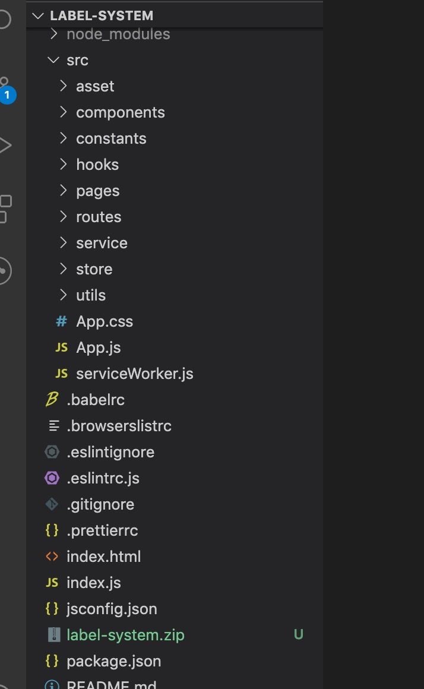

#### vue router使用
- 嵌套路由<router-view></router-view>
- 路由跳转，router-link
- 路由重定向redirect，有别名
- 路由参数$route.params.id, 配置props解耦，URL /search?q=vue 会将 {query: 'vue'}
- 导航守卫有一些钩子
- 路由变化，通过watch获取服务器数据
- 滚动位置，scrollBehavior 
- 通过import方式动态加载路由
```javascript
const Foo = () => import(/* webpackChunkName: "group-foo" */ './Foo.vue')
const Bar = () => import(/* webpackChunkName: "group-foo" */ './Bar.vue')
const Baz = () => import(/* webpackChunkName: "group-foo" */ './Baz.vue')
```
```javascript
const router = new VueRouter({
  routes: [
    { path: '/user/:id', component: User, props: true },

    // 对于包含命名视图的路由，你必须分别为每个命名视图添加 `props` 选项：
    {
      path: '/user/:id',
      components: { default: User, sidebar: Sidebar },
      props: { default: true, sidebar: false }
    }
  ]
})
```
- router.push, replace, go
```javascript
[
  { 
    path: "/user/:id", // params
    role: "admin",
    component: user,
    children: [
      {
        path: "childuser/:cid",
        component: childuser
      },...
    ]
  }  
]

```

#### [http报文结构图解](https://blog.csdn.net/Joven0/article/details/48093899)


#### hr面，大概30min。 
#### 自我介绍， 
#### 项目经历， 
#### 说一下项目中的难点和解决， 
#### 从项目中学习到了什么， 
#### 平时朋友同学怎么评价你， 
#### 自我评价，说说优缺点， 
#### 目前有哪些offer， 
#### 这些公司里面，你的排序是怎样的，说下特点， 
#### 还有投递哪些公司，公司的流程到哪一阶段了，说下特点， 
#### 预期薪资是多少， 
#### 有没有亲属在腾讯， 
#### 你喜欢怎么样的mentor， 
#### 如何去适应校园到公司的节奏， 
#### 如果你入职之后一段时间发现不喜欢这个工作会怎么办。 
#### 希望能顺利，还是去很想留在深圳的

#### [为什么http是无连接的](http://xieli.leanote.com/post/6.HTTP%E6%98%AF%E5%9F%BA%E4%BA%8ETCP%E7%9A%84%EF%BC%8C%E4%B8%BA%E4%BB%80%E4%B9%88%E6%98%AF%E6%97%A0%E7%8A%B6%E6%80%81%EF%BC%9F)
- 因为HTTP是短连接，即每次“请求-响应”都是一次TCP连接。比如用户一次请求就是一次TCP连接，服务器响应结束后断开连接。而每次TCP连接是没有关联的，因此HTTP是无状态的。如果想要使得每次TCP连接之间有关联，服务器和浏览器就得存储相关的信息，这个就是Cookie和Session的作用。
- 虽然HTTP 1.1为了效率，支持了keep-alive，但是这个keep-alive是有时间限制的。这个时间可以通过设置HTTP进程的配置文件来修改，这个时间很短，是以秒来计算的，例如10秒。因此在这10秒内的HTTP请求是使用同一个TCP连接，但是10秒后又重新进行连接。这个时间可以被认为是无状态的。例如那个购物的例子，不可能10s内的HTTP请求无需密码来验证，首先这个时间很短，并且还得记录每次HTTP请求的时间是否在10秒内，这样记录的方式和Session又有什么区别。
- keep-alive一个tcp可以发送多个http请求，只是不能同时使用，但http2可以，因为有多路复用
- chrome浏览器对同一域名允许并行6个tcp连接，可使用多域名加载多图片
#### 如果没有tcp，http请求会是怎样的
- http是基于tcp连接的，没有tcp，目前是无法使用吧，http3是基于udp的
#### 移动端页面有一万张图片，如何保证不卡顿
- 默认使用loading图片，到可视区域切换成真实到图片，非可视区域切换回loading图片
#### 函数的节流和防抖
- 节流是必须间隔一段时间，防抖是清空上一个定时器执行最新定时器
#### 作用域链，有什么方法可以反过来（with）
#### [异步任务的两个队列](https://beta.segmentfault.com/a/1190000011198232)

#### 10个宏任务，10个微任务，执行顺序是什么
#### 什么是跨域
- 协议，域名，端口，jsop，cors
#### 判断一个对象是对象、数组、函数
- Object.prototype.toString.call()
#### Object.prototype.toString.call()和toString()的区别
- 返回[object type],而toString则返回各个类型重写后到返回值
#### url是什么格式的
- 协议: //域名：端口/路径？参数#hash
#### 原型和原型链之间的关系


#### 数组的join方法，不传参数是什么
- 默认是逗号隔开
#### click事件在移动端有延迟，延迟多少毫米，为什么会出现这个问题
- 苹果需要判断双击事件，300ms，使用fastclick


#### 无序数组中求不相邻元素组成的子集的最大和, 比如 1 3 5 7 就是3+7=10
```javascript
// 本质 dp[i] = Math.max(dp[i-1], dp[i-2]+arr[i])
function sumTopN(arr){
  if(!Array.isArray(arr)){
    throw new Error('arguments arr is not array')
  }
  if(arr.length === 0){
    return -1
  }
  if(arr.length === 1){
    return arr[0]
  }
  if(arr.length === 2){
    return Math.max(arr[0], arr[1])
  }
  // 使用循环解题
  // let prev2 = arr[0]
  // let prev1 = Math.max(arr[0], arr[1])
  // let result = 0;
  // for (let index = 2; index < arr.length; index++) {
  //   const element = arr[index];
  //   result = Math.max(prev1, prev2+element)
  //   prev2 = prev1
  //   prev1 = result
  // }
  // return result

  // 使用递归
  return Math.max(sumTopN(arr.slice(0,arr.length-1)), sumTopN(arr.slice(0,arr.length-2))+arr[arr.length-1])
}
```
#### 将从小到大的有序数组循环左移未知次，找到左移后数组最小值, 比如 1234=》 4312，找到1
```javascript
    // 将从小到大的有序数组循环左移未知次，找到左移后数组最小值, 比如 1234=》 4312，找到1
    // 二分法查找，双指针
    function findMin(arr){
      let left = 0;
      let right = arr.length-1
      while (left<right) {
        let mid = left + Math.ceil((right-left)/2)
        if(arr[mid]<arr[right]){
          // 右边升序，则最小值在左边
          right = mid
        } else if(arr[mid]>arr[right]){
          // 左侧升序，则最小值在右侧
          left = mid + 1
        } else{
          // 相等则丢弃最后一个元素
          right--
        }
      }
      return arr[left]
    }
    console.log(findMin([1,3,5]), findMin([4,3,1,2]),findMin([4,5,1,2,3]),findMin([2,2,2,0,1]),findMin([3,3,3,0,2,2,2,3]))
```


#### 介绍一下自己的项目
#### git的reset和revert有什么区别。
- git revert是用一次新的commit来回滚之前的commit，git reset是直接删除指定的commit
#### vue的底层了解吗
#### 现在有一个宽高未知的父布局，以及一个未知宽高的子布局，实现水平垂直居中
- 参考middle-center.html, 绝对定位+transform: translate(-50%,-50%)实现， table-cell，flex，grid
#### hashmap的底层
- 根据key生成hashcode，来决定值存储的位置，不同的key可能产生相同的hashcode，即发生了碰撞
#### hashmap发生碰撞怎么解决？
- 散列表要解决的一个问题就是散列值的冲突问题，通常是两种方法：链表法和开放地址法。
  - 链表法就是将相同hash值的对象组织成一个链表放在hash值对应的槽位；
  - 开放地址法是通过一个探测算法，当某个槽位已经被占据的情况下继续查找下一个可以使用的槽位。
#### [思维题，1000瓶水，一瓶有毒。10只老鼠，喝到有毒的一小时以后会死，问如何在1小时找出哪瓶有毒。](https://blog.csdn.net/lwj734114646/article/details/12076271?utm_medium=distribute.pc_relevant.none-task-blog-title-1&spm=1001.2101.3001.4242)
- 1000瓶水用二进制编号，10位足矣
- 第一只老鼠喝第一位为0的所有水，第二只喝第二位为0的所有水，依次类推。。。
- if(如果第i只老鼠死了) 则让 water[第i位1的水的编号]的值-1. 
  else 则让 water[第i位1的水的编号]的值+1.  
  然后找出wanrer[0]--water[999] 中 的最小数water[i]，
  if(water[i] <0) 即为 第 i 瓶水有毒    else 为第0瓶水有毒。
#### n杯水中有一杯有毒，找出这杯毒水最少需要多少个试剂
logn即可

#### 2、null和undefined
- undefined 的字面意思就是：未定义的值，undefined 一般都来自于某个表达式最原始的状态值，不是人为操作的结果
  - 声明了一个变量，但没有赋值
  - 访问对象上不存在的属性 
  - 函数定义了形参，但没有传递实参
  - 使用 void 对表达式求值
- null 的字面意思是：空值  。这个值的语义是，希望表示 一个对象被人为的重置为空对象，而非一个变量最原始的状态 。 在内存里的表示就是，栈中的变量没有指向堆中的内存对象，null则内存会被回收
- 虽然 undefined 和 null 的语义和场景不同，但总而言之，它们都表示的是一个无效的值。

#### [7、哪些方式有利于SEO](https://juejin.im/post/6844903824428105735)
- 搜索引擎的工作原理就是搜集关键字，所以优化的关键就是要让这些搜索引擎理解你这个网页
- 对网站的标题、关键字、描述精心设置，反映网站的定位，让搜索引擎明白网站是做什么的title、meta description和meta keywords
- 网站内容优化：内容与关键字的对应，增加关键字的密度
- 网页布局语义化，尽量扁平
- 在网站上合理设置Robot.txt文件
- 生成针对搜索引擎友好的网站地图，面包屑导航
- 增加外部链接，到各个网站上宣传
- 导航优化，尽量文字导航，img有title和alt属性
- 控制页面大小，最好不要超过100kb，否则爬虫超时也会离开, 减少http请求，外联静态资源，利用缓存，cdn，gzip等等手段
- 单页应用可以使用服务器端渲染，这样利于seo
#### 8、跨页面通信的方法
- [如果是多页应用](https://juejin.im/post/6844903495636615176)
  - url传参数，cookie，localstorage，sessionStorage, indexDB，postMessage, BroadcastChannel，SharedWorker，通过服务器保存数据(Websocket)
- 如果是单页应用的话
  - 上面多页应用的都可以，同时可以使用props传值，事件总线，vuex，redux
#### 10、项目中遇到的困难，如何解决
- 网签项目，应用了第三方组件，只支持标准都html，不支持vue组件，但是我们的UI组件需要展示一个写好的留言板vue组件和一个调用它们标注组件，
所以最后的方案是标注组件UI我们用vue实现，但是功能调用它们的内部API，同时因为样式也要自定义，按我们的需求来，所以就在它们外层包裹了一层class，
BEM方式防止重复，用层级样式重写它
- 还有就是签批人：签名框=1:n， 选中状态同步，人有哪些签名框及签名框是谁的，签批人在我们组件，签名框在它们组件，所以通信使用事件总线，
还有要求它们签名框支持自定义属性，这样不仅可以存储签名框属于哪个签批人，还能标注签名框类型，或者以后其他扩展功能
- 还有就是发现它们的控件单击后不响应右键事件，只能天天粘着他们的工程师解决这个bug

#### [介绍虚拟内存](https://baike.baidu.com/item/%E8%99%9A%E6%8B%9F%E5%86%85%E5%AD%98)
- 内存在计算机中的作用很大，电脑中所有运行的程序都需要经过内存来执行，如果执行的程序很大或很多，就会导致内存消耗殆尽
- windows有虚拟内存技术，当ram不够或运行慢时，数据从ram-》虚拟内存中（页面文件）


#### [项目中的登录注册如何实现的](https://www.cnblogs.com/fengzheng/p/8416393.html)
- Cookie-Session 认证
早期互联网以 web 为主，客户端是浏览器，所以 Cookie-Session 方式最那时候最常用的方式，直到现在，一些 web 网站依然用这种方式做认证。

  - 认证过程大致如下：
    - 用户输入用户名、密码或者用短信验证码方式登录系统；
    - 服务端验证后，创建一个 Session 信息，并且将 SessionID 存到 cookie，发送回浏览器；
    - 下次客户端再发起请求，自动带上 cookie 信息，服务端通过 cookie 获取 Session 信息进行校验；
  - 弊端
    - 只能在 web 场景下使用，如果是 APP 中，不能使用 cookie 的情况下就不能用了；
    - 即使能在 web 场景下使用，也要考虑跨域问题，因为 cookie 不能跨域；
    - cookie 存在 CSRF（跨站请求伪造）的风险；
    - 如果是分布式服务，需要考虑 Session 同步问题；
- Cookie-Session 改造版, 由于传统的 Cookie-Session 认证存在诸多问题，可以把上面的方案改造一下。改动的地方如下：
  - 不用 cookie 做客户端存储，改用其他方式，web 下使用 local storage，APP 中使用客户端数据库，这样就实现了跨域，并且避免了 CSRF ;
  - 服务端也不存 Session 了，把 Session 信息拿出来存到 Redis 等内存数据库中，这样即提高了速度，又避免了 Session 同步问题；
- 经过改造之后变成了如下的认证过程：
  - 用户输入用户名、密码或者用短信验证码方式登录系统；
  - 服务端经过验证，将认证信息构造好的数据结构存储到 Redis 中，并将 key 值返回给客户端；
  - 客户端拿到返回的 key，存储到 local storage 或本地数据库；
  - 下次客户端再次请求，把 key 值附加到 header 或者 请求体中；
  - 服务端根据获取的 key，到 Redis 中获取认证信息；


#### [session和cookie机制了解过嘛](https://segmentfault.com/a/1190000017831088)
- session是服务器存储信息的会话，而sessionid一般存储在cookie中（也可以存储在url中），sessionid标识一个客户端 
#### 那么其中token这种方***有什么问题呢？
- HTTP协议是无状态的，这种无状态意味着程序需要验证每一次请求，从而辨别客户端的身份。
- cookie存储在客户端，session存储在服务器端，但sessionid（标识客户端）是存储在cookie中的
- token的优点
  - 无状态、可扩展，支持移动设备不需要cookie支持，可跨域，无csrf问题
  - 不通过cookie中的token验证，而是通过http头或者请求参数验证，这样就没有csrf
  - token一般有一个有效期，比如10分钟，需要避免重复登录的话可以使用Refresh Token获取一个新的token
- 为了确保数据通信安全，必须加密通信，而不是明文通信，比如https
- 为了确保数据不被篡改，必须使用数字签名
  - 对元数据做hash摘要，摘要+秘钥加密参数数字证书（可以使用对称和非对称加密算法）
    - 对称加密使用同一个秘钥，加解密速度快，传输保存不安全，管理麻烦，【DES，AES】
    - 非对称，是一对秘钥，公钥私钥，都可以用于加解密，但公钥长，一般用于解密，速度慢，公钥传输不安全【RSA，ECC】
    - https传输对称加密秘钥使用非对称加密的方式
- DNS劫持及防御
  - 在域名映射成ip的过程中被指向一个恶意ip
  - 区域传输用tcp(面向连接，可靠)，客户端请求用udp（非连接，开销少）
  - 通过http请求域名ip（app上使用）
  - dns-over-https加密传输防止被劫持
  - 投诉，要求放开劫持
  - [缓存设置短一些，切换到其他dns服务商，甚至自己建设dns](https://www.dns.com/supports/675.html)
    - DNS云加速覆盖国内6大主要运营商以及31个省份及地区的10w＋加速节点，模拟普通用户上网请求不间断的向运营商DNS服务器发起主动查询推送请求，从而让运营商的DNS服务器一直拥有准确的域名解析记录，保障国内绝大部分地区的运营商DNS服务器都能响应准确的解析结果，这样当真实的用户进行访问的时候就能获取到真实准确的地址了，能够有效从而降低DNS被劫持的风险。
- 防止重放攻击
  - 首先使用数字签名防止数据被篡改
  - 其次通过timeStamp验证是否在有效期内，比如1分钟，支付请求的参数都是从支付供应商实时获取的，整个流程请求肯定不会超过1分钟吧，不在有效期内直接报错非法请求
  - 如果在1分钟内，则去验证nonce随机数，比如到radis内存中看看是不是存在，存在则表示是一个重复请求，报错，否则合法请求，然后radis配置策略nonce过期时间时1分钟，防止无限制浪费内存
#### 前端安全相关；(着重中间人劫持)
- 使用https
- 针对安全性要求比较高的 app，可采取客户端预埋证书的方式锁死证书，只有当客户端证书和服务端的证书完全一致的情况下才允许通信，如一些银行类的app，但这种方式面临一个问题，证书过期的问题，因证书有一定的有效期，当预埋证书过期了，只有通过强制更新或者要求用户下载证书来解决。
- 针对安全性要求一般的app，可采用通过校验域名，证书有效性、证书关键信息及证书链的方式
- 强制启用https连接，在http头中加Strict-Transport-Security，这样只要证书不合法则不允许访问
#### 这两个字符串有什么不同？ let a ='123'; let b =newString();
- 字面量方式声明，不可变值，typeof返回string
- 构造函数声明创建的一个对象，typeof返回object
- Object.prototype.toString.call(a|b)都返回[object String]
- 字面量上执行操作，比如获取长度，访问属性，会隐式转换成String对象

#### 组件封装，组件设计原则
- 高内聚，内耦合，可复用，组合，职责划分清晰
- 列出组件的层次结构，props，state，method等，清楚整个架构，便于职责划分，清晰整个组件的关系
- 扁平的，面向数据的 state/props，尽量不要嵌套数据结构（省得不断使用展开运算符）
- 辅助代码分离，提炼公共代码，比如配置，假数据，utils函数（ajax，本地存储方法等等）
- 公共部分分成很多小模块，然后组合使用
- 集中/统一的状态管理
- 一个组件最好只做一件事，参数通过props传入
- 分为容器（逻辑）组件和展示组件，有状态【Stateful】和 无状态【Stateless】，这样扩展性和维护性更好
#### 你知道主流框架的区别吗？vue和react区别
- 相似之处
  - 使用 Virtual DOM
  - 提供了响应式 (Reactive) 和组件化 (Composable) 的视图组件。
  - 将注意力集中保持在核心库，而将其他功能如路由和全局状态管理交给相关的库。
- react
  - immutable+jsx
  - 函数式，数据不可变，单向数据流
- vue
  - mutable+template
  - 双向数据绑定的mvvm框架
  - 数据劫持&发布-订阅模式的方式
  - 声明式的指令
#### [微软的vs有一个叫依赖注入的，对这个怎么理解的？](https://juejin.im/post/6844903699249102861)
- 依赖注入就是为了解决模块之间的耦合的，被依赖的模块可以动态注入模块
- 比如requirejs AMD
```javascript
const injector = {
  dependencies: {},
  register: function(key, val){
    this.dependencies[key] = val
  },
  resolve: function(deps, func, scope){
    let depArgs = []
    deps.forEach(dep=>{
      depArgs.push(this.dependencies[dep])
    })
    scope = scope || {}
    return function(...args){
      return func.apply(scope, depArgs.concat(args))
    }
  }
}

injector.register('a', function(){ console.log('a') })
injector.register('b', function(){console.log('b')})
const doSomething = injector.resolve(['a','b'], function(a,b,others){
  a();
  b();
  console.log(others)
})
doSomething('others')

```
#### [es6模块化介绍](https://developer.mozilla.org/zh-CN/docs/Web/JavaScript/Guide/Modules)
- es6模块化是基于文件的，一个文件一个模块
- 在最高层export，同时无法在全局中范围到，除非你自己绑定到window对象上，但这样有耦合
- import不仅可以静态导入，也可以作为import函数动态导入
- 可以通过export将多个模块合并到一个模块再导出
- 现在浏览器都原生支持import，export，.mjs作为后缀
- 入口使用 script type="module" 导入，也可以脚步内部导入script type="module" //include script here /script.
- 可以使用as重命名导出与导入，可以导出变量，函数，类
-  .mjs 后缀的文件需要以 MIME-type 为 javascript/esm 来加载(或者其他的JavaScript 兼容的 MIME-type ，比如 application/javascript), 否则，你会一个严格的 MIME 类型检查错误，像是这样的 "The server responded with a non-JavaScript MIME type"
-  如果你尝试用本地文件加载HTML 文件 (i.e. with a file:// URL), 由于JavaScript 模块的安全性要求，你会遇到CORS 错误。你需要通过服务器来做你的测试。GitHub pages is ideal as it also serves .mjs files with the correct MIME type.
#### [es6了解过吗？模块化是怎么实现的？怎么做到变量名之间互不干扰就是模块之间如何保证互不影响，模块化是怎么做到的？](https://juejin.im/post/6844904159385239566)
- 所有导出的模块都统一由installedModules对象管理，路径作为key值，对象包括moduleId，isLoaded(是否加载)，exports(需要导出的变量，函数，类等)
- 通过installedModules[key]判断，防止循环依赖加载
- import时得到的是installedModules[key].exports
```javascript
// 1. 是一个立即执行函数
(function (modules) {
  var installedModules = {};
  // 4. 处理入口文件模块
  function __webpack_require__(moduleId) {
    if (installedModules[moduleId]) {
      return installedModules[moduleId].exports;
    }
    // 5. 创建一个模块
    var module = installedModules[moduleId] = {
      i: moduleId,
      l: false,
      exports: {}
    };
    // 6. 执行入口文件模块函数
    modules[moduleId].call(module.exports, module, module.exports, __webpack_require__);
    module.l = true;
    // 7. 返回
    return module.exports;
  }
  __webpack_require__.d = function (exports, name, getter) {
    if (!__webpack_require__.o(exports, name)) { // 判断name是不是exports自己的属性
      Object.defineProperty(exports, name, {enumerable: true, get: getter});
    }
  };
  __webpack_require__.r = function (exports) {
    if (typeof Symbol !== 'undefined' && Symbol.toStringTag) {
      // Symbol.toStringTag作为对象的属性，值表示这个对象的自定义类型 [Object Module]
      // 通常只作为Object.prototype.toString()的返回值
      Object.defineProperty(exports, Symbol.toStringTag, {value: 'Module'});
    }
    Object.defineProperty(exports, '__esModule', {value: true});
  };
  __webpack_require__.o = function (object, property) {
    return Object.prototype.hasOwnProperty.call(object, property);
  };
  // 3. 传入入口文件id
  return __webpack_require__(__webpack_require__.s = "./index.js");
})({ // 2. 模块对象作为参数传入
  "./index.js":
    (function (module, __webpack_exports__, __webpack_require__) {
      // __webpack_exports__就是module.exports
      "use strict";
      // 添加了__esModule和Symbol.toStringTag属性
      __webpack_require__.r(__webpack_exports__);
      var _module1__WEBPACK_IMPORTED_MODULE_0__ = __webpack_require__("./module1.js");
      console.log(_module1__WEBPACK_IMPORTED_MODULE_0__["m"])
    }),

  "./module1.js":
    (function (module, __webpack_exports__, __webpack_require__) {
      "use strict";
      __webpack_require__.r(__webpack_exports__);
      // 把m/n这些变量添加到module.exports中，并设置getter为直接返回值
      __webpack_require__.d(__webpack_exports__, "m", function () {return m;});
      __webpack_require__.d(__webpack_exports__, "n", function () {return n;});
      var m = 1;
      var n = 2;
    })
});

```
#### react如果更新上级节点，所有子级节点都会更新，要怎么去处理？
- 使用shouldComponentUpdate，最直接也是最有风险的方式，很容易出现不可预知的bug
```javascript
class CounterButton extends React.Component {
  constructor(props) {
    super(props);
    this.state = {count: 1};
  }
  shouldComponentUpdate(nextProps, nextState) {
    if (this.props.color !== nextProps.color) {
      return true;
    }
    if (this.state.count !== nextState.count) {
      return true;
    }
    return false;
  }

  render() {
    return (
      <button
        color={this.props.color}
        onClick={() => this.setState(state => ({count: state.count + 1}))}>
        Count: {this.state.count}
      </button>
    );
  }
}
```
- 使用PureComponent， React.memo 等效于 PureComponent
- 使用react.memo缓存，它会对props进行浅比较, 如果需要自定义比较，可以传入第二个函数自己处理
```javascript
const Button = React.memo((props) => {
  // 你的组件
});
```
- 使用useMemo
```javascript
const memoizedValue = useMemo(() => computeExpensiveValue(a, b), [a, b]);
function Parent({ a, b }) {
  // Only re-rendered if `a` changes:
  const child1 = useMemo(() => <Child1 a={a} />, [a]);
  // Only re-rendered if `b` changes:
  const child2 = useMemo(() => <Child2 b={b} />, [b]);
  return (
    <>
      {child1}
      {child2}
    </>
  )
}
```
#### 对web性能安全有什么了解吗？（主要说了xss和csrf）
- 数字签名防止篡改
- 防止重放攻击（微信支付参数timeStamp，nonceStr，package，signType，paySign）
  - 首先使用数字签名防止数据被篡改
  - 其次通过timeStamp验证是否在有效期内，比如1分钟，支付请求的参数都是从支付供应商实时获取的，整个流程请求肯定不会超过1分钟吧，不在有效期内直接报错非法请求
  - 如果在1分钟内，则去验证nonce随机数，比如到radis内存中看看是不是存在，存在则表示是一个重复请求，报错，否则合法请求，然后radis配置策略nonce过期时间时1分钟，防止无限制浪费内存

### 安全
- 机密性，不可明文传输，秘文
- 完整性不被篡改（数字签名）
- 可用性，防止dos，ddos攻击
- 可审计，不可抵赖
- 系统设计，服务器配置的时候，只允许做什么，而不是不允许做什么
- 最小权限原则，开通的权限越小越好
- 多维度防御，网络防御，防火墙，数据库，后台语言，前端都要做防御
- 数据和代码分离，xss，sql注入等等
- 不可预测原则，csrf攻击，加一个token串

### 安全防御措施
- 前端不操作任何敏感cookie，后台设置cookie为httponly
- 敏感信息不存储在前端，包括cookie，localstorage，本地数据库
- [单击劫持设置X-Frame-Options deny sameorigin allow-from uri](https://developer.mozilla.org/zh-CN/docs/Web/HTTP/X-Frame-Options)
- [csrf防御，黑客只是会传递cookie，但我们自己可以取到cookie放在header或请求体中](https://cloud.tencent.com/developer/article/1494289)
  - 判断请求来源，referer，origin
  - 表单携带token（黑客虽然携带cookie，但是我们可以控制请求参数，此token可以约定算法或者服务器存储【安全系数高】）
  - cookie的SameSite属性， lax（link，form get），strict（其他域都不允许）属性
- xss攻击，存储型和反射型，对输入和输出都要进行编码，分为html编码，url编码，javascritp编码，css编码，html标签属性编码，json编码，目前框架基本都已经做了编码处理，结合csp（script-src，style-src，img-src）
- CSP 的实质就是白名单制度，开发者明确告诉客户端，哪些外部资源可以加载和执行，等同于提供白名单。它的实现和执行全部由浏览器完成，开发者只需提供配置。
- 两种方法可以启用 CSP。一种是通过 HTTP 头信息的Content-Security-Policy的字段。
- 另一种是通过meta标签<meta http-equiv="Content-Security-Policy" content="script-src 'self'; object-src 'none'; style-src cdn.example.org third-party.org; child-src https:">
  * xss攻击分为存储型和反射性
  * httponly,设置csp浏览器只执行指定域名对script
  * <,>"'&/等字符进行转译
  * url中参数要进行编码转义，decodeURIComponent
  * https://tech.meituan.com/2018/09/27/fe-security.html
  * https://zhuanlan.zhihu.com/p/32237154
  - [防御类库](https://github.com/leizongmin/js-xss)
  - [owasp类库，org.owasp.encoder](https://owasp.org/www-project-java-encoder/#tab=Use_the_Java_Encoder_Project)
  - 后端将数据存入数据库之前，先进行转义。
  - 后端输出给前端的数据，需要进行统一转义处理。
  - 前端获取后端的数据后，对数据进行转义处理。
  - 转义的内容包括，html标签，html标签属性（onerror,href）,css内联样式，script标签js，内联json，跳转链接
  - DOM 中的内联事件监听器，如 location、onclick、onerror、onload、onmouseover 等，a标签的 href 属性，JavaScript 的 eval()、setTimeout()、setInterval() 等，都能把字符串作为代码运行。如果不可信的数据拼接到字符串中传递给这些 API，很容易产生安全隐患，请务必避免
  - 输入页面转义的字符有 & < > " ' / 
  - url中取参数需要过滤javascript，http, https, script等等
  - json需要转义U+2028 U+2029 <
  - 在 style 属性和标签中，包含类似 background-image:url("javascript:...") expression(...) 的代码（新版本浏览器已经可以防范）
  - html标签中危险属性直接过滤调
  - 富文本编辑器
    - 事件应该被严格禁止，标签选择应该用白名单，只允许a,img,div
    - 禁止用户自定义css，style等
- [iframe嵌入三方应用时，sandbox的安全属性限制其行为，默认是最小权限原则，有允许提交表单，弹窗，执行脚步等等](https://developer.mozilla.org/zh-CN/docs/Web/HTML/Element/iframe)
- 上传一段js（本来要求用户上传图片的），浏览器强大等容错能力识别是js并执行，防御方式设置X-Content-Type-Options这个HTTP Header明确禁止浏览器去推断响应类型。
- [sql注入与防御，把用户的输入数据当作sql语句执行](https://www.cnblogs.com/digdeep/p/4715245.html)
  - 防范使用存储过程，
  - 采用sql语句预编译和绑定变量，是防御sql注入的最佳方法，使用PreparedStatement把用户输入当成普通字符串，或者使用相应的函数过滤特殊sql字符
  - 严格检查参数的数据类型，还有可以使用一些安全函数，来方式sql注入。ESAPI.encoder().encodeForSQL(codec, name)编码成普通字符串，而不是sql语句
  - 一般框架现在默认都是预编译的

#### sql注入怎么防范
- sql注入本质就是拼sql参数的时候把用户的数据当sql语句执行
- 采用sql语句预编译和绑定变量，是防御sql注入的最佳方法。
- 预先编译好，也就是SQL引擎会预先进行语法分析，产生语法树，生成执行计划，也就是说，后面你输入的参数，无论你输入的是什么，都不会影响该sql语句的 语法结构了，因为语法分析已经完成了，而语法分析主要是分析sql命令，比如 select ,from ,where ,and, or ,order by 等等。所以即使你后面输入了这些sql命令，也不会被当成sql命令来执行了，因为这些sql命令的执行， 必须先的通过语法分析，生成执行计划，既然语法分析已经完成，已经预编译过了，那么后面输入的参数，是绝对不可能作为sql命令来执行的，只会被当做字符串字面值参数。所以sql语句预编译可以防御sql注入。
- 对参数严格白名单式过滤，在接收到用户输入的参数时，我们就严格检查 id，只能是int型。复杂情况可以使用正则表达式来判断。这样也是可以防止sql注入的。
- 使用安全函数，ESAPI.encoder().encodeForSQL(codec, name)
- 实际项目中，一般我们都是采用各种的框架，比如ibatis, hibernate,mybatis等等。他们一般也默认就是sql预编译的。对于ibatis/mybatis，如果使用的是 #{name}形式的，那么就是sql预编译，使用 ${name} 就不是sql预编译的。

#### 借助未验证的URL跳转，将应用程序引导到不安全的第三方区域，从而导致的安全问题。
- 如：http://gate.baidu.com/index?act=go&url=http://t.cn/RVTatrd
- http://qt.qq.com/safecheck.html?flag=1&url=http://t.cn/RVTatrd
- http://tieba.baidu.com/f/user/passport?jumpUrl=http://t.cn/RVTatrd
- 防御方式是白名单可用域名限制


#### 我们如果有一个奖励的系统，有一个用户通过第三方疯狂调用我们的接口我们该怎么做？ 秒杀系统
- 需要考虑高并发，超卖，刷单
- 针对高并发，前端常用的三板斧是【扩容】【静态化】【限流】
  - 扩容：加机器，这是最简单的方法，通过增加前端池的整体承载量来抗峰值。
  - 静态化：将活动页面上的所有可以静态的元素全部静态化，并尽量减少动态元素。通过CDN来抗峰值。超大型活动可提前推送静态资源
  - 限流：一般都会采用IP级别的限流，即针对某一个IP，限制单位时间内发起请求数量。或者活动入口的时候增加游戏或者问题环节进行消峰操作。当然web前端可以使用本地存储限制用户单位时间内的请求数量
  - 无损服务：排队，答题，分层过滤
  - 有损服务：最后一招，在接近前端池承载能力的水位上限的时候，随机拒绝部分请求来保护活动整体的可用性。
  - 使用先进先出队列，比如1000件商品，100台服务器，每台服务器接收前1000个请求，同时请求发给缓存，此时看看缓存中库存大于0的话，使用下面如下两种方案的一种，返回结果给web前端服务器，没有就秒杀完了
  - 使用Memcached缓存方案1：将写操作前移到MC中，同时利用MC的轻量级的锁机制CAS来实现减库存操作。优点：读写在内存中，操作性能快，引入轻量级锁之后可以保证同一时刻只有一个写入成功，解决减库存问题。缺点：没有实测，基于CAS的特性不知道高并发下是否会出现大量更新失败？不过加锁之后肯定对并发性能会有影响。
  - 使用radis缓存方案2：将提交操作变成两段式，先申请后确认。然后利用Redis的原子自增操作，同时利用Redis的事务特性来发号，保证拿到小于等于库存阀值的号的人都可以功提交订单。然后数据异步更新到DB中。优点：解决超卖问题，库存读写都在内存中，故同时解决性能问题。缺点：由于异步写入DB，可能存在数据不一致。另可能存在少买，也就是如果拿到号的人不真正下订单，可能库存减为0，但是订单数并没有达到库存阀值。

- 防止疯狂刷单，用户ID黑白名单，限制IP，单位时间内调用接口次数（令牌桶，漏桶令牌），验证码（图灵测试，字符验证码，计算验证码，智力题验证码，滑块验证码）
- 通过采集终端设备的各项参数，在 APP 启动的时候，生成一个唯一的设备指纹，请求时返回服务器，然后风控分析它的可疑度，有效识别模拟器、改串码、群控等设备异常行为，设备信息通过约定的方法生成加密指纹信息，服务器解密得到信息可判断是否同一用户
- referer校验，ua，origin
#### 设计模式用过吗？最熟悉的模式是什么？
- 单例模式
```javascript
// 单例模式
// https://juejin.im/post/6844903874210299912
const CreateSingleTon = (function(){
  let instance
  return function(name){
    if(instance){
      return instance
    }
    this.name = name
    return instance = this
  }
})()

const singleTon1 = new CreateSingleTon('a')
const singleTon2 = new CreateSingleTon('b')
console.log(singleTon1 === singleTon2)
// 弹窗单例模式
const CreateDialog = function(fn){
  let instance
  return function(){
    return instance || (instance = fn.apply(this, arguments))
  }
}
function maskDialog(){

}
const maskDialogInstance = CreateSingleTon(maskDialog)()
```
- 发布订阅模式
```javascript
/*
4. 事件的发布订阅模式
*/
class EventEmitter {
  constructor() {
    this.sub = {};
  }
  on = (eventType, callback) => {
    this.sub[eventType] = this.sub[eventType] || {};
    // let callbackList = this.sub[eventType].list;
    if (!this.sub[eventType].list) {
      this.sub[eventType].list = [];
    }
    this.sub[eventType].list.push(callback);
  };
  one = (eventType, callback) => {
    let callbackList = this.sub[eventType].list;
    let index = callbackList.indexOf(callback);
    typeof callback === "function" ? callback() : "";
    callbackList.splice(index, 1);
  };
  off = (eventType, callback) => {
    // 遍历删除
    let callbackList = this.sub[eventType].list;
    let index = callbackList.indexOf(callback);
    // 删除指定事件回掉
    callbackList.splice(index, 1);
  };
  emit = (eventType, data) => {
    let callbackList = this.sub[eventType].list;
    while (callbackList.length) {
      let cb = callbackList.shift();
      typeof cb === "function" ? cb(data) : "";
    }
  };
}
```


#### 你说的这些我很赞同，但主要是工程方面，在技术方面呢？比如技术选型和调研，提升开发效率，有什么好的建议吗？比如你做业务中台，其中有一些是重复的工作，那么有什么可以去提升开发效率的事情呢？在技术选型上更多地会去考虑什么呢？
- 写成独立的组件开发，使用打包工具如webpack，使用自动集成工具比如jeankins或者walle
- 网络请求封装工具，重复请求工具
- javascript，typescript，css，saas，less
- vue，react选型
- 组件库，elementUI，antDesign
- 选型需要考虑
  - 首选考虑是否能满足自己的业务需求
  - 考虑兼容性问题，比如要支持老版本浏览器什么的
  - 如果需要考虑跨平台的话选型也要注意
  - 还要满足性能要求，文件大小，渲染速度的快慢等等
  - 扩展性怎么样，比如社区中确实还没有某个库，我在类库上扩张组件是否简单可行
  - 对代码校验的支持，因为毕竟是团队开发，如果支持不好的话，大家写的代码就更加不规范了
  - 模块化的支持，以及打包工具webpack配置是否简单可行，不复杂，最好有cli集成工具，开箱即用
  - 学习成本，以及现在项目中框架使用情况
  - 框架周边的生态及框架是否有牛人维护，社区的组件库丰富成熟

#### 那么要如何去检测线上的用户性能呢？你觉得其中有哪些数据是比较重要的呢？怎么去实现对他们的监测和分析呢？
- tcp连接，dns域名解析，dom ready
- 白屏时间
- 首屏加载时间
- 首页加载时间
- 整页加载时间
### 测量白屏时间和首屏时间
* https://lz5z.com/Web%E6%80%A7%E8%83%BD%E4%BC%98%E5%8C%96-%E9%A6%96%E5%B1%8F%E5%92%8C%E7%99%BD%E5%B1%8F%E6%97%B6%E9%97%B4/
- 白屏时间 = firstPaint - performance.timing.navigationStart || pageStartTime
  ```html
  <!DOCTYPE html>
  <html>
  <head>
      <meta charset="utf-8">
      <title>白屏</title>
      <script>
          // 不兼容 performance.timing 的浏览器
          window.pageStartTime = Date.now()
      </script>
          <!-- 页面 CSS 资源 -->
          <link rel="stylesheet" href="xx.css">
          <link rel="stylesheet" href="zz.css">
          <script>
              // 白屏结束时间
              window.firstPaint = Date.now()
              // 白屏时间
              console.log(firstPaint - performance.timing.navigationStart)
          </script>
  </head>
  <body>
      <h1>Hello World</h1>
  </body>
  </html>
  ```
- 首屏模块标签标记法,由于浏览器解析 HTML 是按照顺序解析的，当解析到某个元素的时候，你觉得首屏完成了，就在此元素后面加入 script 计算首屏完成时间。
  ```html
  <!DOCTYPE html>
  <html>
  <head>
      <meta charset="utf-8">
      <title>首屏</title>
      <script>
          // 不兼容 performance.timing 的浏览器
          window.pageStartTime = Date.now()
      </script>
  </head>
  <body>
      <!-- 首屏可见内容 -->
      <div class=""></div>
      <!-- 首屏可见内容 -->
      <div class=""></div>
      <script type="text/javascript">
              // 首屏屏结束时间
              window.firstPaint = Date.now()
              // 首屏时间
              console.log(firstPaint - performance.timing.navigationStart)
      </script>
      <!-- 首屏不可见内容 -->
      <div class=""></div>
      <!-- 首屏不可见内容 -->
      <div class=""></div>
  </body>
  </html>
  ```
- 统计首屏内加载最慢的图片/iframe, 我们只需要监听首屏内所有的图片的 onload 事件，获取图片 onload 时间最大值，并用这个最大值减去 navigationStart 即可获得近似的首屏时间。
  ```html
  <!DOCTYPE html>
  <html>
  <head>
      <meta charset="utf-8">
      <title>首屏</title>
      <script>
          // 不兼容 performance.timing 的浏览器
          window.pageStartTime = Date.now()
      </script>
  </head>
  <body>
      
      
      <script>
          function load () {
              window.firstScreen = Date.now()
          }
          window.onload = function () {
              // 首屏时间
              console.log(window.firstScreen - performance.timing.navigationStart)
          }
      </script>
  </body>
  </html>
  ```
#### 其中你提到了window.onError来监测线上的数据，那么是怎么做的呢？比如由于浏览器的同源策略，我们是不能获取到真实的代码位置和数据的。这些应该怎么做呢？
- window.onerror，onunhandledrejection 监听promose错误 ，react 的 componentDidCatch，vue有Vue.config.errorHandler，errorCaptured
- try-catch 只能捕获到同步的运行时错误，对语法和异步错误却无能为力，捕获不到。
- window.onerror无法捕获不论是静态资源异常，或者接口异常，错误都无法捕获到。还有无法捕获语法错误。
- Promise最好有catch捕获异常，为了防止有漏掉的 Promise 异常，建议在全局增加一个对 unhandledrejection 的监听，用来全局监听Uncaught Promise Error。
- 利用 window 对象的 load 和 beforeunload 事件实现了网页崩溃的监控。
- Service Worker 有自己独立的工作线程，与网页区分开，网页崩溃了，Service Worker 一般情况下不会崩溃；
- fetch可以创建跨域请求
- 跨域script error问题，第一种方式，静态js资源配置cors和crossorigin="anonymous"
```javascript
app.use(express.static('./public', {
  setHeaders(res) {
    res.set('access-control-allow-origin', res.req.get('origin'));
    res.set('access-control-allow-credentials', 'true');
  }
}));
<script src="http://127.0.0.1:4000/at4000.js" crossorigin="anonymous"></script>
```
- [因为try catch对跨域没有限制，catch中会捕获到堆栈信息，所以可以对$(document).ready，addEventListener，$.fn.click，setTimeout or requestAnimationFrame进行wrapper](https://blog.sentry.io/2016/01/04/client-javascript-reporting-window-onerror)
```javascript
function wrapErrors(fn) {
  // don't wrap function more than once
  if (!fn.__wrapped__) {
    fn.__wrapped__ = function () {
      try {
        return fn.apply(this, arguments);
      } catch (e) {
        captureError(e); // report the error
        throw e; // re-throw the error
      }
    };
  }
  return fn.__wrapped__;
}
var invoke = wrapErrors(function(obj, method, args) {
  return obj[method].apply(this, args);
});
invoke(Math, 'highest', [1, 2]); // no method Math.highest
$(wrapErrors(function () { // application start
  doSynchronousStuff1(); // doesn't need to be wrapped
  setTimeout(wrapErrors(function () {
    doSynchronousStuff2(); // doesn't need to be wrapped
  });
  $('.foo').click(wrapErrors(function () {
    doSynchronousStuff3(); // doesn't need to be wrapped
  });
}));
```
你有自己去实现过吗？怎么去定位线上用户的问题在哪里呢？
说一下小程序为什么比h5更好呢？（然后深挖了很多底层实现）

#### 那我们如果要把http1换成http2，我们网站需要做一些什么工作呢？
- 要求nginx的最低版本是1.10.0，openssl的最低版本是1.0.2, http/2在实现上基本上只支持https
- 必须升级到https，所以静态资源引用协议使用//不加协议，ng需要配置80端口强制跳转到443（用户http强制跳转到https）
- 所有静态资源必须升级为https
#### 说一下https为什么比http更安全？ 为什么要采用非对称加密【RSA，ECC】和对称加密【DES，AES】？
- 因为所有的通信都是加密的
- 非对称加密在交互对称加密的秘钥时使用，之后就使用对称加密方式加密，对称是同一个密钥，速度快，而非对称是公钥私钥，速度慢
#### [http3和http2的区别是什么？](https://blog.fundebug.com/2019/03/07/understand-http2-and-http3/)
- HTTP/2 使用了多路复用，一般来说同一域名下只需要使用一个 TCP 连接。但当这个连接中出现了丢包的情况，那就会导致 HTTP/2 的表现情况反倒不如 HTTP/1 了。因为在出现丢包的情况下，整个 TCP 都要开始等待重传，也就导致了后面的所有数据都被阻塞了。但是对于 HTTP/1.1 来说，可以开启多个 TCP 连接，出现这种情况反到只会影响其中一个连接，剩余的 TCP 连接还可以正常传输数据。
- http3基于upd，HTTP2基于tcp
- http3丢包后无序等待，因为它是基于UDP并自己实现一套QUIC协议的
- 因为 TCP 是基于 IP 和端口去识别连接的，这种方式在多变的移动端网络环境下是很脆弱的。但是 QUIC 是通过 ID 的方式去识别一个连接，不管你网络环境如何变化，只要 ID 不变，就能迅速重连上。
- TCP 协议头部没有经过任何加密和认证，但是 QUIC 的 packet 可以说是武装到了牙齿。除了个别报文比如 PUBLIC_RESET 和 CHLO，所有报文头部都是经过认证的，报文 Body 都是经过加密的。
- 向前纠错 (Forward Error Correction，FEC)，每个数据包除了它本身的内容之外，还包括了部分其他数据包的数据，因此少量的丢包可以通过其他包的冗余数据直接组装而无需重传。向前纠错牺牲了每个数据包可以发送数据的上限，但是减少了因为丢包导致的数据重传，因为数据重传将会消耗更多的时间(包括确认数据包丢失、请求重传、等待新数据包等步骤的时间消耗)
假如说这次我要发送三个包，那么协议会算出这三个包的异或值并单独发出一个校验包，也就是总共发出了四个包。当出现其中的非校验包丢包的情况时，可以通过另外三个包计算出丢失的数据包的内容。当然这种技术只能使用在丢失一个包的情况下，如果出现丢失多个包就不能使用纠错机制了，只能使用重传的方式了。
#### 后端是怎么设置Etag的呢？
- ETag设置成资源的hash值
#### [如果让你来做一个富文本编辑器，你觉得主要用了浏览器的什么功能？](https://juejin.im/post/6844903534798831629)
- 利用contenteditable属性结合document.execCommand API实现，比如国外的CKEditor、百度的UEditor、优秀的后起之秀wangEditor。
- 完全自己模拟实现selection、视图渲染等一切。比如Google Doc、有道云笔记、基于electron开发的VS Code。
#### 用过canvas吗？
```javascript
//1.获取canvas和上下文
var canvas = document.getElementById('canvas');
var ctx = canvas.getContext('2d');
//2.监听鼠标的移动
canvas.onmousedown = function (event){
    //清屏操作
    ctx.clearRect(0,0,canvas.width,canvas.height);
    //开启路径
    ctx.beginPath();
    //起点
    ctx.moveTo(event.offsetX, event.offsetY);
    canvas.onmousemove = function (event){
        //终点
        ctx.lineTo(event.offsetX, event.offsetY);

        //设置颜色和线宽
        ctx.strokeStyle = 'red';
        ctx.lineWidth = 5;
        //绘制 描边
        ctx.stroke();
    };
    canvas.onmouseup = function (){
        canvas.onmousemove = null;
        canvas.onmouseup = null;
    };
};
```
#### 如果让你来做动画，嵌入到我们的网站里，你会有什么方法？
- javascript svg
- apng 缺点：Chrome 59 之后，只有 IE 不支持
- dom动画
- gif，flash
- video， canvas
- 简单动画可以使用css3 transition/animation 
#### [4. 如何做移动端适配？](https://github.com/willson-wang/Blog/issues/84)
```javascript
if (!dpr && !scale) {
    var isAndroid = win.navigator.appVersion.match(/android/gi);
    var isIPhone = win.navigator.appVersion.match(/iphone/gi);
    var devicePixelRatio = win.devicePixelRatio;
    // 如果是iphone，则根据window.devicePixelRatio获取dpr
    if (isIPhone) {
        // iOS下，对于2和3的屏，用2倍的方案，其余的用1倍方案
        if (devicePixelRatio >= 3 && (!dpr || dpr >= 3)) {                
            dpr = 3;
        } else if (devicePixelRatio >= 2 && (!dpr || dpr >= 2)){
            dpr = 2;
        } else {
            dpr = 1;
        }
    } else {
        // 其他设备下，仍旧使用1倍的方案
        dpr = 1;
    }
    // 计算缩放比例
    scale = 1 / dpr;
}

// 设置data-dpr属性，以便可以通过css属性选择器做一些样式处理
docEl.setAttribute('data-dpr', dpr);

// 设置meta标签
if (!metaEl) {
    metaEl = doc.createElement('meta');
    metaEl.setAttribute('name', 'viewport');
    // 设置initial-scale的值
    metaEl.setAttribute('content', 'initial-scale=' + scale + ', maximum-scale=' + scale + ', minimum-scale=' + scale + ', user-scalable=no');
    if (docEl.firstElementChild) {
        docEl.firstElementChild.appendChild(metaEl);
    } else {
        var wrap = doc.createElement('div');
        wrap.appendChild(metaEl);
        doc.write(wrap.innerHTML);
    }
}

function refreshRem(){
    var width = docEl.getBoundingClientRect().width;
    if (width / dpr > 540) {
        width = 540 * dpr;
    }
    // 将docuemntElement宽度分成10份，用于等比缩放
    var rem = width / 10;
    docEl.style.fontSize = rem + 'px';
    flexible.rem = win.rem = rem;
}

// 监听resize事件，如果触发resize事件，重新设置根元素的font-size
win.addEventListener('resize', function() {
    clearTimeout(tid);
    tid = setTimeout(refreshRem, 300);
}, false);


win.addEventListener('pageshow', function(e) {
    if (e.persisted) {
        clearTimeout(tid);
        tid = setTimeout(refreshRem, 300);
    }
}, false);

refreshRem();
```
#### 9. git基本操作会哪些？git merge git rebase？ 
- git rebase 和 git merge 一样都是用于从一个分支获取并且合并到当前分支

#### 10. Vue自定义指令是否有用过？如何进行组件封装？ 
```javascript
// 组件内封装
directives: {
  drag: {
    /*
    el：指令所绑定的元素，可以用来直接操作 DOM。
    binding：一个对象，包含以下 property：
      name：指令名，不包括 v- 前缀。
      value：指令的绑定值，例如：v-my-directive="1 + 1" 中，绑定值为 2。
      oldValue：指令绑定的前一个值，仅在 update 和 componentUpdated 钩子中可用。无论值是否改变都可用。
      expression：字符串形式的指令表达式。例如 v-my-directive="1 + 1" 中，表达式为 "1 + 1"。
      arg：传给指令的参数，可选。例如 v-my-directive:foo 中，参数为 "foo"。
      modifiers：一个包含修饰符的对象。例如：v-my-directive.foo.bar 中，修饰符对象为 { foo: true, bar: true }。
    vnode：Vue 编译生成的虚拟节点。移步 VNode API 来了解更多详情。
    oldVnode：上一个虚拟节点，仅在 update 和 componentUpdated 钩子中可用。
    */
    bind: function(el, binding, vnode, oldnode){

    },
    // 指令的定义
    inserted: function (el) {
      el.focus()
    }
  }
}
// 全局绑定
Vue.directive('pin', {
  bind: function (el, binding, vnode) {
    el.style.position = 'fixed'
    var s = (binding.arg == 'left' ? 'left' : 'top')
    el.style[s] = binding.value + 'px'
  }
})
```

#### 3. 括号生成（代码也作为福利送给大家好了，不过不是我的原版） 
```javascript
// 输入：n = 3
// 输出：[
// "((()))",
// "(()())",
// "(())()",
// "()(())",
// "()()()"
// ]
var generateParenthesis = function(n) {
    if(!n) return [];
    let res = [];
    function dfs(subs,left,right,n){
        if(left === n && right === n){
            res.push(subs);
            return;
        }
        if(left < right){
            return;
        }
        left < n && dfs(subs+'(',left+1,right,n);
        right < n && dfs(subs+')',left,right+1,n);
    }
    dfs('',0,0,n);
    return res;
};

```


#### [前端浏览器加载原理](https://github.com/amandakelake/blog/issues/55)
#### axios和ajax区别
- ajax
  - 1.本身是针对MVC的编程,不符合现在前端MVVM的浪潮
  - 2.基于原生的XHR开发，XHR本身的架构不清晰。
  - 3.JQuery整个项目太大，单纯使用ajax却要引入整个JQuery非常的不合理（采取个性化打包的方案又不能享受CDN服务）
  - 4.不符合关注分离（Separation of Concerns）的原则
  - 5.配置和调用方式非常混乱，而且基于事件的异步模型不友好。
- axios
  - 1.从浏览器中创建 XMLHttpRequest
  - 2.支持 Promise API
  - 3.客户端支持防止CSRF
  - 4.提供了一些并发请求的接口（重要，方便了很多的操作）
  - 5.从 node.js 创建 http 请求
  - 6.拦截请求和响应
  - 7.转换请求和响应数据
  - 8.取消请求
  - 9.自动转换JSON数据
#### params具体请求原理
- get请求放在url中key=value形式
- post放在请求体中
#### webpack打包优化
```javascript
module.exports = {
  entry: {
    app: './index.js',
  },
  output: {
    path: path.resolve(__dirname, '..', 'dist'),
  },
  resolve: {
    extensions: ['.js', '.jsx', '.json'],
    alias: {
      '@src': path.resolve(__dirname, '../src'),
    },
  },
  module: {
    rules: [
      {
        test: /\.jsx?$/,
        exclude: /(node_modules)/,
        use: [
          {
            loader: `happypack/loader?id=${JS_LOADER_ID}`,
          }
        ],
      },
      {
        test: /\.(less|css)/,
        exclude: /\.modules\.(less|css)$/,
        use: [
          {
            loader: `happypack/loader?id=${cssLoaderId}`,
          },
        ],
      },
      {
        test: /\.less$/,
        include: CSS_MODULE_PATH,
        use: [ `happypack/loader?id=${cssModuleLoaderId}` ],
      },
      {
        test: /\.(eot|woff2?|ttf|svg)$/,
        use: [
          {
            loader: 'url-loader',
            options: {
              name: '[name]-[hash:5].min.[ext]',
              limit: 5000, // fonts file size <= 5KB, use 'base64'; else, output svg file
              publicPath: 'fonts/',
              outputPath: 'fonts/',
            },
          },
        ],
      },
      {
        test: /\.(png|jpg|jpeg|gif)$/,
        use: [
          {
            loader: 'url-loader',
            options: {
              name: '[name]-[hash:5].min.[ext]',
              limit: 0, // size <= 10KB
              outputPath: 'images/',
            },
          },
        ],
      },
    ],
  },
  plugins: [
    // new BundleAnalyzerPlugin(),
    // dll替代方案，提升编译速度
    new HardSourceWebpackPlugin(),
    // 开发环境和生产环境二者均需要的插件
    new HtmlWebpackPlugin({
      title: '标注系统',
      filename: 'index.html',
      template: path.resolve(__dirname, '..', 'index.html'),
      chunksSortMode: 'none',
      minify: {
        collapseWhitespace: true,
      },
    }),
    new CleanWebpackPlugin(),
    new HappyPack({
      // 用唯一的标识符 id 来代表当前的 HappyPack 是用来处理一类特定的文件
      id: JS_LOADER_ID,
      // 如何处理 .js 文件，用法和 Loader 配置中一样
      loaders: ['babel-loader?cacheDirectory'],
      threadPool: happyThreadPool,
    }),
    new HappyPack({
      // 用唯一的标识符 id 来代表当前的 HappyPack 是用来处理一类特定的文件
      id: cssLoaderId,
      // 如何处理 .css 文件，用法和 Loader 配置中一样
      loaders: ['style-loader', 'css-loader'],
      threadPool: happyThreadPool,
    }),
    new HappyPack({
      // 用唯一的标识符 id 来代表当前的 HappyPack 是用来处理一类特定的文件
      id: cssModuleLoaderId,
      // 如何处理 .css 文件，用法和 Loader 配置中一样
      loaders: [
        'style-loader',
        {
          loader: 'css-loader',
          options: {
            importLoaders: 1,
            modules: true,
            localIdentName: "[name]__[local]___[hash:base64:5]",  
          },
        },
        'less-loader', // 使用 less-loader 将 less 转为 css
      ],
      threadPool: happyThreadPool,
    }),
  ],
};
```
#### vueX四个用法
```javascript
// vuex分模块, vuex本质上还是事件总线的方式通信
import Vuex from 'vuex'
import getters from './getters'
import home from './modules/home.js'
import approval from './modules/approval'
import process from './modules/process'
import workbench from './modules/workbench'
import personalData from './modules/personalData'
import personalApproval from './modules/personalApproval'
Vue.use(Vuex)
export default new Vuex.Store({
  modules: {
    home,
    approval,
    process,
    workbench,
    personalData,
    personalApproval
  },
  getters
})
// 在项目根目录下导入vuex，比如main.js
import store from './store'
new Vue({
  router,
  store,
  render: h => h(App)
}).$mount('#app')

// 然后再在具体页面导入mapState,mapGetter,mapActions
import { createNamespacedHelpers } from 'vuex'
const { mapActions } = createNamespacedHelpers('process')
const { mapState } = createNamespacedHelpers('process')
```
#### 数组常用方法，以及每个方法入参和返回值
```javascript
arr.forEach((item, index, array)={})
arr.push(...args)
arr.unshift(...args)
arr.pop()
arr.shift()
arr.indexOf()
// index:添加/删除元素索引 
// howmany：可选。规定应该删除多少元素。必须是数字，但可以是 "0"。如果未规定此参数，则删除从 index 开始到原数组结尾的所有元素。
// ...itemX: 需要添加的项
arr.splice(index,howmany,item1,.....,itemX)
arr.slice()
arr.concat(value1[, value2[, ...[, valueN]]])
```
#### vue3.0新特性
- Composition API
  - 整个函数就是一个功能
  - 函数包含创建新文件夹所依赖的数据和逻辑
  - 函数完全独立，功能可以复用
  - 不知道代码引用来源
  - 与引入的组件属性或方法命名冲突
  - HOC和slot需要额外的有状态的组件实例，从而使得性能有所损耗。
  ```javascript
  /*
  *所有的数据来源都非常清晰
  可以通过解构重命名，不存在命名冲突
  不再需要仅为逻辑复用而创建的组件实例
  */
  import { useMousePosition } from './mouse'
  export default {
    setup() {
      const { x, y } = useMousePosition()
      // 其他逻辑...
      return { x, y }
    },
  }
  ```
- Vue2.x使用Object.defineProperty拦截数据实现响应式系统，到了Vue3.0，响应式系统的核心api使用了Proxy, 从此告别$set
- defineProperty和Proxy区别
  - Object.defineProperty针对对象上特定属性(不能拦截新增属性)，Proxy针对handler对象(不论你是否为新增属性)
  - Proxy除了get、set外还有其他多种操作符
  - Proxy不兼容IE 11，相当于IE家族不能使用Vue3.0的应用了(也许未来Vue或社区有优雅降级的方案)
  - proxy优点
  - 对属性的添加、删除动作的监测
  - 对数组基于下标的修改、对于 .length 修改的监测
  - 对 Map、Set、WeakMap 和 WeakSet 的支持
  - 公开的用于创建 observable (即响应式对象——译注) 的 API。这为小型到中型的应用提供了一种轻量级的、极其简单的跨组件状态管理解决方案。（译注：在这之前我们可以通过另外 new Vue({data : {…}}) 来创建这里所谓的 observable；另外，其实 vuex 内部也是用这种方式来实现的）
  - 默认为惰性监测（Lazy Observation）。在 2.x 版本中，任何响应式数据，不管它的大小如何，都会在启动的时候被监测。如果你的数据量很大的话，在应用启动的时候，这就可能造成可观的性能消耗。而在 3.x 版本中，只有应用的初始可见部分所用到的数据会被监测，更不用说这种监测方案本身其实也是更加快的。
  - 更精准的变动通知。举个例子：在 2.x 系列中，通过 Vue.set 强制添加一个新的属性，将导致所有依赖于这个对象的 watch 函数都会被执行一次；而在 3.x 中，只有依赖于这个具体属性的 watch 函数会被通知到。
  - 不可变监测对象（Immutable observable）：我们可以创建一个对象的“不可变”版本，以此来阻止对他的修改——包括他的嵌套属性，除非系统内部临时解除了这个限制。这种机制可以用来冻结传递到组件属性上的对象和处在 mutation 范围外的 Vuex 状态树。
  - 更良好的可调试能力：通过使用新增的 renderTracked 和 renderTriggered 钩子，我们可以精确地追踪到一个组件发生重渲染的触发时机和完成时机，及其原因。
  - 更加全面、精准、高效；更具可调试性的响应跟踪；以及可用来创建响应式对象的 API。使速度加倍，并节省了一半的内存开销。
- VDom的性能优化，对于静态节点将不进行diff，添加事件缓存  
- Vue3.0做到了按需引入，更好支持tree shaking，有时候并不需要Vue全部的功能，打包时可以将无用的代码剪掉
- Vue3.0支持模板添加多个根节点，意味着render函数也可以返回数组了
#### ssl握手过程,ssl原理，ca证书校验过程，校验ca证书是否会发请求，https加密方式,https原理

- 数字证书认证机构(CA)通过非常严格的审核之后颁发的电子证书 (当然了是要钱的，安全级别越高价格越贵)。颁发证书的同时会产生一个私钥和公钥。私钥由服务端自己保存，不可泄漏。公钥则是附带在证书的信息中，可以公开的。证书本身也附带一个证书电子签名，这个签名用来验证证书的完整性和真实性，可以防止证书被篡改。
- 客户端解析证书并对其进行验证。如果证书不是可信机构颁布，或者证书中的域名与实际域名不一致，或者证书已经过期，就会向访问者显示一个警告，由其选择是否还要继续通信
- 握手期间所使用的的密钥交换和认证算法 (最常用的是 RSA 算法)
- 加密算法 (用于握手完成后的对称加密，常用的有 AES、3DES等)
- 信息摘要算法 (常用的有 SHA-256、SHA-1 和 MD5 等)
#### options请求
- cors跨域预检请求，检查服务器支持的http方法
- 触发预检请求的条件（触发一定条件时浏览器会在正式请求之前自动先发起OPTIONS请求，即CORS预检请求，服务器若接受该跨域请求，浏览器才继续发起正式请求。）
  - 使用了除get，post之外的方法，比如PUT/DELETE/CONNECT/OPTIONS/TRACE/PATCH
  - 使用了自定义头部（即人为设置了以下集合之外首部字段）Accept/Accept-Language/Content-Language/Content-Type/DPR/Downlink/Save-Data/Viewport-Width/Width
  -  Content-Type 的值不属于下列之一application/x-www-form-urlencoded、multipart/form-data、text/plain
-  Access-Control-Max-Age可以缓存options预检请求的结果
#### em（参考父元素fontsize） rem（参考根元素fontsize） vw（1vw等于视窗宽度的1%） vh（1vh等于视窗高度的1%）
#### OSI七层模型及原理
- ssl在会话层，在表示层和传输层之间

#### margin的百分比是基于谁的
- 相对于父元素的宽度来计算
#### react 中 key的作用， react diff算法
- React diff 算法的 3 个策略
  - 策略一：Web UI 中 DOM 节点跨层级的移动操作特别少，可以忽略不计。tree diff
  - 策略二：拥有相同类的两个组件将会生成相似的树形结构，拥有不同类的两个组件将会生成不同的树形结构。 component diff
  - 策略三：对于同一层级的一组子节点，它们可以通过唯一 id 进行区分 element diff
- tree diff
  - React 对树的算法进行了简洁明了的优化，即对树进行分层比较，两棵树只会对同一层次的节点进行比较。如果发现层级变化，则直接删除，重建
  - 
- component diff(当组件 D 变为组件 G 时，即使这两个组件结构相似，一旦 React 判断 D 和
G 是不同类型的组件，就不会比较二者的结构，而是直接删除组件 D，重新创建组件 G 及其子节
点。虽然当两个组件是不同类型但结构相似时，diff 会影响性能，但正如 React 官方博客所言：
不同类型的组件很少存在相似 DOM 树的情况，因此这种极端因素很难在实际开发过程中造成重
大的影响。)
  - 如果是同一类型的组件，按照原策略继续比较 Virtual DOM 树即可。
  - 如果不是，则将该组件判断为 dirty component，从而替换整个组件下的所有子节点。
  - 对于同一类型的组件，有可能其 Virtual DOM 没有任何变化，如果能够确切知道这点，那
么就可以节省大量的 diff 运算时间。因此，React 允许用户通过 shouldComponentUpdate()
来判断该组件是否需要进行 diff 算法分析。
  - 
- element diff
  -  
  - 
#### 设计搜索框
#### 抖音打点设计

#### 重排重绘，重排和重绘，页面渲染过程，dom渲染过程， 如何减少重排
- HTML 被 HTML 解析器解析成 DOM 树；
- CSS  被 CSS 解析器解析成 CSSOM 树；
- 结合 DOM 树和 CSSOM 树，生成一棵渲染树(Render Tree)，这一过程称为 Attachment；
- 生成布局(flow)，浏览器在屏幕上“画”出渲染树中的所有节点；
- 将布局绘制(paint)在屏幕上，显示出整个页面。
- 第四步和第五步是最耗时的部分，这两步合起来，就是我们通常所说的渲染。

- 重绘：某些元素的外观被改变，例如：元素的填充颜色
- 重排：重新生成布局，重新排列元素。
- 重绘不一定导致重排，但重排一定会导致重绘。
- 减少重排
  - 减少重排范围
  - 减少重排次数
    - 样式集中改变
    - 分离读写操作
  - 将 DOM 离线（拼凑好html字符，一次性插入，或者使用fragment）
  - 使用 absolute 或 fixed 脱离文档流
  - 优化动画，GPU 加速通常包括以下几个部分：Canvas2D，布局合成, CSS3转换（transitions），CSS3 3D变换（transforms），WebGL和视频(video)。
#### BFC
- BFC(Block Formatting Contexts)直译为"块级格式化上下文"。Block Formatting Contexts就是页面上的一个隔离的渲染区域，容器里面的子元素不会在布局上影响到外面的元素，反之也是如此。如何产生BFC？
float的值不为none。 
overflow的值不为visible。 
position的值不为relative和static。
display的值为table-cell, table-caption, inline-block中的任何一个。 
那BFC一般有什么用呢？比如常见的多栏布局，结合块级别元素浮动，里面的元素则是在一个相对隔离的环境里运行。
#### 虚拟DOM
- dom操作很可能会重排重绘，即重新渲染，这个操作是非常昂贵的，所以才有了虚拟dom最小化更新dom操作
- 虚拟dom是在内存中计算是否更新，所以速度很快
- 构建一套简易 Virtual DOM 模型并不复杂，它只需要具备一个 DOM 标签所需的基本
元素即可, 标签名; 节点属性, 包含样式、属性、事件等; 子节点; 标识 id
- 通过javascript描述UI
- 服务器端渲染还是拼接字符串速度更快
```javascript
{
// 标签名
tagName: 'div',
// 属性
properties: {
// 样式
style: {}
},
// 子节点
children: [],
// 唯一标识
key: 1
}
```
#### 实现Array.reduce()
```javascript
Array.prototype.polyfillReduce = function(fn, initValue){
  let arr = this
  let base = typeof initValue === 'undefined' ? arr[0] : initValue
  let startPoint = typeof initValue === 'undefined' ? 1 : 0
  arr.slice(startPoint).forEach((value, index)=>{
    base = fn(base, value, startPoint+index, arr)
  })
  return base
}
```
#### 使用reduce实现map
```javascript
if (!Array.prototype.mapUsingReduce) {
  Array.prototype.mapUsingReduce = function(callback, thisArg) {
    return this.reduce(function(mappedArray, currentValue, index, array) {
      mappedArray[index] = callback.call(thisArg, currentValue, index, array)
      return mappedArray
    }, [])
  }
}
```
#### babel 的原理（ES6 转到 ES6 的过程）

- ES6代码输入 ==》 babylon进行解析 ==》 得到AST
==》 plugin用babel-traverse对AST树进行遍历转译 ==》 得到新的AST树
==》 用babel-generator通过AST树生成ES5代码
- babel-core：babel转译器本身，提供了babel的转译API，如babel.transform等，用于对代码进行转译。像webpack的babel-loader就是调用这些API来完成转译过程的。
- babylon：js的词法解析器
- babel-traverse：用于对AST（抽象语法树，想了解的请自行查询编译原理）的遍历，主要给plugin用
- babel-generator：根据AST生成代码
- 功能包
  - babel-types：用于检验、构建和改变AST树的节点
  - babel-template：辅助函数，用于从字符串形式的代码来构建AST树节点
  - babel-helpers：一系列预制的babel-template函数，用于提供给一些plugins使用
  - babel-code-frames：用于生成错误信息，打印出错误点源代码帧以及指出出错位置
  - babel-plugin-xxx：babel转译过程中使用到的插件，其中babel-plugin-transform-xxx是transform步骤使用的
  - babel-preset-xxx：transform阶段使用到的一系列的plugin
  - babel-polyfill：JS标准新增的原生对象和API的shim，实现上仅仅是core-js和regenerator-runtime两个包的封装
  - babel-runtime：功能类似babel-polyfill，一般用于library或plugin中，因为它不会污染全局作用域
#### 怎么将公共的 JS 代码抽离？
- vue使用mixins
- 实践中更好的方式是放在单独的文件中，通过import方式导入
#### 获取相应的 class 的第一个元素，最后一个元素
- :nth-child(an+b) 这个 CSS 伪类首先找到所有当前元素的兄弟元素，然后按照位置先后顺序从1开始排序，选择的结果为CSS伪类:nth-child括号中表达式（an+b）匹配到的元素集合（n=0，1，2，3...）
- :nth-of-type() 这个 CSS 伪类是针对具有一组兄弟节点的标签, 用 n 来筛选出在一组兄弟节点的位置。
- :first-child，:last-child
- CSS 伪类 :first-of-type表示一组兄弟元素中其类型的第一个元素。
- :last-of-type CSS 伪类 表示了在（它父元素的）子元素列表中，最后一个给定类型的元素。当代码类似Parent tagName:last-of-type的作用区域包含父元素的所有子元素中的最后一个选定元素，也包括子元素的最后一个子元素并以此类推。
#### 根据 class 获取 元素（querySelector、querySelectorAll、getElementsByClassName）


#### 求两个数组中公共数字组成的数组
```javascript
// 对其中一个数组做hash，遍历另一个数组，值如果在hash中存在，则说明有交集，放入交集数组中
// 时间复杂度O(n+m) 空间复杂度O(n)
```

#### 2.设计 一个a 能使a === 1 && a===2 && a===3 === true
```javascript
// 非严格模式
const a = { value: 0 }
a.valueOf = function(){
  return this.value += 1
}
// 严格模式
var value = 0; //window.value
Object.defineProperty(window, 'a', {
    get: function() {
        return this.value += 1;
    }
});

console.log(a===1 && a===2 && a===3) // true
```

#### 最短路径和


#### 小Q定义了一种数列称为翻转数列:
给定整数n和m, 满足n能被2m整除。对于一串连续递增整数数列1, 2, 3, 4..., 每隔m个符号翻转一次, 最初符号为'-';。
例如n = 8, m = 2, 数列就是: -1, -2, +3, +4, -5, -6, +7, +8.
而n = 4, m = 1, 数列就是: -1, +2, -3, + 4.
小Q现在希望你能帮他算算前n项和为多少。
通过读题不难发现:在一个数列中求前n项的和与m,n的关系

我们先来分析一下数组,递增的,连续.每过m个数,符号翻转一次,前n项翻转 n/m 次 即是说我们把n分成了n/m段
仔细分析每次翻转,我们可以发现 我们可以将"连续的-"号和"+"号的二段合并一下求值  那么前n项就被分成了n/2m 
那么我们来看一下 一段"连续的-"号和"+" 的和是多少 拿第一个加号值加上第一个减号值,差值刚好是m,在这一段数字中 恰好有m个m
以 n = 8, m = 2, 数列是: -1, -2, +3, +4, -5, -6, +7, +8.为例
将数组看成-1, -2, +3, +4 和-5, -6, +7, +8组合而成
前一部分3-1+4-2=4
后一部分7-5+8-6=4
(8/(2*2))*2*2 = 8
于是得出公式
前n项的和为 (n/2m)*mm


#### 看一段代码，题目大概是两个div包裹着，分别绑定addEventListener的单机事件，第三个参数分别设置true和false，一共四个事件，分别alert 1,2,3,4，点击子div问1234输出顺序（考察事件流的事件捕获，事件冒泡执行顺序）
- 在同一层级上按注册先后顺序触发事件，父子层级则先捕获后冒泡，参考alibaba.html（事件执行顺序）

#### 算法题：一串都是由大中小正反括号组成的字符串，判断该字符串是否符合括号嵌套标准, 括号匹配，括号配对
- 使用栈，参考vivo.js(getMinMatchStr)


8.29腾讯pcgHR面 20min 电话面试
面试官是个小姐姐，声音很好听，hr声音都很奈斯
自我介绍
本科是哪里的
为什么想着来深圳
未来的几年的职业打算
家里人员情况
有没有女朋友
做了哪些项目，项目中的难点如何解决的
前端的学习模式和方法
对于加班有什么看法
平时有什么爱好
目前还在面试哪些公司

#### 如何用函数的方式给对象添加属性 
- 写一个extend函数动态添加属性
- Object.defineProperty(obj, prop, descriptor)

#### 判断数组中是否有重复数
- 使用hash判断即可，O(n), 或者正则
#### 排序链表去重
```javascript
// 这是一个简单的问题，仅测试你操作列表的结点指针的能力。由于输入的列表已排序，因此我们可以通过将结点的值与它之后的结点进行比较来确定它是否为重
// 复结点。如果它是重复的，我们更改当前结点的 next 指针，以便它跳过下一个结点并直接指向下一个结点之后的结点。
function deleteDuplicates(ListNode head) {
    ListNode current = head;
    while (current != null && current.next != null) {
        if (current.next.val == current.val) {
            current.next = current.next.next;
        } else {
            current = current.next;
        }
    }
    return head;
}
```
- 3. 翻转二叉树
```javascript
var invertTree = function(root) {
    if (root === null) {
        return null;
    }
    const left = invertTree(root.left);
    const right = invertTree(root.right);
    root.left = right;
    root.right = left;
    return root;
};
```
- 4. 分割链表。leetcode86
```javascript
// 创建两个链表，一个放小于x的，一个放大于x的，然后再合并
function partition(head, x) {

    // before and after are the two pointers used to create the two list
    // before_head and after_head are used to save the heads of the two lists.
    // All of these are initialized with the dummy nodes created.
    let before_head = { val: -1, next:null };
    let before = before_head;
    let after_head = { val: -1, next:null };
    let after = after_head;

    while (head != null) {

        // If the original list node is lesser than the given x,
        // assign it to the before list.
        if (head.val < x) {
            before.next = head;
            before = before.next;
        } else {
            // If the original list node is greater or equal to the given x,
            // assign it to the after list.
            after.next = head;
            after = after.next;
        }

        // move ahead in the original list
        head = head.next;
    }

    // Last node of "after" list would also be ending node of the reformed list
    after.next = null;

    // Once all the nodes are correctly assigned to the two lists,
    // combine them to form a single list which would be returned.
    before.next = after_head.next;

    return before_head.next;
}
```
- 5. 解压展开。 输入ab[2|cd]e， 输出 abcdcde。与leetcode394类似
```javascript
//https://www.cnblogs.com/grandyang/p/5849037.html
function decodeString(s) {
    let t = "";
    let s_num=[];
    let s_str=[];
    let cnt = 0;
    for (let i = 0; i < s.length; ++i) {
        if (s[i] >= '0' && s[i] <= '9') {
            cnt = 10 * cnt + s[i] - '0';
        } else if (s[i] == '[') {
            s_num.push(cnt);
            s_str.push(t);
            cnt = 0; t.clear();
        } else if (s[i] == ']') {
            let k = s_num.top(); s_num.pop();
            for (let j = 0; j < k; ++j) s_str.top() += t;
            t = s_str.top(); s_str.pop();
        } else {
            t += s[i];
        }
    }
    return s_str.empty() ? t : s_str.top();
}
```

#### 设置http only有什么不好的
本质就是不允许访问cookie了，那比如追踪用户，维护用户UI选项可能会受到影响

#### jsonp方法中，怎么捕获异常
其实有点投机取巧，就是采用 timeout 属性，因为当资源只要没有正确返回，就会计算在 timeout 时间消耗内。

#### 跨域解决方法中cors怎么设置只允许a.com,b.com的域名访问
程序动态控制Access-Control-Allow-Origin的值

#### promise的catch可以捕获构造函数中的异步中的异常吗
- 当前promise由当前catch捕获，所以如果构造函数中的异步没有链接给外面的promise则不会捕获

#### 页面中引入两个js文件，其中一个里面有报错的话，另一个还会继续执行吗？
会影响同一个js中后面的代码执行，但是不会影响另一个文件的js执行

#### 前端路由原理，路由变更映射组件变化从而UI变化
- hash onhashchange事件
- history则可以监听popstate
#### 循环移动数组
```javascript
// 1、逆序排列abcd：abcd1234--->dcba1234；
// 2、逆序排列1234：dcba1234--->dcba4321；
// 3、全部逆序：dcba4321--->1234abcd。
Reverse(int *arr, int b, int e)      //逆序排列
{
	for( ; b < e; b++, e--)    //从数组的前、后一起遍历
	{
		int temp = arr[e];
		arr[e] = arr[b];
		arr[b] = temp;
	}
}
 
RightShift(int *arr, int N, int K)
{
	K = K % N ;
	Reverse(arr, 0, N-K-1);     //前面N-K部分逆序
	Reverse(arr, N-K, N-1);     //后面K部分逆序
	Reverse(arr, 0, N-1);       //全部逆序
}
```

#### 智力题：100个乒乓球、甲乙一次可以拿一到五个、甲先拿的话怎么能最后一个拿完
意思是每个人每次可以拿1-5个.
假设此时剩下6个球,轮到乙拿,
不管乙拿1-5中任意数量,甲都能保证自己一次拿空.
假设剩下12个球,轮到乙拿,
如果乙拿1,甲拿5；
如果乙拿2,甲拿4……
又会成为上面那种剩下6个球的情况.
因此甲的必胜策略是一开始拿掉4个球,剩下96个（可以整除6）
这时候剩下96个归乙拿,
乙取x个,甲取6-x就行了,
甲只要保证自己拿完后剩余的球仍然是6的倍数
就能确保自己拿到最后一把


在线文档有什么难点、应该怎么解决
前端文档内容实时更新怎么实现？
服务端使用websocket与客服端通信
websocket和http的区别
富文本怎么做
input里面放script的危险性
前端的攻击有哪些、怎么解决(cookie)
前端怎么实现离线缓存、离线加载
301和302的区别以及分别的应用场景
除了cookie和localstorage之外还有什么存储方式
indexDB、memory cache、disk cache
页面渲染中遇到复杂计算造成的卡顿怎么解决？
在引入js文件的script标签中加defer或者async实现异步加载
开启一个web worker子线程来计算
前端还有哪些worker
service worker、web worker、shared worker
分别介绍一下、说一下怎么用区别啥的
如何监控页面的卡顿、崩溃
service worker
前端的表格怎么布局
渲染10万个div会造成什么？为什么？怎么解决？
刷算法题对于前端有哪些好处
webpack对于一个文件中未使用的函数也会进行打包吗？需要怎么操作？
开启tree shaking


对腾讯文档了解吗？
让你实现的话觉得有哪些难点？
除了websocket还可以怎么实现内容实时更新（emmmm，其实websocket是二面面试官告诉我的，客户端每隔一秒钟发一次请求、轮询之类的开始胡扯了）
两个同时更新一块内容造成冲突咋办（加锁，，，瞎胡扯的）
H5和小程序的区别？为啥小程序更受欢迎
设计模式以及在前端的应用
观察者和订阅/发布的区别
数据结构有哪些、图的深度优先遍历、图的广度优先遍历
时间复杂度、空间复杂度、排序算法、快排思想、桶排序思想
工厂模式及其优缺点
单例模式及其优缺点
观察者模式及其优缺点
js中的上下文对象

hr 面试
自我介绍
对于以后工作的打算，意向的城市和公司
收到了哪些offer，怎么选择呢
对于这些公司以及在流程中的公司心里的排序是什么呢
家是哪里的、家里几口人、父母对于以后的工作有没有什么建议
三个词形容自己的优点
三个词形容自己的性格缺点
实习的收获
项目中印象深刻的难点、怎么处理的
觉得学生到社会的过渡中自己还有哪些方面的欠缺
学历确认
有无亲戚在腾讯
有无疾病
后续流程告知

#### BOM 和 DOM 
- DOM（document object model）：文档对象模型，提供操作页面元素的方法和属性
- BOM（browser object model）；浏览器对象模型，提供一些属性和方法可以操作浏览器
- Javascript 由三部分构成，ECMAScript，DOM和BOM。根据宿主（浏览器）的不同，具体的表现形式也不尽相同，ie和其他的浏览器风格迥异,IE 扩展了 BOM，加入了 ActiveXObject 类，可以通过 JavaScript 实例化 ActiveX 对象。 
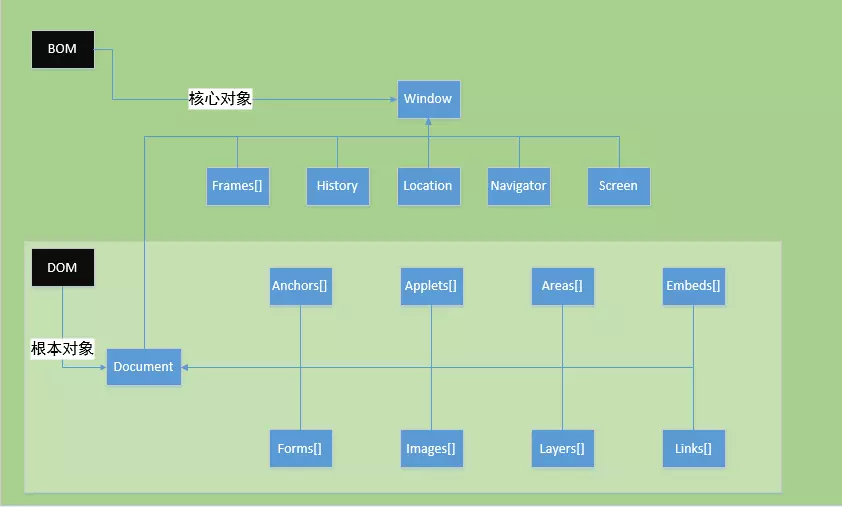

#### 18.栈内存和堆内存
- 堆内存是系统调度，内存空间相对自由，可自由使用分配，但速度慢（因为系统来管理和销毁），存储对象类型
- 栈用于程序执行，速度快，先进后出原则

#### session怎么实现数据什么时候被销毁
- 创建session时会有sessionid存储在cookie中
- 有时效性，最后一次被使用到当前时间是否超过某个时效性
- 手动强制释放
- web服务终止服务

#### vue 实例化过程

#### vue 模板编译
- Vue的渲染机制指的是Vue怎么将单文件组件中的template转换为AST(语法树)，再将AST转换成render函数，最后生成虚拟dom节点(包含创建元素节点的一切信息的JavaScript对象)，并创建元素节点挂载到页面上，基本过程如下图: 
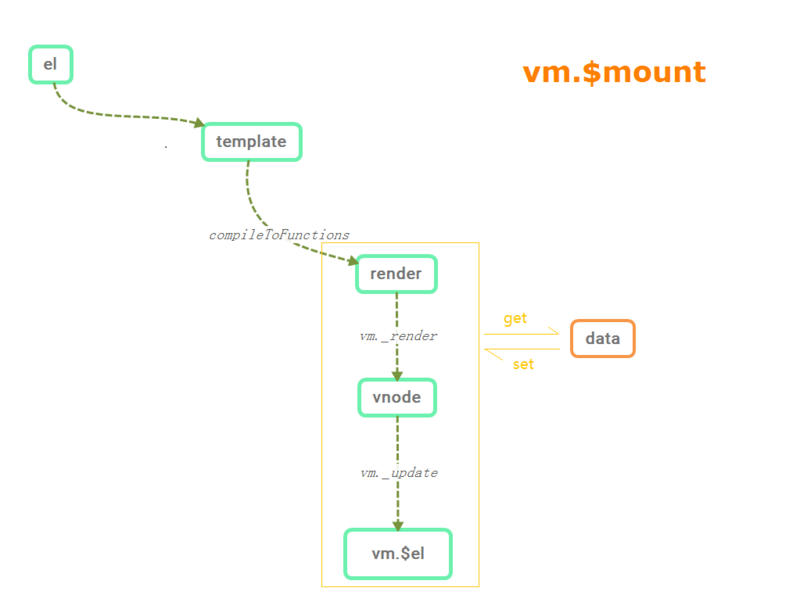
#### 网页怎么渲染pdf（canvas）

#### vue中数组和对象响应式
- this.$set(this.someObject,'b',2) 或者 Vue.set(vm.someObject, 'b', 2)
- Vue.set(vm.items, indexOfItem, newValue) 或者 vm.items.splice(indexOfItem, 1, newValue)， vm.$set(vm.items, indexOfItem, newValue)
- 异步更新获取新值使用$nextTick方法
```javascript
this.$nextTick(function () {
  console.log(this.$el.textContent) // => '已更新'
})
```

#### Babel配置怎么写
```json
/* .babelrc */

{
  "presets": [
    ["@babel/preset-env", {
      "modules": false,
      "targets": "ie >= 8"
    }],
    '@vue/cli-plugin-babel/preset'
  ],
  "plugins": [
    ["@babel/plugin-transform-runtime", {
      "corejs": 2
    }]
  ]  
}
```
#### async,generator
```javascript
let range = {
  from: 1,
  to: 5,

  [Symbol.iterator]() { // called once, in the beginning of for..of
    return {
      current: this.from,
      last: this.to,

      next() { // called every iteration, to get the next value
        if (this.current <= this.last) {
          return { done: false, value: this.current++ };
        } else {
          return { done: true };
        }
      }
    };
  }
};

for(let value of range) {
  alert(value); // 1 then 2, then 3, then 4, then 5
}

// async await
function spawn(genF) {
  return new Promise(function(resolve, reject) {
    const gen = genF();
    function step(nextF) {
      let next;
      try {
        next = nextF();
      } catch(e) {
        return reject(e);
      }
      if(next.done) {
        return resolve(next.value);
      }
      Promise.resolve(next.value).then(function(v) {
        step(function() { return gen.next(v); });
      }, function(e) {
        step(function() { return gen.throw(e); });
      });
    }
    step(function() { return gen.next(undefined); });
  });
}

```
#### 按需引入怎么实现
- 使用webpack打包，路由配置，使用import这个函数即可按需加载component: () => import('@/views/users/companyEdit.vue')返回一个promise函数

#### 对象obj，alert(obj)为3，如何实现（定义toString,valueOf方法)
#### 如何实现input框显示，但是无法输入（readonly disabled οnfοcus=this.blur() keydown preventDefault(搜狗中文输入法依然有问题)
- disabled不可编辑，不可复制，不可选择，不能接收焦点,后台也不会接收到传值。设置后文字的颜色会变成灰色。disabled 属性无法与 input type="hidden" 一起使用。
- readonly 属性规定输入字段为只读可复制，但是，用户可以使用Tab键切换到该字段，可选择,可以接收焦点，还可以选中或拷贝其文本。后台会接收到传值. readonly 属性可以防止用户对值进行修改
#### 用js创建的DOM白屏，如何定位问题，DOM
- 有没有语法错误，有没有抛出异常，标签有没有闭合出错
- 单一对照原则，慢慢注释代码
#### 断点调试工具考察。两个一样的函数，如何判断执行了哪个 console.log即可
#### 时间复杂度最优的排序算法。我说桶排序。追问桶排序的原理
- 快速排序一般是nlogn,最坏n2，找到一个基点，小的放左边，大的放右边
- 堆排序nlogn，最坏也是nlogn，本质就是有序二叉树
- 桶排序是计数排序的升级版。它利用了函数的映射关系，高效与否的关键就在于这个映射函数的确定。为了使桶排序更加高效，我们需要做到这两点：
  - 最好情况n+k, 最坏情况 $n^2$ 因为需要k个桶，所以空间复杂度k
  - 在额外空间充足的情况下，尽量增大桶的数量
  - 使用的映射函数能够将输入的 N 个数据均匀的分配到 K 个桶中
- 元素分布在桶中：
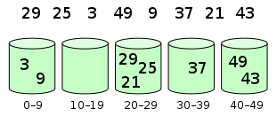
- 然后，元素在每个桶中排序：


#### 链表倒数第k个结点
思路使用双指针，首先使两个指针间隔为k，然后同时移动，后指针到结尾时，前指针即为倒数k个节点
#### [git原理](https://tonybai.com/2020/04/07/illustrated-tale-of-git-internal-key-concepts/)
- 每个commit都是一个git仓库的快照
- svn
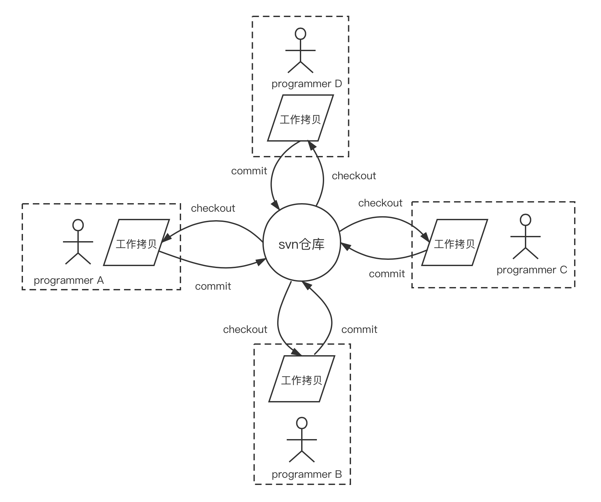
- git
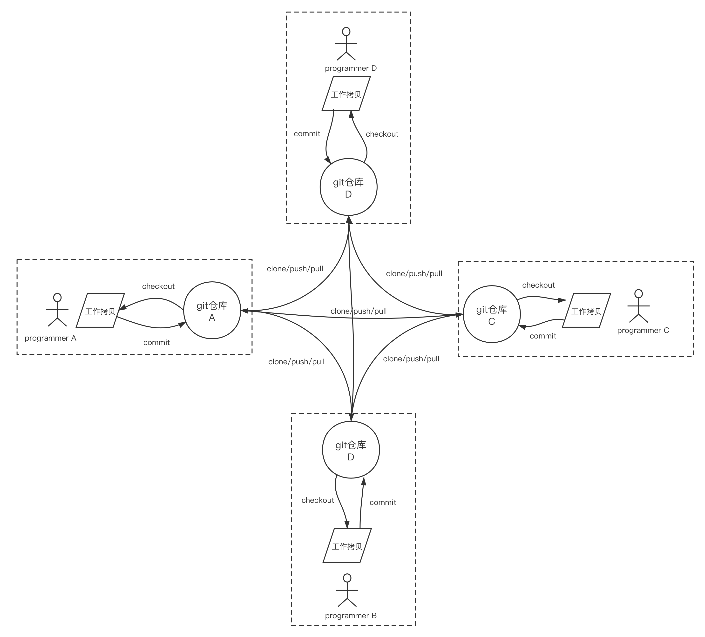
- github


#### 弹幕功能实现，要考虑性能
- 因为弹幕量可能会很大，所以引入队列做缓冲
- 弹幕的滚动本质上是位移动画，DOM 和 canvas，dom动画好做，可以使用 CSS 的 transition 和 transform， animation来实现动画，充分利用gpu，canvas需要自己写大量效果阴影什么的，而且流畅度可能不如css原生动画 
- 弹幕速度匀速，但是间隔时间可以根据量动态调整
- 暂停和恢复（标签页切到后台，则弹幕暂停，切到前台再恢复）
```javascript
let hiddenProp, visibilityChangeEvent;
if (typeof document.hidden !== 'undefined') {
  hiddenProp = 'hidden';
  visibilityChangeEvent = 'visibilitychange';
} else if (typeof document.msHidden !== 'undefined') {
  hiddenProp = 'msHidden';
  visibilityChangeEvent = 'msvisibilitychange';
} else if (typeof document.webkitHidden !== 'undefined') {
  hiddenProp = 'webkitHidden';
  visibilityChangeEvent = 'webkitvisibilitychange';
}

document.addEventListener(visibilityChangeEvent, () => {
  if (document[hiddenProp]) {
    this.pause();
  } else {
    // 必须异步执行，否则恢复后动画速度可能会加快，从而导致弹幕消失或重叠，原因不明
    this._resumeTimer = setTimeout(() => { this.resume(); }, 200);
  }
}, false);

```
- 长时间排队的弹幕要丢弃

#### javascript执行上下文，js执行上下文，javascript上下文，js上下文
- 全局执行上下文 — 这是默认或者说基础的上下文，任何不在函数内部的代码都在全局上下文中。它会执行两件事：创建一个全局的 window 对象（浏览器的情况下），并且设置 this 的值等于这个全局对象。一个程序中只会有一个全局执行上下文。
- 函数执行上下文 — 每当一个函数被调用时, 都会为该函数创建一个新的上下文。每个函数都有它自己的执行上下文，不过是在函数被调用时创建的。函数上下文可以有任意多个。每当一个新的执行上下文被创建，它会按定义的顺序（将在后文讨论）执行一系列步骤。
- Eval 函数执行上下文 — 执行在 eval 函数内部的代码也会有它属于自己的执行上下文，但由于 JavaScript 开发者并不经常使用 eval，所以在这里我不会讨论它。
- 执行栈，也就是在其它编程语言中所说的“调用栈”，是一种拥有 LIFO（后进先出）数据结构的栈，被用来存储代码运行时创建的所有执行上下文。
- this 值的决定，即我们所熟知的 This 绑定。
- 创建词法环境组件。
- 创建变量环境组件。
- 在全局执行上下文中，this 的值指向全局对象。(在浏览器中，this引用 Window 对象)。
- 在函数执行上下文中，this 的值取决于该函数是如何被调用的。如果它被一个引用对象调用，那么 this 会被设置成那个对象，否则 this 的值被设置为全局对象或者 undefined


#### 介绍状态机。
- 一般通过状态、事件、转换和动作来描述有限状态机。
- 某个组件有显示和隐藏两个状态，通常会设计两个方法 show() 和 hide() 来实现切换，而 React 只需要设置状态setState({ showed: true/false }) 即可实现。同时，React 还引入了组件的生命周期这个概念。通过它，就可以实现组件的状态机控制，从而达到“生命周期→状态→组件”的和谐画面。

#### 介绍oauth。
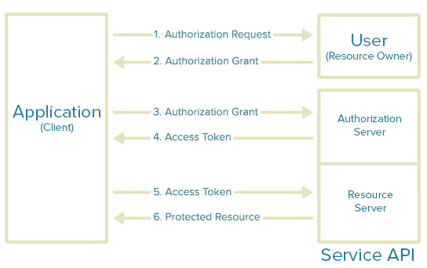

#### weex和react native，flutter原理。
- weex
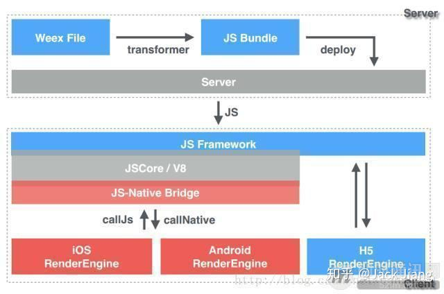
- react native
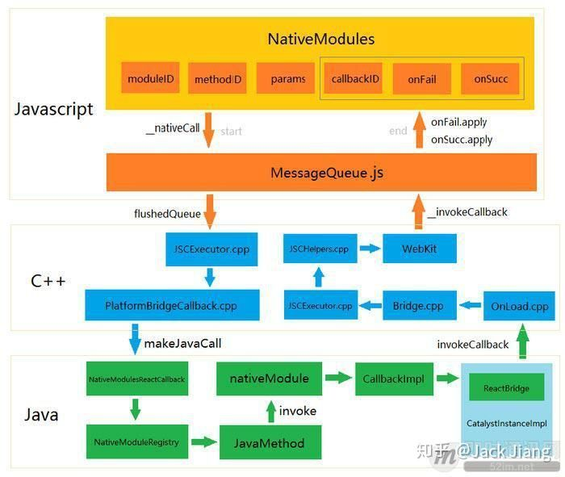
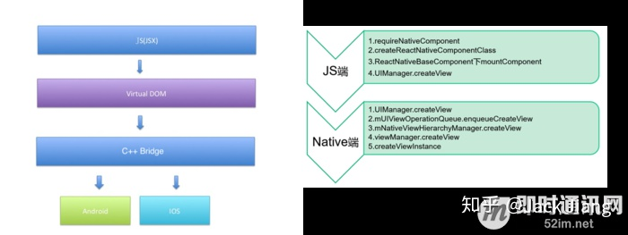
- flutter
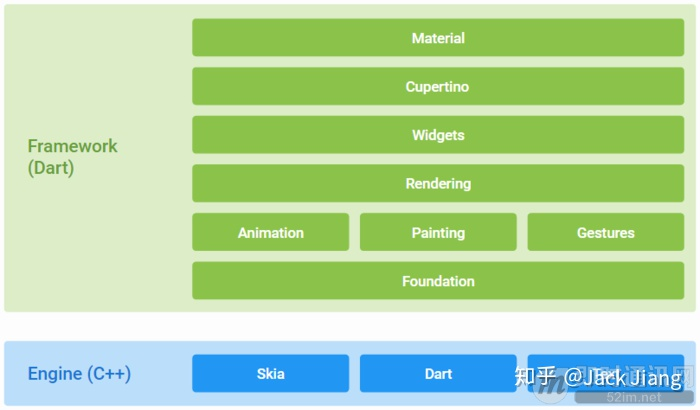
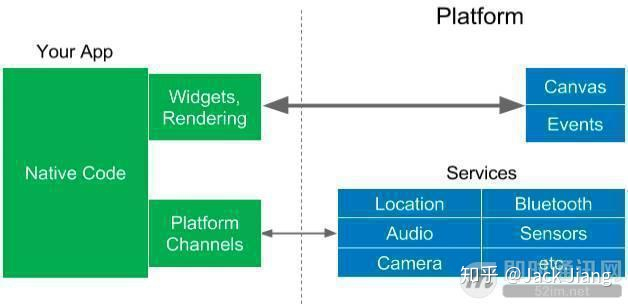
- 对比


#### 大屏用的技术。
- javascript+echarts
- 屏幕自适应
- 布局，主要信息和次要信息
- 数据实施更新

#### websocket的使用场景。
- 相对于HTTP这种非持久的协议来说，Websocket是一个持久化的协议。用websocket可以实现服务端主动发送信息给客户端，并且客户端能够接收进行处理。当我们创建某个会话的时候，我们彼此就建立了持久化的协议，然后各自都有约定好的监听，后台可以随时主动与你通信，你也可以主动给后台发送请求  具体的使用场景如下：
- websocket是全双工通信
- http是半双工通信，请求响应断开
- 社交订阅、多玩家游戏、协同编辑/编程、点击流数据、股票基金报价、体育实况更新等。


#### 判定是否为数组的几种方法
- Object.prototype.toString.call(something) === '[object Array]'
- Array.isArray
#### cookie防止串改
- httponly只读cookie
- 但是防止篡改可以使用数字签名
#### 编程：生成n个不相同的取值【2-32】的随机数，使用Set，边界条件，代码块风格
```javascript
let set = new Set()
while(set.size<n){
  let random = Math.random() * (upper-lower) + lower
  set.add(Math.ceil(random))
}
```
#### React新特性有哪些，Fiber做了什么，为什么要提出来
- 大量的同步计算任务阻塞了浏览器的 UI 渲染。默认情况下，JS 运算、页面布局和页面绘制都是运行在浏览器的主线程当中，他们之间是互斥的关系。如果 JS 运算持续占用主线程，页面就没法得到及时的更新。当我们调用setState更新页面的时候，React 会遍历应用的所有节点，计算出差异，然后再更新 UI。整个过程是一气呵成，不能被打断的。如果页面元素很多，整个过程占用的时机就可能超过 16 毫秒，就容易出现掉帧的现象。
- 解决主线程长时间被 JS 运算占用这一问题的基本思路，是将运算切割为多个步骤，分批完成。也就是说在完成一部分任务之后，将控制权交回给浏览器，让浏览器有时间进行页面的渲染。等浏览器忙完之后，再继续之前未完成的任务。
- 旧版 React 通过递归的方式进行渲染，使用的是 JS 引擎自身的函数调用栈，它会一直执行到栈空为止。而Fiber实现了自己的组件调用栈，它以链表的形式遍历组件树，可以灵活的暂停、继续和丢弃执行的任务。实现方式是使用了浏览器的requestIdleCallback这一 API。
- react 框架内部运作分3层
  - Virtual DOM 层，描述页面长什么样。
  - Reconciler 层，负责调用组件生命周期方法，进行 Diff 运算等。（改动最大，fiber reconciler）
  - Renderer 层，根据不同的平台，渲染出相应的页面，比较常见的是 ReactDOM 和 ReactNative。
- 以前的 Reconciler 被命名为Stack Reconciler。Stack Reconciler 运作的过程是不能被打断的，必须一条道走到黑：

- 而 Fiber Reconciler 每执行一段时间，都会将控制权交回给浏览器

- 阶段一，生成 Fiber 树，得出需要更新的节点信息。这一步是一个渐进的过程，可以被打断。
- 阶段二，将需要更新的节点一次过批量更新，这个过程不能被打断,

- Fiber Reconciler 在阶段一进行 Diff 计算的时候，会生成一棵 Fiber 树。这棵树是在 Virtual DOM 树的基础上增加额外的信息来生成的，它本质来说是一个链表。
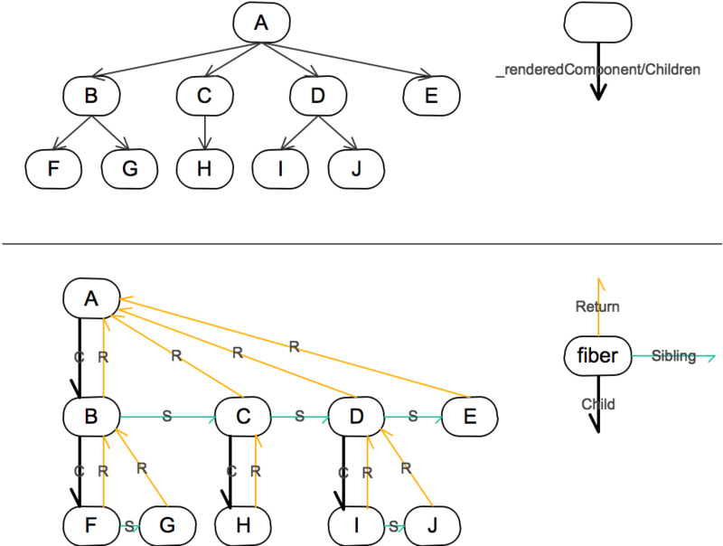
- Fiber 树在首次渲染的时候会一次过生成。在后续需要 Diff 的时候，会根据已有树和最新 Virtual DOM 的信息，生成一棵新的树。这颗新树每生成一个新的节点，都会将控制权交回给主线程，去检查有没有优先级更高的任务需要执行。如果没有，则继续构建树的过程：
- 如果过程中有优先级更高的任务需要进行，则 Fiber Reconciler 会丢弃正在生成的树，在空闲的时候再重新执行一遍。
- 在构造 Fiber 树的过程中，Fiber Reconciler 会将需要更新的节点信息保存在Effect List当中，在阶段二执行的时候，会批量更新相应的节点。


#### 动画有哪些， 缩放怎么做
- javascript直接实现；SVG（可伸缩矢量图形），CSS3 transition；CSS3 animation；Canvas动画；requestAnimationFrame；
- transform: scale(1)

#### [面对不同的运营商，有什么想法提升用户的使用性能？？？](https://zhuanlan.zhihu.com/p/33179166)
- 离线缓存
- 文件压缩，css头部无表达式，js放在尾部，域名收敛，图片懒加载
- 网络不好的运营商部署更多cdn，尝试对接了很多国外的知名CDN服务商。通过智能DNS解析用户的IP来源，如果是境外访问则CNAME到国外CDN，国内访问时仍然走的是国内CDN。
- httpDNS，防止劫持等等很多缺点，域名解析自己控制

- DNS Prefetch
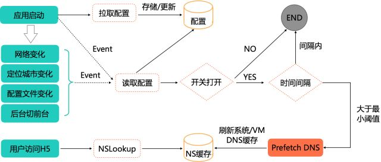
- 长连接
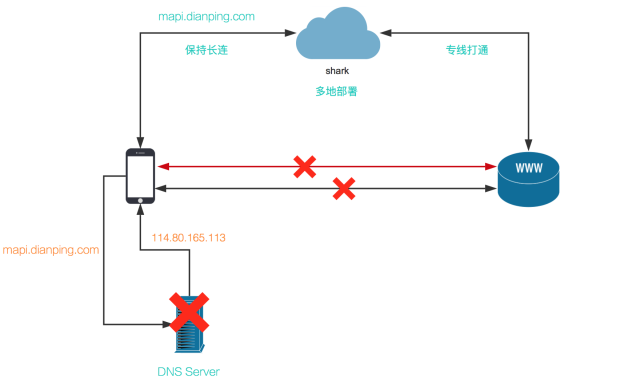
- 专线直连
- 前后端分离，图片优化，域名收敛、减少请求，离线化，自建机房，搭专线，cdn

#### post()和get()的本质区别 
- get是一次发送，而post数据多时会分多次发送，所以才有100 continue不是


#### [对MVC MVP MVVM的了解？](https://www.ruanyifeng.com/blog/2015/02/mvcmvp_mvvm.html)
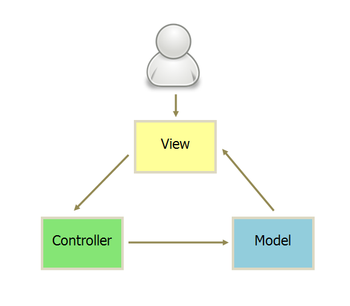

- 各部分之间的通信，都是双向的。
- View 与 Model 不发生联系，都通过 Presenter 传递。
- View 非常薄，不部署任何业务逻辑，称为"被动视图"（Passive View），即没有任何主动性，而 Presenter非常厚，所有逻辑都部署在那里。

- 和mvp唯一的区别是，它采用双向绑定（data-binding）：View的变动，自动反映在 ViewModel，反之亦然。

五面
1、同事怎么看待你的？
2、你的优点和你的缺点；
3、你认为自己还能提高的地方在哪里？
4、三年内的职业规划
5、其他的日常聊天，在这里就不再过多地赘述了；
6、你还有什么想要问我的？
然后我问了一些部门的基本情况，比如部门在 XXG 以至公司的定位，相比于公司其他方向的部门，我们的特点是什么？相比于同方向其他公司的部门，我们的特点是什么？设计师、产品、研发之间的合作？以及部门对公司或对行业最大的贡献是？


#### 使用过webpack吗？讲一下插件（plugin）和loader的区别
- loader，它是一个转换器，将A文件进行编译成B文件，比如：将A.less转换为A.css，单纯的文件转换过程。
- plugin是一个扩展器，它丰富了webpack本身，针对是loader结束后，webpack打包的整个过程，它并不直接操作文件，而是基于事件机制工作，会监听webpack打包过程中的某些节点，执行广泛的任务，比如：清理东西 打包优化、文件管理、环境注入

#### 利用apply手写一个bind函数， bind函数返回的是一个什么东西？
```javascript
// Does not work with `new (funcA.bind(thisArg, args))`
if (!Function.prototype.bind) (function(){
  var slice = Array.prototype.slice;
  Function.prototype.bind = function() {
    var thatFunc = this, thatArg = arguments[0];
    var args = slice.call(arguments, 1);
    if (typeof thatFunc !== 'function') {
      // closest thing possible to the ECMAScript 5
      // internal IsCallable function
      throw new TypeError('Function.prototype.bind - ' +
             'what is trying to be bound is not callable');
    }
    return function(){
      var funcArgs = args.concat(slice.call(arguments))
      return thatFunc.apply(thatArg, funcArgs);
    };
  };
})();
//  Yes, it does work with `new (funcA.bind(thisArg, args))`
if (!Function.prototype.bind) (function(){
  var ArrayPrototypeSlice = Array.prototype.slice;
  Function.prototype.bind = function(otherThis) {
    if (typeof this !== 'function') {
      // closest thing possible to the ECMAScript 5
      // internal IsCallable function
      throw new TypeError('Function.prototype.bind - what is trying to be bound is not callable');
    }

    var baseArgs= ArrayPrototypeSlice.call(arguments, 1),
        baseArgsLength = baseArgs.length,
        fToBind = this,
        fNOP    = function() {},
        fBound  = function() {
          baseArgs.length = baseArgsLength; // reset to default base arguments
          baseArgs.push.apply(baseArgs, arguments);
          return fToBind.apply(
                 fNOP.prototype.isPrototypeOf(this) ? this : otherThis, baseArgs
          );
        };

    if (this.prototype) {
      // Function.prototype doesn't have a prototype property
      fNOP.prototype = this.prototype; 
    }
    fBound.prototype = new fNOP();

    return fBound;
  };
})();
```


#### cookie的属性有哪些，如果cookie不设置有效期，cookie什么时候删除
- domain,path, secure, httponly, expire, samesite
- 不设置有效期就是会话cookie，默认为当前浏览器会话有用，关闭浏览器就消失
```javascript
//设置 cookie
function setCookie(objName, objValue, objHours){//添加cookie
    var str = objName + "=" + encodeURIComponent(objValue);
    if (objHours > 0) {//为0时不设定过期时间，浏览器关闭时cookie自动消失
        var date = new Date();
        var ms = objHours * 3600 * 1000;
        date.setTime(date.getTime() + ms);
        str += "; expires=" + date.toUTCString();
    }
    document.cookie = str;

}
//获取 cookie
function getCookie(objName){//获取指定名称的cookie的值
    //多个cookie 保存的时候是以 ;空格  分开的
    var arrStr = document.cookie.split("; ");
    for (var i = 0; i < arrStr.length; i++) {
        var temp = arrStr[i].split("=");
        if (temp[0] == objName){
            return decodeURIComponent(temp[1]);
        }else{
            return "";
        }
            
    }
}

//为了删除指定名称的cookie，可以将其过期时间设定为一个过去的时间
function delCookie(name){
    var date = new Date();
    date.setTime(date.getTime() - 10000);
    document.cookie = name + "=a; expires=" + date.toUTCString();
}
```

○如何加快页面首屏渲染？
○如何实现DNS预解析？DNS预解析在什么时候执行？
○详细说一下CDN？它是怎么找到离它地理位置最近的服务器的而不是其他的服务器？
○说一下vue的实现原理
○vue的生命周期
○vue指令了解多少？v-if和v-show的区别？两者的应用场景
○项目用的是vue-cli3.0吧？vue.config.js用过吗？拿来做什么？还配置过什么？
○说一下webpack。自己写过loader吗？
○node.js用过吗？express拿来做什么？koa用过吗？

二面 24min
○vue源码有没有看过？vue-router原理？
○webpack打包流程知道吗？treeshaking是什么？它是怎么实现的？源码看过吗？自己手写过loader吗？
○后端会写吗？koa？mysql？要是来这实习的话，后端一般是要自己写的


三面 28min
○页面白屏如何逐一排除问题？
○如何知道用户的网络有问题？
○说一下网络请求底层是怎么实现的？
○页面如何进行调试？
○vue源码看过吗？虚拟dom实现原理？diff算法如何实现的？
○前端学习方法
○前端性能优化，图片具体，什么格式应用什么场景，详细问了base64
○react生命周期
○一个班70%的人喜欢足球 80%喜欢篮球，90%喜欢排球，同时喜欢足球和篮球的有多少人
○手上offer，现在还在面其他公司吗？
○实习多久，什么时候能来实习？

hr面 30min
○自我介绍
○讲一讲你的项目，难点是怎么解决的
○项目的亮点，与众不同的地方，怎么实现的？
○如何进行学习
○你觉得有成就感的事
○你有什么优势和劣势
○目前海康实习是在做什么事？
○项目交给你，是怎么提前这么久完成的？你是怎么着手项目的？
○能实习多久，多久来实习
○考研吗？为什么不考？
○介绍下你的家庭，父母同意你来深圳吗？
○有女朋友吗？她怎么看？
○还在面哪家公司或其他offer吗，如果字节也面到了怎么选择
○你还有什么问题想问我吗？


1. Given an array nums, write a function to move all 0's to the end of it while maintaining the relative order of the non-zero elements.
For example, given nums = [0, 1, 0, 3, 12], after calling your function, nums should be [1, 3, 12, 0, 0].

Note: You must do this in-place without making a copy of the array. Minimize the total number of operations.

2.  实现一个函数countLongest(tree)，输入一棵二叉树，返回二叉树中距离最长的两个叶子节点的距离
3. 在前端开发中，通常会把多个 js 文件合并成一个文件，以减少网络请求次数，达到优化加载速度的目的，但是当文件之间存在依赖关系时，对 js 合并的顺序，会有一定的要求，比如 A.js 依赖了 B.js，那打包后的文件，B.js 需要排在 A.js 的前面。实现一个函数 `resolve(tree)`，根据 js 的依赖关系树 tree，输出合理的打包顺序的数组（结果可能不唯一，输出其中一种即可）。
4. 给定一个整数数组 a，实现一个函数 `countMax(a)`，计算出从 a 中选择出多个不相邻元素组成最大的和是多少。

以下代码输出
```javascript
var name = "first";
(function foo() {
	var name = "second";
	console.log(this.name);
})();
console.log(this.name);


var name = "global name";
var a = {
	name: "name A",
	func: function () {
		console.log(this.name);
	},
};
a.func();
window.a.func();
var func = a.func;
func();
func = window.a.func;
func();


var foo = { n: 1 };
(function (foo) {
	var foo;
	console.log(foo.n);
	foo.n = 3;
	var foo = { n: 2 };
	console.log(foo.n);
})(foo);
console.log(foo.n);
```

8. 问了一下如何上传文件
9. drag, drop api怎么使用


1、知道animation-fill-mode吗？不知道
4、如何渲染一个十几万条的大数据显示到页面上。
6、项目的构建工具，vue-cli、webpack。

3.HTML跟HTML5的区别（面试官为我解释了本质区别，框架上的区别😅）
